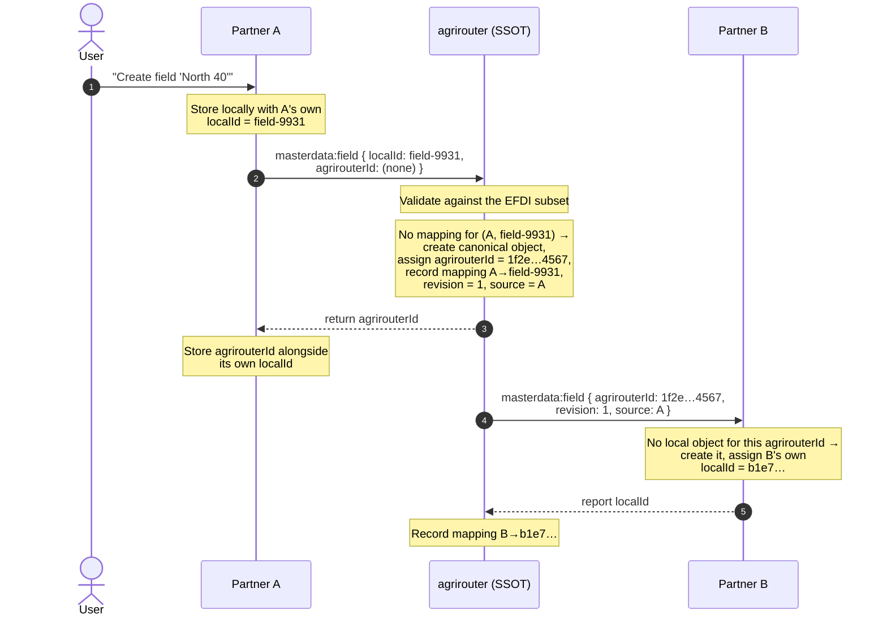
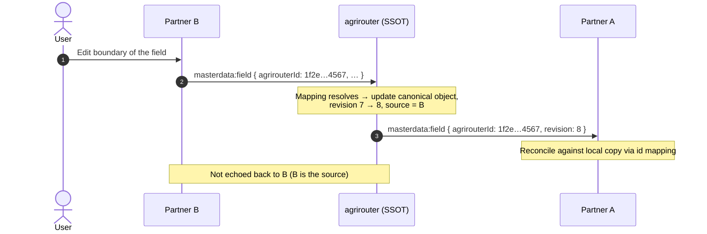

# ADR 01 - Reference architecture: agrirouter as the canonical Single Source of Truth

- **Status:** Proposed
- **Scope:** Communicating parties infrastructure and data flow

## Context

Applications in the agricultural domain work on top of the same set of entities,
such as farms, fields, customers. These entities need to be known for most basic
operations and systems need to be able to exchange them as well as nominally
agree on which states are possible to be represented. These relatively static
entities would be referred to as **master data**.

As users create and edit master data in one of the systems, the changes must be
synchronized to all other systems. When user registers in another system, the
master data needs to be synchronized to that new system as well.
As with usual agrirouter-enabled communication, user should be in control of
which systems receive the master data and which do not.

Synchronization of master data should be happening **continuously** so that
when users switch between systems, they would be able to see the same master
data and continue working on the same entities.

When system is disconected for awhile it should be able to reconnect and synchronize
to the current state of master data without losing any changes made in the meantime.

If system already holds its own version of master data, which users might have
entered into that system via other means, it should be able to reconcile its own data 
with the canonical version of master data and not duplicate it.

A purely meshed exchange - partners forwarding changes directly to one another -
leaves no single place to establish cross-vendor identity, to break loops, or to
seed a returning system. Those problems become intractable as the number of
participants grows.

## Decision

Adopt an architecture where agrirouter sits in the middle and holds the
**canonical** copy, while each partner keeps its own.

```mermaid
flowchart LR
    Astore[("Partner A Local store<br/>own copy · own ids")]
    SSOT[("agrirouter SSOT store<br/><b>canonical</b> objects<br/>+ id mapping")]
    Bstore[("Partner B Local store<br/>own copy · own ids")]
    user(["👤 User"])
    Aplatform["Partner A Platform"]
    Bplatform["Partner B Platform"]
    user -->|"creates / edits / uses<br/>master data"| Aplatform
    user -->|"creates / edits / uses<br/>master data"| Bplatform
    Aplatform -->|"reads / writes<br/>master data"| Astore
    Bplatform -->|"reads / writes<br/>master data"| Bstore
    Astore <-->|"synchronization"| SSOT
    SSOT <-->|"synchronization"| Bstore
    Aplatform [("Partner A Platform")]
    Bplatform [("Partner B Platform")]
    %% ceasg:{"id":"1d1ti28h"} %%
    %% mermaid-flow:pos Astore=84,297 SSOT=436,297 Bstore=769,296 user=417,48 Aplatform=84,131 Bplatform=772,144
```

### Each system keeps its own store and its own identifiers

Every partner keeps its **own local copy** of the master data under its **own
identifiers**, and continues to serve its own users from that copy. Read "Partner
A" as any [participant](../specification.md#terminology): an FMIS, a machine
platform, terminal software, a service provider.

These are the key reasons:

- **Reads must stay local - a CQRS-style split of reads from writes.** Reading
  master data is separated from changing it
  ([CQRS](https://martinfowler.com/bliki/CQRS.html)). Partner applications perform
  a wide variety of operations over master-data entities - rendering field maps,
  planning tasks, filtering lists, feeding machine guidance - and each reads the master
  data in its own way. This access pattern is specific to each partner's
  implementation and cannot be generified into a single query interface that a
  central platform could serve efficiently. Each partner therefore needs its own
  local store, shaped and optimized for the operations it performs; every read is
  answered from that store and never reaches agrirouter, while only *changes* are
  propagated through it.
- **The central platform must scale with change, not with use.** If agrirouter
  had to answer the query traffic of every participant's application, it would
  become the bottleneck of the whole ecosystem and could not scale as
  participants are added. Keeping the query side local means the center's load
  is proportional to how often master data *changes*, not to how often it is
  *read* - which is what makes an n:m network tractable.
- **Existing applications keep their internal state.** Partner applications today
  are already built against their own internal representation of this data.
  Re-implementing them to read from a central state would require significant
  effort per partner; keeping each system on its own local store avoids that
  rework and lowers the barrier to adopting the protocol.

### agrirouter holds the canonical Single Source of Truth

agrirouter holds the [Single Source of Truth (SSOT) store](../specification.md#agrirouter-as-the-single-source-of-truth):
for every synchronized entity, the *canonical* version plus an *identifier
mapping* recording what each partner calls that entity.

The key property: **all three keep state, but only agrirouter's state is
canonical.** The partners' copies are local projections that AMSP keeps in step
with the canonical copy. Consistent with the read/write split of D1, changes
propagate through agrirouter, which keeps SSOT authoritative.
The SSOT exists *only* to make synchronization tractable - it is explicitly
[not a history store or a product](../specification.md#what-this-protocol-is-and-is-not).

### What each store holds for one field

The three stores describe the same field, but not identically. Each partner
identifies the field by its own **`localId`** - the identifier by which *that
partner* knows the field inside its own store, meaningful only there and assigned
by the partner itself. agrirouter's canonical object carries the stable, globally
meaningful `agrirouterId` and the mapping from it back to each partner's `localId`.

| | Partner A store | agrirouter SSOT | Partner B store |
|---|---|---|---|
| Identifier | `localId` = `field-9931` (how A knows it) | `agrirouterId` = `1f2e…4567` (canonical) | `localId` = `b1e7…` (how B knows it) |
| Id mapping | - | A → `field-9931`, B → `b1e7…` | - |
| Revision | (local) | `revision` = 7 (authoritative) | (local) |
| Data | name, boundary, … | canonical name, boundary, … | name, boundary, … |

The `idMappings` on the canonical object are what let a change originating in A be
delivered to B as *the same field B already knows*, rather than a duplicate. See
[Identifier mapping](../specification.md#identifier-mapping).

We suggest to keep identity mapping for these main reasons:
- as mentioned before access patterns are different for each partner and pre-existing schema of identifying entities could vary between different implementations. Therefore, it is not possible to have a single identifier for each entity that would be used by all partners at the same time.
- we have to avoid creating duplicate entities, which requires to track identity across all data stores.
- we need to be able to enforce the same entity identification across all partners, in that we need to be able to communicate to partner application when it is trying to assign the same identity to two entities which are different in the canonical store. This is described in [Asymmetric and non-unique mappings](../specification.md#asymmetric-and-non-unique-mappings).

### Golden path: a user creates a field in Partner A

This is the core scenario the architecture is built around. A user draws a new
field in Partner A's UI. That command should cause the new field to become visible 
in both Partner A and in a Partner B - without either partner talking to the other 
directly.



Step by step:

1. **The command lands in Partner A.** The user creates the field; Partner A
   writes it to its own store under its own identifier (`field-9931`). At this
   moment only A knows about it.
2. **A tells agrirouter.** A sends a
   [`masterdata:field`](../specification.md#message-types) message carrying its
   `localId` and *no* `agrirouterId` (the entity is new to the network).
3. **agrirouter validates and makes it canonical.** agrirouter
   [validates the message](../specification.md#hard-validation) against the
   defined format and rejects it outright if it does not conform. On success it
   sees no existing mapping for `(A, field-9931)`, so it **creates a new canonical
   object**, assigns a stable `agrirouterId`, sets `revision` to its first value,
   records the source endpoint, and stores the mapping `A → field-9931`.
   **agrirouter's state has now changed** - this is the pivot of the whole flow.
4. **A learns the canonical id.** Through the delivery confirmation, A records the
   `agrirouterId` next to its own `localId`, so future updates to this field are
   recognized as the same object.
5. **agrirouter syncs the change to Partner B.** Because B has opted into `field`,
   agrirouter delivers the canonical object to B. B has no local object for this
   `agrirouterId`, so it creates one under *its own* `localId` (`b1e7…`) and
   reports it back, completing the id mapping. Partner B's user now sees "North 40".
6. **agrirouter does not echo the change back to A.** A was the source of this
   revision, so agrirouter [does not deliver it back to A](../specification.md#loop-prevention).
   This is what stops the change from ricocheting A → B → A forever.

The command entered through **Partner A**, but nothing about the flow is specific
to A. The identical sequence runs if the user had created the field in **Partner
B** instead - commands can enter through *any* partner, and agrirouter is always
the point where they become canonical and fan out to the others.

### A subsequent edit, and why loops don't form

Once the field exists everywhere, edits follow the same shape, with one addition:
the change now carries a known `agrirouterId`, so agrirouter *updates* the existing
canonical object instead of creating one, and bumps `revision`.



Two mechanisms in the SSOT keep this from looping, both described in
[Loop prevention](../specification.md#loop-prevention):

- **Origin suppression.** A revision is never delivered back to the endpoint that
  produced it (tracked by `sourceEndpointId`).
- **No-op detection.** If an incoming message does not actually change the
  canonical object - some systems emit a notification even when nothing changed -
  agrirouter creates no new `revision` and forwards nothing.

Because these safeguards live in agrirouter and not in the partners, they hold even
when connected integration is not able to suppress the echo itself. For example in
JDOC integration we technically are unable to know whether a change was made by the user
or by our client. In this case since JDOC would provide us the same data as is already
stored in the canonical store, agrirouter would consider it a no-op and would not create 
a new revision nor forward it to other partners.

## Consequences

- **One place to reconcile against.** Every change is applied to a single canonical
  object, so there is a definitive current value and `revision` rather than N
  different systems arguing about whose copy is newest.
- **Identity across vendors.** The id mapping lets separately identified objects be recognized as one entity, which is what prevents duplication on delivery.
- **Loop prevention has an anchor.** Origin suppression and no-op detection need a
  single authority that knows the source and the current state - that is the agrirouter single source of truth.
- **New and returning systems can be seeded.** A partner that connects (or
  reconnects) is brought up to date from the canonical set; see
  [Initial load and seeding](../specification.md#initial-load-and-seeding). Any
  partner can disconnect and reappear with no loss of sync capability.
- **Possible latencies**: background sync implies a separate process that is not necessarily instant (i.e reads may be stale - eventual consistency). In some situations it may even lead to writes being rejected due to stale reads. See [ADR 05 - Solving stale reads](./05-stale-reads.md) for more details.
- agrirouter takes on **statefulness and storage** it would not have as a pure
  message bus, along with responsibility for validation and canonicity.
- The canonical store is a facilitation mechanism only. It is deliberately **not**
  a history store, a data-maintenance UI, or a marketed "source of truth" product (for example it is not supposed to be queried directly).
- Some problems are **pushed to the partner applications by design**: field-level conflict
  resolution during seeding, and genuine n:1 granularity mismatches, are resolved
  in partner software, not adjudicated by agrirouter (see
  [Asymmetric and non-unique mappings](../specification.md#asymmetric-and-non-unique-mappings)).
