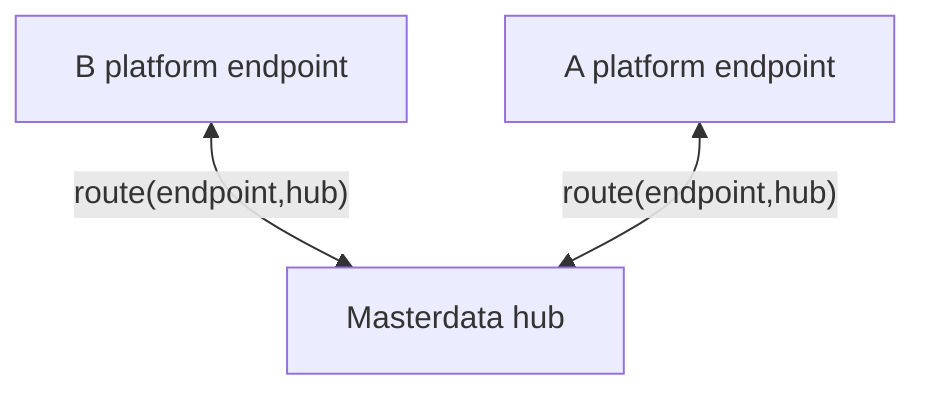

# ADR 04 - Routing of master data

- **Status:** WIP
- **Scope:** Routing masterdata to applications

## Context

In agrirouter message/file exchange protocol user has a full control and overview of data flows using concepts of endpoints and routes. Endpoints might represent an account in single cloud hosted application, or organization in a multi-tenant application or single device - specifics of what endpoint represents are up to the application that has created it, although some high level classification is available and instructs "default routing" that is created automatically by agrirouter when an endpoint is configured. Two types are important here - virtual communication unit endpoints are representing a single machine that has a communication unit installed that is responsible to communicate with agrirouter, while cloud software endpoint represents an "office" software that is able to communicate with agrirouter and probably hosted on servers that partner controls. Default routing matches virtual communication unit endpoints with cloud software endpoints, however virtual communication units would not communicate to each other by default, same as cloud software endpoints would not communicate to each other by default, as primary purpose of agrirouter is to facilitate optionally bidirectional device-to-cloud-to-device communication.

In case of master data exchange, however, communication between cloud software endpoints is the one required by default.

One facet of endpoints and routing in agrirouter is the visualization of data flows that agrirouter UI does to help users understand and control data flows. Routes between endpoints are simply visualized as arrows connecting blocks representing endpoints. Master data is required to preserve the same simple visualization, hence we would need to stay within the same model of a route connecting two endpoints (source and recipient) and not introduce any additional routing concepts that would require users to learn new concepts and would not be visualized in the same way as other data flows.

At the other hand, with master data connecting a new application to the network unintentionally might cause a lot of data being overriden and from this perspective potentially dangerous, one of possible options due to this was to require explicit routing configuration for master data.

If routing would allow users to arbitrary connect any endpoints to masterdata exchange, it would be also possible to create a "split brain" situation when unconnected groups of endpoints would maintain different sets of masterdata, thus creating another layer of abstraction within the tenant, which is undesirable from perspective of what would happen when any of these groups would intersect and thus cause potentially many conflicts having to be resolved at the same time.

## Decision

To not deal with "split brain" complexity whilst also keeping same UX in regards to representing data flows we decided to create a special "masterdata hub" block in UI that would visually look same as endpoints, but located differently. This hub would not participate in normal routing and normal processes where endpoints typically work and hence is not referred to as "endpoint", but it would serve as a way to connect endpoints with masterdata exchange. The masterdata hub always is available in all tenants by default.

Via creating arrows to the masterdata hub, user can control which endpoints (devices, cloud software) are participating in masterdata exchange, in the same way that they already control which endpoints are talking to each other directly.

This creates a new type of entity for agrirouter: `hub`. 

`hub` is NOT an endpoint, but in many ways it may function same as endpoints do.

What `hub` does same as endpoint:
- shown in UI as a block looking similarly to endpoint (but possibly in different location than normal endpoints?)
- routes can be established with any other **compatible** endpoints

What `hub` does NOT do same as endpoint:
- only one hub of particular type can exist in a tenant (i.e one `masterdata hub` per tenant) - this avoids the "split brain" situation described above
- is not visible as endpoint from any API perspective, including G4, needs to be represented there as a special case (including f.e connecting to masterdata exchange during remote application connection - aka RAC)
- is not backed up by any remote application, but rather by `agrirouter` itself

Note that `hub` name implies that it is a central point that fans out data to all connected participants indiscriminately and single instance of the `hub` in a tenant does exactly that. So when referring to `hub` here and further, the single `hub` is like a single endpoint in a tenant, not as in one `hub` per `agrirouter`, it would be f.e incorrect to say 'our system communicates with agrirouter masterdata hub', since there is no such thing as agrirouter hub. You can say though 'user routed our endpoint to masterdata hub in their tenant'. And you can say 'our system communicates with masterdata API of agrirouter'.

For hub we would need to define a new type of route:
HubRoute(endpointId, 'masterdata') - route between endpoint and hub, which is different from normal route(sourceEndpointId, recipientEndpointId) that is used for routing between endpoints:
- not directional - endpoint is either connected to hub or not
- may be "read only"? (i.e allows for app to read masterdata, but not write it..) - should consider how application knows about whether it is allowed to write or not and handles errors

What should happen if user disconnected endpoint from the masterdata hub, but data originated from that endpoint has already been written to SSOT? Should we delete that data and ask connected endpoints to deactivate it? Should user have a way to drop data from SSOT by themselves somehow? Or should we do nothing? 
- we should do nothing

## Consequences

- new type of entity `hub` is introduced, which we may want to use for other purposes in the future, but for now is only used for masterdata exchange where it matches explicit UX requirements, which potentially may happen in other cases as well
- from user perspective masterdata exchange is controlled in much the same way as other data flows by connecting blocks with arrows visually, there is just new block shown that is not technically an endpoint

