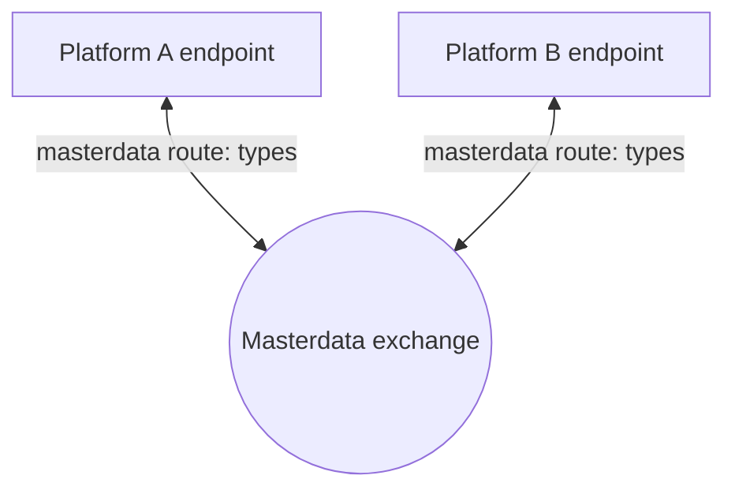

# ADR 04 - Routing of master data

- **Status:** WIP
- **Scope:** Routing masterdata to applications

## Context

In agrirouter message/file exchange protocol user has a full control and overview of data flows using concepts of endpoints and routes. Endpoints might represent an account in single cloud hosted application, or organization in a multi-tenant application or single device - specifics of what endpoint represents are up to the application that has created it, although some high level classification is available and instructs "default routing" that is created automatically by agrirouter when an endpoint is configured. Two types are important here - **virtual communication unit endpoints** are representing a single machine that has a communication unit installed that is responsible to communicate with agrirouter, while a **cloud software endpoint** represents an "office" software that is able to communicate with agrirouter and probably hosted on servers that partner controls. Default routing matches virtual communication unit endpoints with cloud software endpoints, however virtual communication units would not communicate to each other by default, same as cloud software endpoints would not communicate to each other by default, as the primary purpose of agrirouter is to facilitate optionally bidirectional device-to-cloud-to-device communication.

In case of master data exchange, however, communication between cloud software endpoints is the one required by default.

One facet of endpoints and routing in agrirouter is the visualization of data flows that agrirouter UI does to help users understand and control data flows. Routes between endpoints are simply visualized as arrows connecting blocks representing endpoints. Master data is required to preserve the same simple visualization, hence we would need to stay within the same model of a route connecting two endpoints (source and recipient) and not introduce any additional routing concepts that would require users to learn new concepts and would not be visualized in the same way as other data flows.

Master data, on the other hand, is more dangerous: connecting a new application to the network unintentionally could overwrite a lot of data. One option considered to prevent this was to require explicit routing configuration for master data.

Routing that lets users connect any endpoints to masterdata exchange arbitrarily would also allow a "split brain" situation, where unconnected groups of endpoints maintain different sets of masterdata. That adds another layer of abstraction within the tenant, which is undesirable: as soon as two such groups intersect, potentially many conflicts would have to be resolved at once.

## Decision

Each endpoint gets its own **masterdata route**: a direct connection between that endpoint and masterdata exchange, independent of every other endpoint's route. There is no shared object that endpoints route to and no per-tenant cap to enforce, so split brain cannot arise - every routed endpoint reads and writes the same canonical store.

A masterdata route carries a selection of which entity types the endpoint exchanges. By creating the route on an endpoint and selecting entity types on it, users control whether that endpoint participates in masterdata exchange and what it exchanges, in the same way they already control which endpoints talk to each other directly.

The masterdata route is a new type of route, `masterdataRoute(endpointId, types)`, not a new kind of endpoint or a shared entity - it is not visible as an endpoint from any API perspective, including G4. It differs from the normal `route(sourceEndpointId, recipientEndpointId)` used between endpoints:
- it is not directional - an endpoint's masterdata route is either present or absent, not source/recipient
- it names one endpoint and a set of entity types, rather than a pair of endpoints
- it is created and edited by the user in agrirouter; remote application connection (RAC) does not cover it, since the selection is the user's to make, not the partner's

If a user removes an endpoint's masterdata route after data from that endpoint has already been written to the SSOT, it might be tempting to clean out the data owned by that endpoint. This would be complex and potentially not what the user expects, so the data should remain. The endpoint's identifier mapping remains with it, so that re-adding the route is a matched re-load rather than a fresh reconciliation ([Disconnection and re-connection](../specification.md#disconnection-and-re-connection)).

### Not in MVP: "read only" routes

A masterdata route could carry a direction, letting a user connect an endpoint so that it receives master data without being allowed to write it back. **This is out of scope for the MVP: every masterdata route is read/write.**

Supporting it would require additional error handling, plus a way to inform applications that the user set their endpoint to "read only" for masterdata exchange, so that they do not attempt to write there. That is meaningful extra complexity for partner implementations, and it can be added later without changing the routing model described above.

## Consequences

- a masterdata route is per endpoint, not a shared object: there is no separate entity for masterdata exchange itself, so nothing new needs representing in G4 or in any endpoint listing
- from the user's perspective, masterdata exchange is controlled the same way as other data flows: giving an endpoint a route and selecting which entity types flow on it. There is no additional block to learn - the route lives directly on the endpoint
