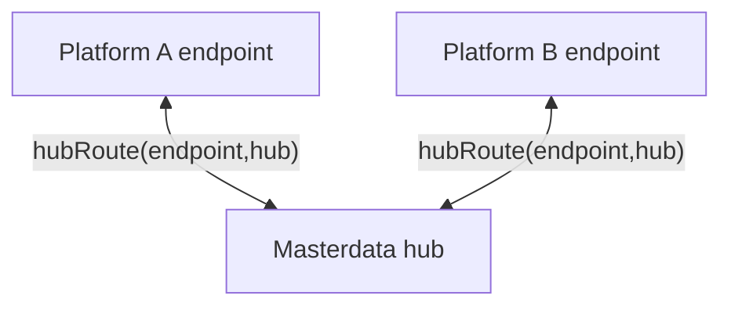

# ADR 04 - Routing of master data

- **Status:** WIP
- **Scope:** Routing masterdata to applications

## Context

In agrirouter message/file exchange protocol user has a full control and overview of data flows using concepts of endpoints and routes. Endpoints might represent an account in single cloud hosted application, or organization in a multi-tenant application or single device - specifics of what endpoint represents are up to the application that has created it, although some high level classification is available and instructs "default routing" that is created automatically by agrirouter when an endpoint is configured. Two types are important here - **virtual communication unit endpoints** are representing a single machine that has a communication unit installed that is responsible to communicate with agrirouter, while a **cloud software endpoint** represents an "office" software that is able to communicate with agrirouter and probably hosted on servers that partner controls. Default routing matches virtual communication unit endpoints with cloud software endpoints, however virtual communication units would not communicate to each other by default, same as cloud software endpoints would not communicate to each other by default, as the primary purpose of agrirouter is to facilitate optionally bidirectional device-to-cloud-to-device communication.

In case of master data exchange, however, communication between cloud software endpoints is the one required by default.

One facet of endpoints and routing in agrirouter is the visualization of data flows that agrirouter UI does to help users understand and control data flows. Routes between endpoints are simply visualized as arrows connecting blocks representing endpoints. Master data is required to preserve the same simple visualization, hence we would need to stay within the same model of a route connecting two endpoints (source and recipient) and not introduce any additional routing concepts that would require users to learn new concepts and would not be visualized in the same way as other data flows.

Master data, on the other hand, is more dangerous: connecting a new application to the network unintentionally could overwrite a lot of data. One option considered to prevent this was to require explicit routing configuration for master data.

Routing that lets users connect any endpoints to masterdata exchange arbitrarily would also allow a "split brain" situation, where unconnected groups of endpoints maintain different sets of masterdata. That adds another layer of abstraction within the tenant, which is undesirable: as soon as two such groups intersect, potentially many conflicts would have to be resolved at once.

## Decision

To not deal with "split brain" complexity whilst also keeping same UX in regards to representing data flows, we decided to create a special "masterdata hub" block in the UI that would visually resemble endpoints, but located differently on the canvas. This hub would not participate in normal routing and normal processes involving endpoints and hence is not referred to as "endpoint". Instead, it would serve as a way to connect endpoints with masterdata exchange. The masterdata hub is always available in all tenants by default.

By creating arrows to the masterdata hub, users can control which endpoints (devices, cloud software) are participating in masterdata exchange, in the same way that they already control which endpoints are talking to each other directly.

This creates a new type of entity for agrirouter: `hub`.

A `hub` is NOT an endpoint, but in many ways it behaves like one.

Where `hub` behaves like an endpoint:
- shown in the UI as a block that resembles an endpoint (but in a different location than normal endpoints)
- routes can be established with any **compatible** endpoint

Where `hub` differs from an endpoint:
- only one hub of a particular type can exist in a tenant (i.e. one `masterdata hub` per tenant) - this avoids the "split brain" situation described above
- it is not visible as an endpoint from any API perspective, including G4, and needs to be represented there as a special case (for example, when connecting to masterdata exchange during remote application connection - aka RAC)
- it is not backed by a remote application, but by `agrirouter` itself

Note that the name `hub` implies a central point that fans out data to all connected participants indiscriminately, and the single hub in a tenant does exactly that. "Single" here means one hub per tenant, the way an endpoint belongs to a tenant, not one hub per agrirouter. It would therefore be incorrect to say "our system communicates with the agrirouter masterdata hub", since no such global hub exists. You can say "the user routed our endpoint to the masterdata hub in their tenant", or "our system communicates with the masterdata API of agrirouter".

The hub also requires a new type of route: `HubRoute(endpointId, 'masterdata')`, connecting an endpoint to the hub. It differs from the normal `route(sourceEndpointId, recipientEndpointId)` used between endpoints:
- it is not directional - an endpoint is either connected to the hub or not

If a user disconnects an endpoint from the masterdata hub after data from that endpoint has already been written to the SSOT, it might be tempting to clean out the data owned by that endpoint. This would be complex and potentially not what the user expects, so the data should remain.

### Not in MVP: "read only" routes

A `HubRoute` could carry a direction, letting a user connect an endpoint so that it receives master data without being allowed to write it back. **This is out of scope for the MVP: every `HubRoute` is read/write.**

Supporting it would require additional error handling, plus a way to inform applications that the user set their endpoint to "read only" towards the masterdata hub, so that they do not attempt to write there. That is meaningful extra complexity for partner implementations, and it can be added later without changing the routing model described above.

## Consequences

- a new type of entity, `hub`, is introduced. For now it is only used for masterdata exchange, where it matches explicit UX requirements, but the same requirements may appear in other cases and we may want to reuse it there
- from the user perspective, masterdata exchange is controlled much the same way as other data flows, by visually connecting blocks with arrows. The only difference is a new block that is not technically an endpoint,

