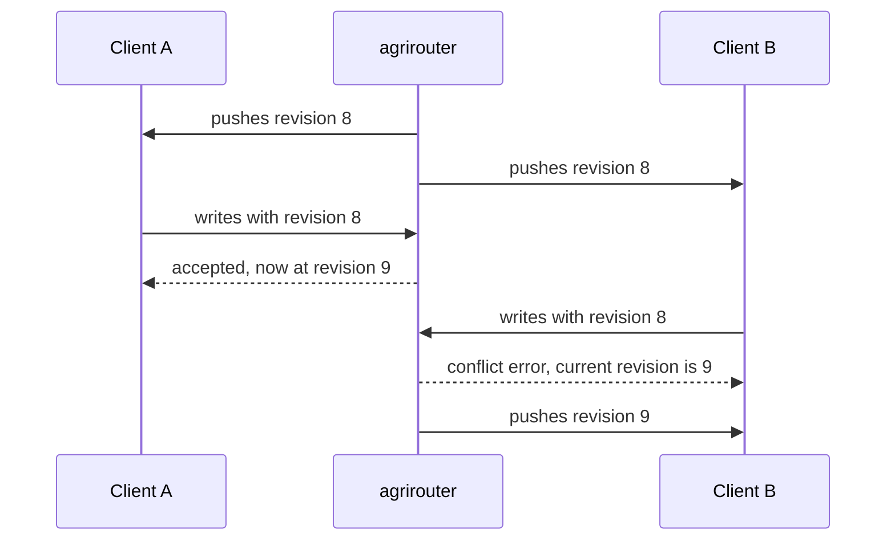
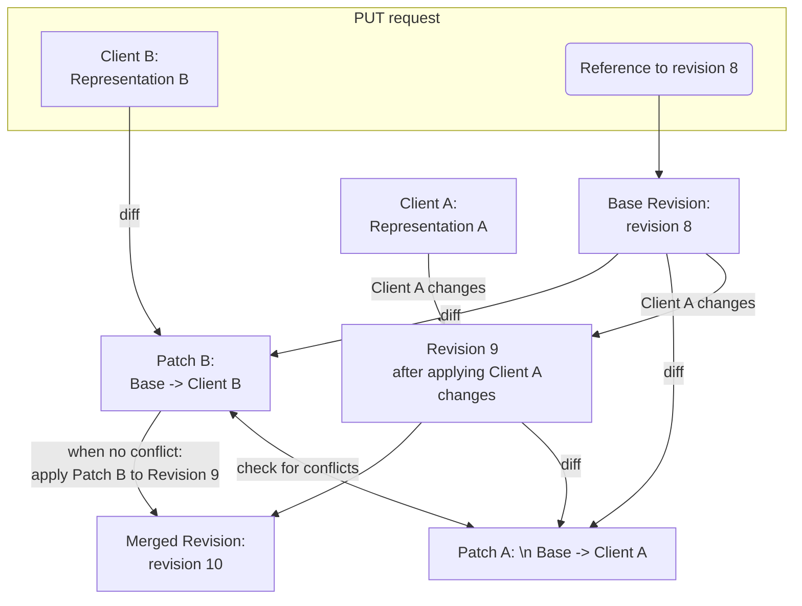

# ADR 05 - Solving stale reads

**Status:** Proposed

**Scope:** Preventing stale reads affecting masterdata sync processes

## Context

When multiple clients attempt to edit the same masterdata object concurrently, it is possible that one client will overwrite changes made by another client without being aware of it. This can lead to data inconsistencies and loss of important information.

Since we have a variety of reading processes (seeding, synchronization) that are not necessarily aware of each other, we need a cross-cutting mechanism that rejects writes based on a stale read and tells the client that this is what happened.

The simplest solution to this common issue is known as "**Compare And Swap**" (**CAS**). Every time a client wants to perform a write operation they have to provide a previous revision of the object they are trying to modify. In case the object has been modified in the meantime, the write operation will be rejected and the client will have to get the latest version of the object before re-applying their changes.

## Decision

We shall require CAS for write operations except following cases:
- object does not exist yet (_create_ operation)
- object is being or is already deactivated (for deactivation idempotency)
- requested value for the object is exactly the same as the current value (there is no need to force client to resolve any conflicts, as the resulting value is expected to be the same)
- agrirouter was able to resolve the conflict automatically via three-way merge [see Automatic conflict resolution](#automatic-conflict-resolution)

We would use revision number as the CAS value, since it is already a monotonically increasing positive integer assigned solely by agrirouter and has the properties of total order and uniqueness within the object.

The revision which agrirouter determined to be the current one for the object will be returned to the client in the response of every write operation. Note that in situations when there was a mismatch on previous revision (see exceptions above), but the write operation is still considered successful, the response might contain a revision that is NOT simply the previous revision + 1, which means clients MUST always use the revision that is returned in the response.

A partner's primary store often has nowhere to put the agrirouter revision - this is typical of outbound integrations, where the revision cannot be propagated down to the actual data store. Such clients are still expected to keep the last known revision per object, alongside their primary store rather than inside it.



### Automatic conflict Resolution


Example - two writes are done at approximately same time:

`PUT /masterdata/field-boundaries/123`

```json
{
    "harvestPeriod": {
        "validFrom": "2024-01-01",
        "validTo": "2024-12-31"
    },
    ///... all other fields are same as in the current revision
}
```

`PUT /masterdata/field-boundaries/123`

```json
{
    "boundary": {
        "type": "Polygon",
        "coordinates": [
            [
                [10.0, 50.0],
                [10.0, 51.0],
                [11.0, 51.0],
                [11.0, 50.0],
                [10.0, 50.0]
            ]
        ]
    },
    ///... all other fields are same as in the current revision
}
```

Let's assume they have been done concurrently or semi-concurrently (e.g. if one of systems lags on receiving the latest revision from sync stream or sync stream is down) by two different clients .

One of the changes might be rejected by CAS, which would potentially result in data loss in case the system that was rejected was unable to surface the conflict to the user (e.g. change coming from outbound integration such as John Deere, where we cannot control the path of user storing the data).

However, the two changes are technically not conflicting directly, they only conflict on the revision number. Given that agrirouter sees the full object for all its revisions (at different times), it may be able to apply **three-way-merge** conflict resolution.

This is how it might work (actual implementation could vary):



#### A merged revision MUST NOT be origin-suppressed

[Loop prevention](../specification.md#loop-prevention) says agrirouter never
echoes a change back to the endpoint that made it. That rule is safe only because
a write carries the whole object: whoever wrote the current value necessarily
wrote all of it, so withholding it withholds nothing the writer does not already
hold.

A three-way merge is the one case where that premise fails. The merged revision's
source is B, but its content includes A's change, which B never sent and - if the
merge is suppressed as B's own echo - never learns about.

agrirouter MUST therefore mark a revision it synthesised and deliver it to its
source endpoint as well. The exemption is narrow: it applies to revisions
agrirouter produced by merging, never to a revision a client wrote as sent.

## Rejected alternatives

### Conflict-free replicated data types (CRDTs)

We considered modelling master-data objects as **conflict-free replicated data types
(CRDTs)**, which would merge concurrent edits automatically and would decouple write
acceptance from sync liveness (with CAS, a client that cannot reach agrirouter cannot
learn the fresh revision it needs to write). We reject them because for the fields
that carry an object's actual meaning - a boundary polygon, a name, a status - there
is no meaningful automatic merge, so a CRDT degrades to silently discarding one edit,
which is exactly the loss this ADR exists to prevent, only harder to notice. They also
impose per-object causal metadata (version vectors, tombstones) on every partner and
on the wire, where CAS needs only a single integer. Using CRDTs *inside* a
partner's own store remains a fine implementation choice.

## Consequences

Special cases:
- when two clients attempt to create the same object concurrently, only one of them will succeed, and the other will receive a conflict error. The client that received the conflict error will have to fetch the latest version of the object and apply their changes or decide to discard the update. Even though this is not a CAS operation per se, it still constitutes a conflict.
- when a client attempts to deactivate an object simultaneously with another client attempting to modify it, this is considered a conflict and only one of the clients will succeed. Even though further deactivations are idempotent and their prior revision is ignored when the object is already deactivated, for the first deactivation attempt, CAS mechanism must be applied.

Consequences of automatic merge:
- a revision can exist that no client sent, which means `sourceEndpointId` stops being a complete answer to "who wrote this". agrirouter MUST record that a revision was merged, and MUST NOT origin-suppress it.
- the merging client receives a revision back on the same object it just wrote successfully. Since apply is idempotent and the returned revision is authoritative anyway, this needs nothing new on the client beyond the usual "adopt the revision agrirouter returns".

