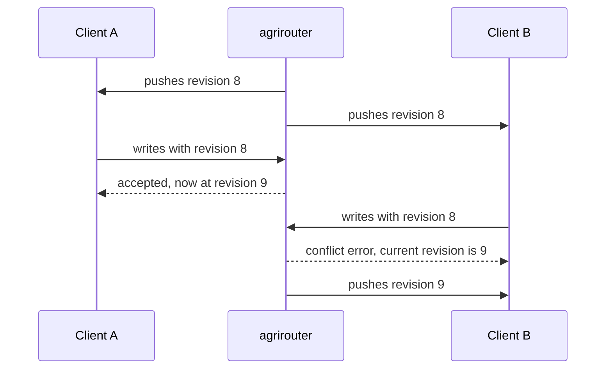
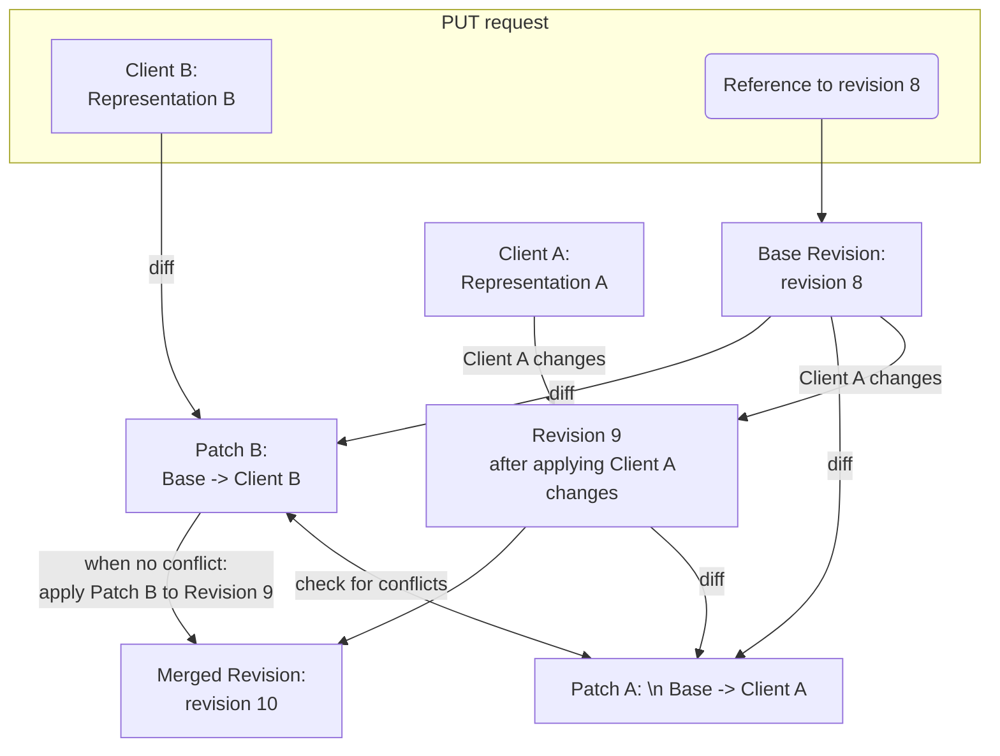

# ADR 05 - Solving stale reads

**Status:** Proposed

**Scope:** Preventing stale reads affecting masterdata sync processes

## Context

When multiple clients attempt to edit the same masterdata object concurrently, it is possible that one client will overwrite changes made by another client without being aware of it. This can lead to data inconsistencies and loss of important information.

Since we have a variety of reading processes (seeding, synchronization) that are not necessarily aware of each other, we need a cross-cutting mechanism that rejects writes based on a stale read and tells the client that this is what happened.

The simplest solution to this common issue is known as "**Compare And Swap**" (**CAS**). Every time a client wants to perform a write operation they have to provide a previous revision of the object they are trying to modify. In case the object has been modified in the meantime, the write operation will be rejected and the client will have to get the latest version of the object before re-applying their changes.

## Decision

We shall require CAS for write operations except following cases:
- object does not exist yet (_create_ operation)
- object is being or is already deactivated (for deactivation idempotency)
- requested value for the object is exactly the same as the current value (there is no need to force client to resolve any conflicts, as the resulting value is expected to be the same)
- agrirouter was able to resolve the conflict automatically via three-way merge [see Automatic conflict resolution](#automatic-conflict-resolution)

We would use revision number as the CAS value, since it is already a monotonically increasing positive integer assigned solely by agrirouter and has the properties of total order and uniqueness within the object.

The revision which agrirouter determined to be the current one for the object will be returned to the client in the response of every write operation. Note that in situations when there was a mismatch on previous revision (see exceptions above), but the write operation is still considered successful, the response might contain a revision that is NOT simply the previous revision + 1, which means clients MUST always use the revision that is returned in the response.

A partner's primary store often has nowhere to put the agrirouter revision - this is typical of outbound integrations, where the revision cannot be propagated down to the actual data store. Such clients are still expected to keep the last known revision per object, alongside their primary store rather than inside it.



### Automatic conflict Resolution


Example - two writes are done at approximately same time:

`PUT /masterdata/field-boundaries/123`

```json
{
    "harvestPeriod": {
        "validFrom": "2024-01-01",
        "validTo": "2024-12-31"
    },
    ///... all other fields are same as in the current revision
}
```

`PUT /masterdata/field-boundaries/123`

```json
{
    "boundary": {
        "type": "Polygon",
        "coordinates": [
            [
                [10.0, 50.0],
                [10.0, 51.0],
                [11.0, 51.0],
                [11.0, 50.0],
                [10.0, 50.0]
            ]
        ]
    },
    ///... all other fields are same as in the current revision
}
```

Let's assume they have been done concurrently or semi-concurrently (e.g. if one of systems lags on receiving the latest revision from sync stream or sync stream is down) by two different clients .

One of the changes might be rejected by CAS, which would potentially result in data loss in case the system that was rejected was unable to surface the conflict to the user (e.g. change coming from outbound integration such as John Deere, where we cannot control the path of user storing the data).

However, the two changes are technically not conflicting directly, they only conflict on the revision number. Given that agrirouter sees the full object for all its revisions (at different times), it may be able to apply **three-way-merge** conflict resolution.

This is how it might work (actual implementation could vary):



#### A merged revision is returned, not streamed

[Loop prevention](../specification.md#loop-prevention) says agrirouter never
echoes a change back to the endpoint that made it. A three-way merge looks like a
case for an exemption: the merged revision's source is B, but its content includes
A's change, which B never sent.

It is not, because **a merged revision only ever comes into existence inside a
write request.** The merge is triggered by B's stale-base write, so at the moment
agrirouter synthesises it there is always an open response to hand it back on. B
therefore receives the merged object synchronously, as the resulting canonical
object in its own write response, and the stream is never the only way to reach
it. This is the same channel through which a client already learns an
`agrirouterId` it did not author.

The requirement this puts on participants is that **a write response is applied
exactly as a delivered object is** - it is not merely an acknowledgement carrying
a revision. Detecting a merge needs no diff against what was sent: the response
carries a revision that is not the client's precondition + 1.

The alternative - treat the response as an acknowledgement only and stream the
merged revision back to its source - is
[rejected below](#streaming-the-merged-revision-to-its-source).

## Rejected alternatives

### Streaming the merged revision to its source

Keep the local store a pure projection of the event stream: a write response
carries only the revision, and agrirouter marks a revision it synthesised and
exempts it from origin suppression so the merged content arrives on the stream.

It is the more appealing of the two at first sight - one channel carries content,
so a participant applies frames blindly in stream order and needs no comparison -
and it is rejected because it loses A's change in the case it exists to protect.

**The split channel breaks CAS.** The writer must take the revision from the
response, since its own ordinary writes are origin-suppressed and would otherwise
never yield a fresh precondition. After a merge it therefore holds revision 10 as
its token while its content is still the pre-merge value it sent. Its next write
passes CAS, and A's merged-in change is overwritten with no conflict, no error and
no trace.

Closing that requires the writer to notice the merge - the same response check
this alternative was meant to avoid - and then hold its write path until its
stream consumer has caught up, coupling the two. The client burden ends up larger
than the one it avoids, on top of a `merged` flag that has to be carried on the
delivery record, branched on in the suppression predicate, and kept correct
through compaction.

### Conflict-free replicated data types (CRDTs)

We considered modelling master-data objects as **conflict-free replicated data types
(CRDTs)**, which would merge concurrent edits automatically and would decouple write
acceptance from sync liveness (with CAS, a client that cannot reach agrirouter cannot
learn the fresh revision it needs to write). We reject them because for the fields
that carry an object's actual meaning - a boundary polygon, a name, a status - there
is no meaningful automatic merge, so a CRDT degrades to silently discarding one edit,
which is exactly the loss this ADR exists to prevent, only harder to notice. They also
impose per-object causal metadata (version vectors, tombstones) on every partner and
on the wire, where CAS needs only a single integer. Using CRDTs *inside* a
partner's own store remains a fine implementation choice.

## Consequences

Special cases:
- when two clients attempt to create the same object concurrently, only one of them will succeed, and the other will receive a conflict error. The client that received the conflict error will have to fetch the latest version of the object and apply their changes or decide to discard the update. Even though this is not a CAS operation per se, it still constitutes a conflict.
- when a client attempts to deactivate an object simultaneously with another client attempting to modify it, this is considered a conflict and only one of the clients will succeed. Even though further deactivations are idempotent and their prior revision is ignored when the object is already deactivated, for the first deactivation attempt, CAS mechanism must be applied.

Consequences of automatic merge:
- a revision can exist that no client sent, which means `sourceEndpointId` stops being a complete answer to "who wrote this". Whether agrirouter records that a revision was merged is an internal matter: it does not affect what is delivered to whom.
- **a write response is a delivery, not an acknowledgement.** The merging client gets back content it did not send, so adopting the returned revision is not enough - the response body goes through the same apply path a stream frame does. That is a second entrance to apply, and the reason for the two rules below.
- **apply MUST be revision-guarded.** With a second channel, "later in the stream" stops meaning "newer": a response carrying revision 10 can land after the stream consumer has applied 11. A participant MUST NOT apply an object whose `revision` is lower than the one it holds. The comparison is what [ADR 03](./03-revision-model.md) built a totally ordered integer for.
- **an unobserved outcome means the object is unknown.** A participant whose write neither succeeds nor fails visibly - a dropped connection after agrirouter committed - MUST NOT assume its own value stands. It re-requests the object ([lazy loading](../specification.md#requesting-objects-lazy-loading)) or retries the write, which returns the current revision either way. Under a merge-and-stream design the stream covered this silently.
- origin suppression stays unconditional, so [ADR 07](./07-sync-streaming.md) needs no exception and the delivery record needs no marker.

