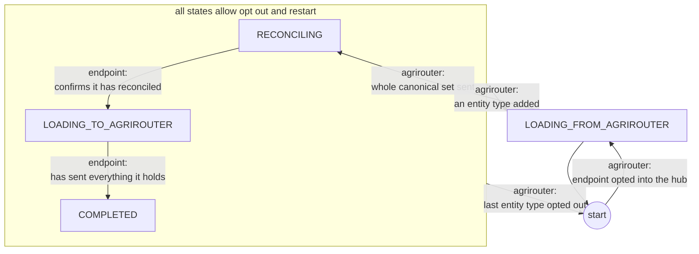
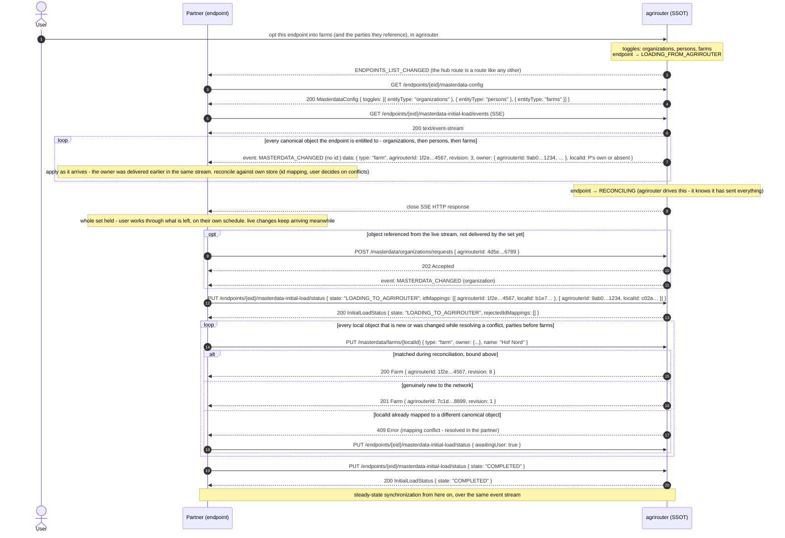
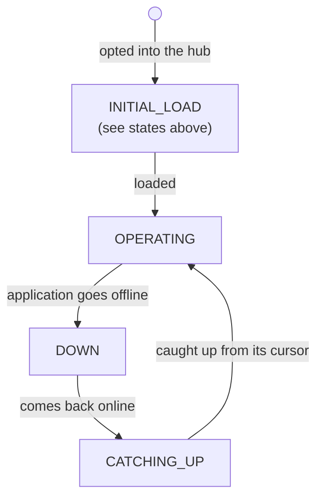

# ADR 06 - Initial load

- **Status:** WIP
- **Scope:** Bringing a newly connected or returning endpoint into agreement with the canonical master data

## Context

[ADR 01](./01-reference-architecture.md) and [ADR 07](./07-sync-streaming.md) describe steady-state synchronization: once every participant is in step, a change made in one system propagates through the canonical store to the others. But the *first* time an endpoint joins master-data exchange - when the user routes it to the [masterdata hub](./04-routing.md) - there is a bootstrap problem that steady-state sync does not cover.

Note on the naming: the initial load process to fix this is also known as "seeding". This term is not used in the specification to avoid conflating with "seeding" as in "planting seeds", which might be introduced later when we cover other types of data. For exmaple workplans and field operations might refer to _seeding_ in that context. Hence only "initial load" is used in the specs.

The newly connected system is rarely empty. Users have usually already entered master data into it by other means, so it holds **its own set of entities under its own `localId`s**. At the same time, agrirouter already holds the canonical set the rest of the network agreed on. Neither side is a blank slate, and the two sets overlap in unknown ways: the same real-world field may exist on both sides under different identifiers, or exist in only one.

Therefore, bringing the two into agreement has two directions:

- **From agrirouter:** the endpoint must receive what the network already knows, so its user immediately sees the shared master data.
- **To agrirouter:** the network must learn what the endpoint holds that is not canonical yet, so nothing the user already had is lost.

The ordering is what makes this non-trivial. If the endpoint blindly pushed all of its local objects first, it would duplicate everything the network already had. So it must first learn the canonical set, reconcile its own data against it (via [identifier mapping](../specification.md#identifier-mapping)), and only then send what is genuinely new or was changed while resolving a conflict.

This is a mix of technical and organizational concerns: some of it is a defined message flow, and some of it - conflicts, granularity mismatches, differing required attributes - can only be resolved by a human in the partner's own software.

## Decision

Model initial load as an explicit **state machine per endpoint** that agrirouter holds. There is one state and one stream per endpoint, covering every entity type it is opted into, rather than one of each per entity type. [Entity dependencies](../specification.md#entity-dependencies) - a field cannot be applied before the farm it references - are respected by the *order* of the one stream, which agrirouter produces: it is the same tier order the live stream's catch-up already uses ([ADR 07](./07-sync-streaming.md#the-sweep-delivers-in-tier-order)), so the endpoint has nothing to sequence. An earlier revision of this ADR tracked the state per entity type and left the ordering to the endpoint; see [the rejected alternative](#rejected-alternative-a-state-machine-and-a-stream-per-entity-type) for why that was dropped.

The flow, per endpoint:

1. **Opt in.** The user routes the endpoint to the [masterdata hub](./04-routing.md) and opts it into one or more entity types. The endpoint enters `LOADING_FROM_AGRIROUTER`.
2. **Load from agrirouter.** agrirouter sends the endpoint every canonical object of every opted-in type it is entitled to receive, on the endpoint's one stream, ordered so that a referenced object precedes the objects referencing it. This direction is well-defined precisely because [agrirouter is the SSOT](./01-reference-architecture.md) - it already holds the authoritative set to hand over, and the order to hand it over in.
3. **Set delivered.** agrirouter closes the HTTP response once it has sent everything, and moves the endpoint to `RECONCILING`. This is mechanical and agrirouter drives it: it knows it has sent everything, so nothing needs to be reported back. There is no in-band end marker, because a dropped connection closes the response the same way an orderly finish does; the state is what records that the set was sent, and an endpoint that finds itself still at `LOADING_FROM_AGRIROUTER` connects again.
4. **Confirm.** Reconciliation potentially finishes much later. Whatever conflicts it surfaced are settled in the partner's software - by a user where the partner's own rules cannot settle them - on a schedule agrirouter does not control. The endpoint confirms after *that*, moving to `LOADING_TO_AGRIROUTER`. This transition is explicit precisely because agrirouter can see the previous moment and not this one.
5. **Load to agrirouter.** The endpoint now sends the objects it holds that the canonical set did not contain, plus any it changed while resolving conflicts. Because it reconciled first, it sends genuinely new objects instead of duplicates of ones it just received.
6. **Complete.** When the endpoint has sent everything, it enters `COMPLETED`, and ordinary steady-state synchronization ([ADR 07](./07-sync-streaming.md)) applies from then on.

The same six steps run again if the endpoint is re-routed to the hub, or if an
entity type is added to it - the set is fixed when a load starts, and there is
one load per endpoint, so a type opted in later means the load starts over
covering every opted-in type, from whichever state the endpoint was in. The
second time the endpoint's identifier mapping is still there, so step 2 delivers
objects the endpoint recognises and steps 4 and 5 have little to do
([Disconnection and re-connection](../specification.md#disconnection-and-re-connection)).
A participant that removed the endpoint and onboarded a new one instead gets no
such discount: the mapping was keyed by the endpoint it deleted
([ADR 11](./11-mapping-scope.md)), so the new endpoint runs a first load in full.
`previousLoadCompletedAt` on the initial-load resource is what tells the endpoint
which of the two it is in, and an endpoint that ignores it duplicates its own data.
Opting a type out leaves the state alone - the endpoint is still in step for what
it remains opted into - unless it was the last one, in which case there is
nothing left to be in step for and the state goes with it.

The `RECONCILING` state enables differentiating between 3 and 4. In its absence, agrirouter would be unable to say whether it still owed the endpoint data or was waiting on a partner app - a distinction it needs for its own scheduling ([ADR 07](./07-sync-streaming.md)), and one the user-facing UI could show as well.

### There is no way to ask for the set again

**Nothing re-enters `LOADING_FROM_AGRIROUTER` but opt-in.** Neither a partner nor
a user can ask agrirouter to send an endpoint its canonical set again; setting
that state on the `status` resource is a `409` from everywhere. Opting an entity 
type in still restarts the load, because the set is
fixed when a load starts - that is the only way back in, and it is a user's
decision about what to share rather than a maintenance lever.

**Why a partner does not start its own load.** What follows a load is
reconciliation, and reconciliation surfaces the conflicts a person might need to
settle. A load begun without a user would land in `RECONCILING` in front of
nobody, and have agrirouter report the endpoint as waiting on someone who was
never asked.

### The flow in concrete calls

The same six steps expressed as the actual operations of the master-data API,
for an endpoint opted into organizations, persons and farms - the smallest
dependency-closed set that includes farms. `{eid}` is the endpoint's
`externalEndpointId`.

Points worth noting about the calls themselves:

- **The confirmation carries what reconciliation decided.** Matching a canonical
  object to one the endpoint already holds is a fact only the endpoint has, and
  it has to reach agrirouter or the object is sent back as new and duplicated.
  The bindings ride on the confirmation rather than one call per object, because
  matching happens over a whole set - see
  [ADR 10](./10-identifier-binding.md). It is also why the loop above has a `200`
  branch at all: an object matched and then edited during conflict resolution is
  an update to a canonical object, not a creation.
- **There is one initial load /events resource per endpoint.** The form of the
  stream is the same as the persistent event stream (`GET /masterdata/events`) to
  simplify implementation, but it is a separate resource because the way initial
  load accesses data is quite different from the way steady-state sync does. It is
  one per endpoint, `.../masterdata-initial-load/events`, because that is the
  granularity the state has, and because the order the set has to arrive in runs
  *across* entity types: it is the sweep [ADR 07](./07-sync-streaming.md) already
  runs for catch-up, restricted to one endpoint and started from zero, and a
  sweep is one pass over every type. The set a stream delivers is fixed when the
  load starts; a type opted in while it runs restarts the load rather than being
  missed or advanced having been sent nothing.
- **Dependency order is agrirouter's.** The stream delivers a referenced object
  before the objects referencing it, by tier, and opt-in is dependency-closed, so
  every target is in the set. The endpoint applies each object as it arrives and
  sequences nothing. What the order does *not* say is where one type ends and
  another begins, or that the order will stay the way it is: the specification
  reserves the right to change it, and the only promise is that references
  resolve. During a load the one source of a reference that does not resolve yet
  is the live stream, which is independent of this one; the endpoint requests
  such an object rather than waiting.
- **Opting in is what starts the first load, and opt-in is the user's.** The
  toggles are set in agrirouter next to the hub-route arrow; `GET
  .../masterdata-config` is how a partner reads them, and there is no operation
  to change them. agrirouter also drives the step to `RECONCILING` - it is the
  side that knows the set has been sent - and the restart when a further type is
  added. The endpoint drives the confirmation and the completion through
  `PUT .../masterdata-initial-load/status`; every other transition there is a
  `409`, including any attempt to set `LOADING_FROM_AGRIROUTER`. Repeating the
  transition the endpoint is already in is `200`
  ([below](#repeating-a-transition-is-not-a-conflict)).
- **Opting out and back in is the only way back, and only the user can do it.**
  Removing an entity type stops its delivery and leaves the endpoint's state
  alone - or discards it, if it was the last type - and adding it back restarts
  the load for every opted-in type.
- **The endpoint reads the state machine, it does not keep one.** agrirouter is
  authoritative for every phase, including whether the canonical set finished
  arriving (that is the difference between
  `LOADING_FROM_AGRIROUTER` and `RECONCILING`). So
  `GET /endpoints/{eid}/masterdata-initial-load/status` answers both questions an
  endpoint that restarted mid-flow has: whether it still owes a push, and whether
  it holds the whole set.
- **The to-agrirouter direction uses the ordinary send operation.**  There is no
  special initial-load write path - `PUT /masterdata/farms/{localId}` is the same
  call the endpoint uses in steady state, and the same `409` signals a
  [non-unique mapping](#granularity-mismatches-and-differing-requirements).
- **There is no "not started" state.** An endpoint has an initial-load state
  only once it is opted into something - the absence of any toggle in
  `masterdata-config` already says it does not participate, and a second
  representation of that would allow the two to disagree. Opting the last type
  out discards the state along with the toggle, so opting back in reloads rather
  than resumes - see above for why resuming would not be safe.

### Repeating a transition is not a conflict

An endpoint that sets the state it is already in gets `200` and the
current status, never the `409` reserved for transitions out of order. Where the
request carries `idMappings`, agrirouter applies every pair again - each bind is
idempotent on its own ([ADR 10](./10-identifier-binding.md)) - and recomputes
`rejectedIdMappings` against the mapping as it now stands.

The case that needs this is a lost response on the confirmation. The endpoint
sent its bindings and does not know whether they were recorded, and it cannot
ask: agrirouter does not serve the mapping back
([ADR 10](./10-identifier-binding.md#rejected-alternatives)). Repeating the
confirmation is the one way it has to find out, and answering that with `409`
would leave it stuck in exactly the phase where a user has just finished work.

### Conflicts are resolved in the application, not in agrirouter

While reconciling, the endpoint may find that its own object and the canonical object for the same real-world entity disagree. Consistent with [ADR 01](./01-reference-architecture.md), agrirouter does not adjudicate field-level conflicts: it provides the canonical set to reconcile against, and the **partner's own software presents the conflict to the user**. This keeps agrirouter out of business decisions it has no basis to make, and it is why the "to agrirouter" step can carry objects the user changed during resolution.

### Where the user is when conflicts appear

The conflicts are in the partner's software, but the user who connected the endpoint is not necessarily there. Three questions follow: whether agrirouter has to be told that conflicts exist, whether it should send the user somewhere, and what happens when no user is present at all.

**agrirouter is told that reconciliation needs user action.** The endpoint raises `awaitingUser` flag on its status the moment its own software detects that reconciliation is needed, and agrirouter clears it on the next forward transition. That is the whole of the reporting:

| what agrirouter holds | what agrirouter UI says about the endpoint |
| --- | --- |
| `LOADING_FROM_AGRIROUTER`, `awaitingUser` unset | agrirouter is sending your master data to *app* |
| `LOADING_FROM_AGRIROUTER`, `awaitingUser` set | waiting for you in *app* |
| `RECONCILING`, `awaitingUser` unset | *app* is working through your master data |
| `RECONCILING`, `awaitingUser` set | waiting for you in *app* |
| `LOADING_TO_AGRIROUTER`, `awaitingUser` unset | *app* is sending its data |
| `LOADING_TO_AGRIROUTER`, `awaitingUser` set | waiting for you in *app* |
| `COMPLETED` | in sync |

`awaitingUser` is a flag signifying that user action is needed to perform reconciliation. It is reset by a transition agrirouter owns rather than by a second call from the endpoint. It is one flag per endpoint, like the resource it sits on: reconciliation is one job in the partner's software, and a user who is needed for fields is needed, full stop.

**Every phase before `COMPLETED` can need a person.** Reconciling against the canonical set is the obvious source of conflicts, and they surface object by object as objects arrive - so the flag can be raised while the set is still being delivered, not only once it is complete. The push direction produces them too: a `PUT /masterdata/farms/{localId}` can come back `409` because the canonical object it names is already mapped to a different `localId` ([below](#granularity-mismatches-and-differing-requirements)), and resolving that is a decision in the partner's software just the same.

The flag therefore spans two windows rather than three. `LOADING_FROM_AGRIROUTER` and `RECONCILING` are one window - the same reconciliation work, before and after the last object lands - cleared by the confirmation. `LOADING_TO_AGRIROUTER` is the second, cleared by the completion. The `LOADING_FROM_AGRIROUTER` → `RECONCILING` step does **not** clear it: that transition is agrirouter saying it has finished sending, which asserts nothing about whether the user has finished deciding.

**An unset flag says nothing about the user.** It is ambiguous in two directions at once - the endpoint may not report the flag at all, or may report it and have nothing to raise yet. So reporting it only ever *upgrades* a label, and an endpoint that never sends it costs precision rather than correctness.

The flag is independent of the fact that the whole canonical set has been received: conflicts surface object by object as they arrive.

**A link, not a redirect.** When the route is created there is nothing to resolve yet, so redirecting then lands the user on an empty page, and the flag that says otherwise arrives hours later. So the partner supplies a **master-data resolution URI**, which agrirouter renders as a link throughout initial load - the call to action while `awaitingUser` is set, quiet otherwise. Opaque, not per conflict, and where none is supplied the label stands on its own.

**It is per endpoint and sits on the endpoint**. A partner with one endpoint per customer organization would otherwise potentially land the user in the wrong one, and nothing would catch it.

**The user is in agrirouter when a load starts.** The canvas arrow ([ADR 04](./04-routing.md)) and the toggles are two gates on the same thing, both in agrirouter, so the work is always somewhere the user is not. That is what the label and the link exist for.

A load is never **started automatically**: default routing never creates a `HubRoute`. Opting into master data stays an explicit act by a user, for the reason [ADR 04](./04-routing.md) gives - connecting an application unintentionally can overwrite a lot of data - so an endpoint created by a partner that supports master data is not silently opted in, and no initial load starts with nobody to tell.

**Waiting is not free**, which is why the partner should not rely on the user wandering back. Delivery does not expire, so a resolution left half done does not cost a reload of the canonical set ([ADR 07](./07-sync-streaming.md)) - but the set keeps moving underneath it, so the longer a conflict sits the likelier it is that the object the user is deciding about has changed again since it was surfaced. Pending resolution SHOULD therefore be surfaced in the partner's own UI rather than only on the screen the user happened to be on.

### Granularity mismatches and differing requirements

Two problems surface at initial load that agrirouter deliberately does **not** try to solve:

- **n:1 / non-unique mappings.** Two objects in one system can correspond to a single object in another - for example two fields that are a single field elsewhere. This is not solvable centrally, because the ambiguity exists even without agrirouter in the loop. So an endpoint MUST NOT map two of its own `localId`s onto the same canonical object; agrirouter rejects the second, pushing resolution back to the partner. See [Asymmetric and non-unique mappings](../specification.md#asymmetric-and-non-unique-mappings).
- **Differing required attributes.** One system may require a customer on every field where another treats it as optional. The **stricter recipient** handles this - e.g. by asking the user for a fallback value - rather than agrirouter enforcing one system's rules on another or silently dropping data.

### The initial-load stream is retaken, not resumed

Two kinds of interruption look alike and are handled differently.

An already-`COMPLETED` endpoint going offline while changes accumulate is the live stream's concern. Its application resumes from the last delivery position it durably applied - the **delivery cursor** [ADR 03](./03-revision-model.md) calls for rather than the per-object `revision` - carried as `Last-Event-ID`; its shape, and the fact that it cannot expire, are described in [ADR 07](./07-sync-streaming.md).

A connection dropping mid-load is not that case, and the live stream's resume mechanic does not transfer to it. An initial-load stream delivers a fixed set rather than a sequence of changes, so it carries no position: its frames carry no `id:`, it does not accept `Last-Event-ID`, and a dropped connection is recovered by connecting again and taking the set from the beginning. The order the set arrives in is agrirouter's and may change, so there is no offset to pick up from either. A drop therefore costs the whole set, which is the same price an interrupted sweep pays on the live stream and is bounded the same way ([ADR 07](./07-sync-streaming.md)). What the endpoint reads to decide whether it must reconnect is its state: agrirouter advances it to `RECONCILING` only after sending everything, so an endpoint still at `LOADING_FROM_AGRIROUTER` after the response closed has not been delivered in full.

Here is approximate lifecycle that we are expected to support:

### Rejected alternative: a state machine and a stream per entity type

An earlier revision of this ADR kept the state, the status resource and the
stream per entity type: `.../masterdata-initial-load/{entityType}/events` and
`.../{entityType}/status`, each advancing on its own. It bought three things.
Closing a stream advanced exactly the type it carried, so a type opted in while
another was streaming needed no special handling. A dropped connection cost one
type's set rather than every type's. And the confirmation carried the bindings of
one type, matching the granularity a partner might reconcile at.

What it cost was the order. One stream can deliver a referenced object before the
object referencing it; several cannot promise that between them, so ordering
across types moved to the endpoint - open the streams in dependency order, or
tolerate references that resolve only once another stream has delivered their
target. Every partner implemented that separately, the partner that opened its
streams in parallel got dangling references it then had to request one by one,
and the endpoint was deriving on its side an order agrirouter already produces
for the same objects on the live stream's catch-up
([ADR 07](./07-sync-streaming.md#the-sweep-delivers-in-tier-order)). It also
meant five states to poll, five confirmations to send and five flags to raise for
what is one job in the partner's software.

One state and one stream per endpoint puts the order where the knowledge is.
The one situation the per-type design handled for free - a type added mid-load -
is handled by fixing the set when a load starts and restarting the load when the
set would change, which costs a repeat delivery of already-matched objects and
nothing else. The per-type granularity of a dropped connection is given up: a
drop costs the whole set, as an interrupted sweep does on the live stream.

## Consequences

- agrirouter holds an explicit per-endpoint initial-load state, covering every entity type the endpoint is opted into, and exposes it as a `status` resource that the endpoint reads and advances by setting its state (confirm receipt, then complete), as part of the master-data API.
- The "from agrirouter, then to agrirouter" ordering is what prevents duplication: reconciliation happens against the canonical set before the endpoint sends anything.
- Some of the hard parts are intentionally organizational: conflict resolution and granularity mismatches live in partner software, so the protocol defines the flow and the failure signals but not the resolution.
- Initial load has no position of its own. A returning `COMPLETED` endpoint is served by the live stream from its application's cursor; an interrupted load is taken again from the beginning, and the endpoint's state, not the stream, says whether that is needed.
- agrirouter learns that a user action is needed, never what for. `awaitingUser` is one bit per endpoint, monotonic within a window and cleared by the endpoint-driven transition that ends it.
- The bit is advisory. Endpoints that omit it cost only label precision, and nothing in the flow branches on it.
- `masterdata-config` is a `GET` and nothing else. The toggles are the user's, set in agrirouter, and a partner reads them rather than writing them. Default routing never opts an endpoint into the hub.
- The resolution URI sits on the endpoint resource and has to be per endpoint: a partner with one endpoint per customer organization would otherwise land the user in the wrong one. The master-data API has no configuration write at all.
- Either endpoint-driven transition *may* wait on a human - the confirmation on reconciliation, the completion on a rejected push - and neither necessarily does: an endpoint with no conflicts, or one whose conflicts its own rules settle, advances straight through. What agrirouter cannot tell is which case it is in, since it sees only when it finished sending. So an endpoint can sit in either loading state for days without anything being wrong, and no timeout on them would be meaningful.
- `RECONCILING` separates "agrirouter still owes data" from "the endpoint still owes a decision". agrirouter needs that distinction for its own scheduling - on a reconnect it must know whether a sweep is outstanding ([ADR 07](./07-sync-streaming.md)) - and publishing it rather than hiding it keeps a single representation of the phase, consistent with there being no "not started" state.
- The state machine has agrirouter-driven and endpoint-driven edges, and they divide cleanly: every entry into `LOADING_FROM_AGRIROUTER` is agrirouter's - opt-in, an added entity type, a user asking for the set again - as is the step to `RECONCILING`; the two exits, the confirmation and the completion, are the endpoint's.
- Confirming from `LOADING_FROM_AGRIROUTER` is a `409`. An endpoint cannot have reconciled a set it has not finished receiving.
- Repeating the current transition is `200`, with `idMappings` re-applied and `rejectedIdMappings` recomputed. A lost response on the confirmation is recovered by sending it again, which is the only recovery available since the mapping cannot be read back.
- The initial-load stream is per endpoint, like the state it serves, and agrirouter orders it: a referenced object precedes the objects referencing it, across every opted-in type, and opt-in closure guarantees the target is in the set. The endpoint applies objects as they arrive and sequences nothing. The order is agrirouter's to change, and the specification says so; an endpoint that reads anything but resolvable references out of it is relying on an implementation detail.
- Adding an entity type restarts the endpoint's load. The set is fixed when a load starts, and there is one load per endpoint, so a type opted in later is delivered by sending the whole set again. Already-loaded objects arrive matched, so the repeat costs bandwidth, not reconciliation. Opting a type out leaves the state where it is, unless it was the last one.
- Initial-load state is keyed per endpoint, while the delivery cursor is keyed per application ([ADR 07](./07-sync-streaming.md)). The live stream therefore carries endpoints at every phase of initial load at once, and an application MUST NOT treat "my stream is in initial load" as a single condition.
- Because event delivery does not expire, an endpoint can sit in either loading state indefinitely without putting its application's position at risk. The only cost of a slow user is a canonical set that has moved on.
- Several details remain open: best-practice guidance for implementors on conflicts and differing requirements.
