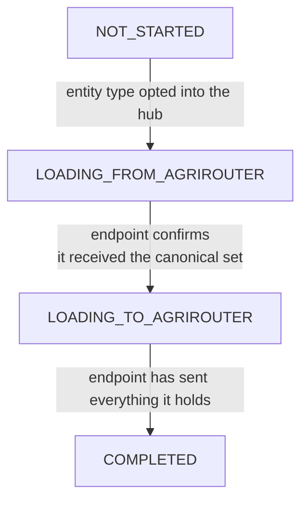
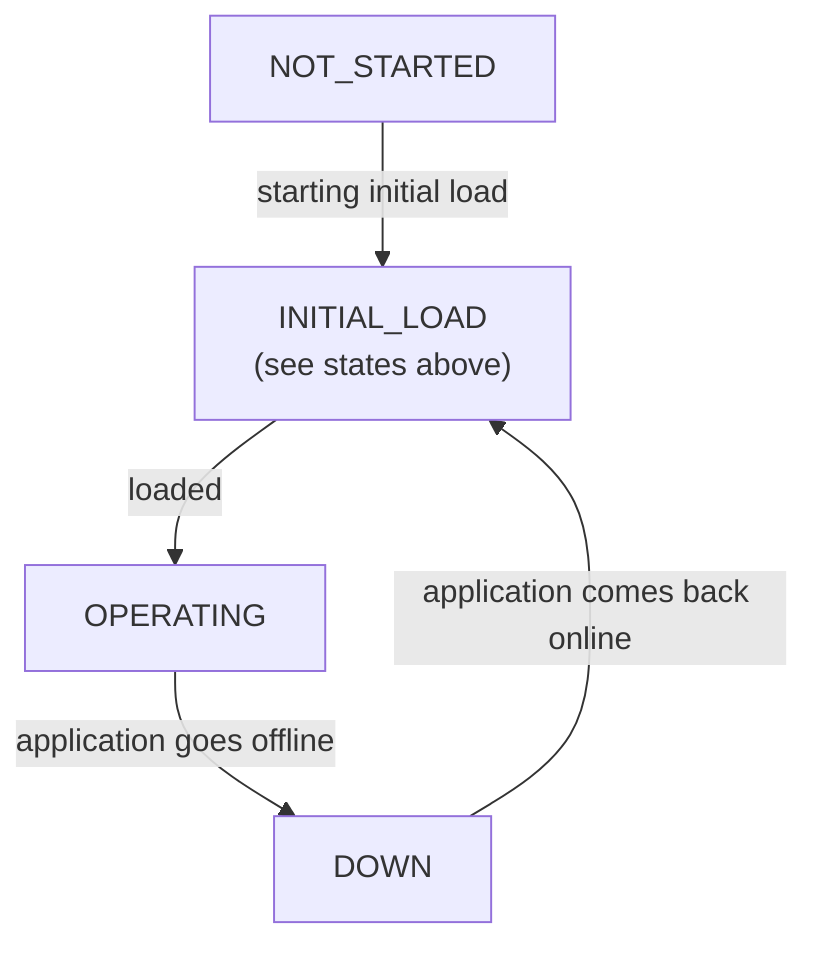

# ADR 06 - Initial load

- **Status:** WIP
- **Scope:** Bringing a newly connected or returning endpoint into agreement with the canonical master data

## Context

[ADR 01](./01-reference-architecture.md) describes steady-state synchronization: once every participant is in step, a change made in one system propagates through the canonical store to the others. But the *first* time an endpoint joins master-data exchange - when the user routes it to the [masterdata hub](./04-routing.md) - there is a bootstrap problem that steady-state sync does not cover.

Note on the naming: the initial load process to fix this is aka as "seeding", which is not used in the specification to avoid conflating with "seeding" as in planting seeds that might be introduced later when we cover other types of data, including possibly workplans and/or field operations, which might refer to seeding in that context, hence only "initial load" is used in the specs.

The newly connected system is rarely empty. Users have usually already entered master data into it by other means, so it holds **its own set of farms, fields and customers under its own `localId`s**. At the same time agrirouter already holds the canonical set the rest of the network agreed on. Neither side is a blank slate, and the two sets overlap in unknown ways: the same real-world field may exist on both sides under different identifiers, or exist on only one.

Bringing the two into agreement therefore has two directions:

- **From agrirouter:** the endpoint must receive what the network already knows, so its user immediately sees the shared master data.
- **To agrirouter:** the network must learn what the endpoint holds that is not canonical yet, so nothing the user already had is lost.

The ordering is what makes this non-trivial. If the endpoint blindly pushed all of its local objects first, it would duplicate everything the network already had. So it must first learn the canonical set, reconcile its own data against it (via [identifier mapping](../specification.md#identifier-mapping)), and only then send what is genuinely new or was changed while resolving a conflict.

This is a mix of technical and organizational concerns: some of it is a defined message flow, and some of it - conflicts, granularity mismatches, differing required attributes - can only be resolved by a human in the partner's own software.

## Decision

Model initial load as an explicit **per-entity-type state machine** that agrirouter holds for each endpoint. Tracking it per entity type, rather than once for the whole endpoint, respects [entity dependencies](../specification.md#entity-dependencies): a field cannot be reconciled before the customers and farms it references.

The flow, per entity type:

1. **Opt in.** The user routes the endpoint to the [masterdata hub](./04-routing.md) and opts it into one or more entity types. Each such entity type enters `LOADING_FROM_AGRIROUTER`.
2. **Load from agrirouter.** agrirouter sends the endpoint every canonical object of that type it is entitled to receive. This direction is well-defined precisely because [agrirouter is the SSOT](./01-reference-architecture.md) - it already holds the authoritative set to hand over.
3. **Confirm.** Once the endpoint has received and reconciled that set against its own store, it confirms receipt, moving the entity type to `LOADING_TO_AGRIROUTER`. The confirmation is explicit because agrirouter cannot otherwise know the endpoint has caught up.
4. **Load to agrirouter.** The endpoint now sends the objects it holds that the canonical set did not contain, plus any it changed while resolving conflicts. Because it reconciled first, it sends genuinely new objects instead of duplicates of ones it just received.
5. **Complete.** When the endpoint has sent everything, the entity type enters `COMPLETED`, and ordinary steady-state synchronization ([ADR 01](./01-reference-architecture.md)) applies from then on.

### Conflicts are resolved in the partner, not in agrirouter

While reconciling, the endpoint may find that its own object and the canonical object for the same real-world entity disagree. Consistent with [ADR 01](./01-reference-architecture.md), agrirouter does not adjudicate field-level conflicts: it provides the canonical set to reconcile against, and the **partner's own software presents the conflict to the user**. This keeps agrirouter out of business decisions it has no basis to make, and it is why the "to agrirouter" step can carry objects the user changed during resolution.

### Granularity mismatches and differing requirements

Two problems surface at initial load that agrirouter deliberately does **not** try to solve:

- **n:1 / non-unique mappings.** Two objects in one system can correspond to a single object in another - for example two fields that are a single field elsewhere. This is not solvable centrally, because the ambiguity exists even without agrirouter in the loop. So an endpoint MUST NOT map two of its own `localId`s onto the same canonical object; agrirouter rejects the second, pushing resolution back to the partner. See [Asymmetric and non-unique mappings](../specification.md#asymmetric-and-non-unique-mappings).
- **Differing required attributes.** One system may require a customer on every field where another treats it as optional. The **stricter recipient** handles this - e.g. by asking the user for a fallback value - rather than agrirouter enforcing one system's rules on another or silently dropping data.

### Resume is the same machinery, not a special case

A connection can drop mid-load, or an already-`COMPLETED` endpoint can go offline while changes accumulate on both sides. Rather than re-running initial load from scratch, the endpoint resumes from the last position it confirmed. This needs a **per-endpoint delivery checkpoint**, not the per-object `revision` - see [ADR 03](./03-revision-model.md). The precise catch-up semantics are still open.

Here is approximate lifecycle that we are expected to support:

## Consequences

- agrirouter holds an explicit per-endpoint, per-entity-type initial-load state and exposes it, plus the two endpoint-driven transitions (confirm, complete), as part of the master-data API.
- The "from agrirouter, then to agrirouter" ordering is what prevents duplication: reconciliation happens against the canonical set before the endpoint sends anything.
- Some of the hard parts are intentionally organizational: conflict resolution and granularity mismatches live in partner software, so the protocol defines the flow and the failure signals but not the resolution.
- Initial load and resume share the same checkpoint machinery, so a returning system is a continuation of the same state rather than a separate code path.
- Several details remain open: the confirmation/checkpoint format, downtime / pause-resume semantics, and best-practice guidance for implementors on conflicts and differing requirements.
