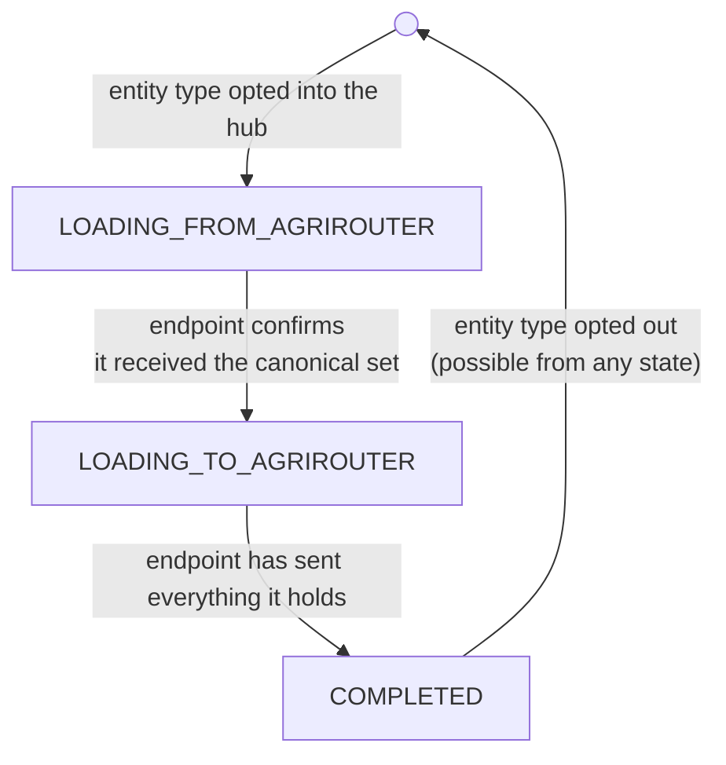
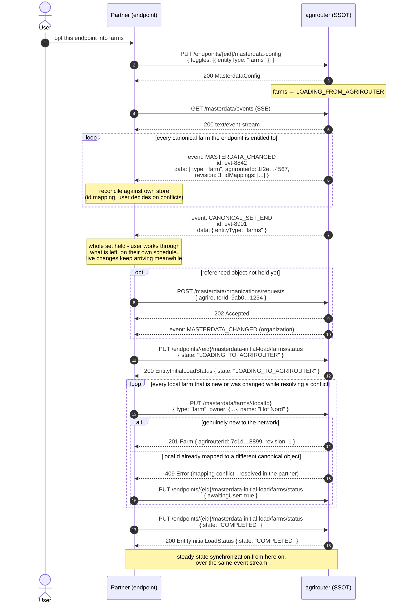
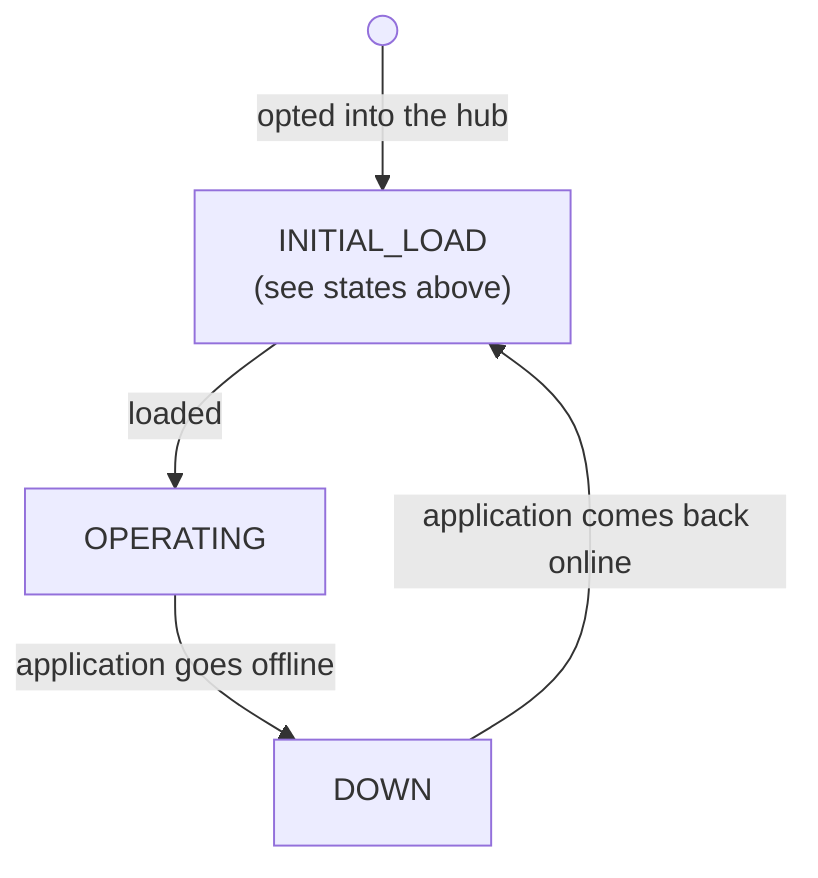

# ADR 06 - Initial load

- **Status:** WIP
- **Scope:** Bringing a newly connected or returning endpoint into agreement with the canonical master data

## Context

[ADR 01](./01-reference-architecture.md) describes steady-state synchronization: once every participant is in step, a change made in one system propagates through the canonical store to the others. But the *first* time an endpoint joins master-data exchange - when the user routes it to the [masterdata hub](./04-routing.md) - there is a bootstrap problem that steady-state sync does not cover.

Note on the naming: the initial load process to fix this is also known as "seeding". This term is not used in the specification to avoid conflating with "seeding" as in "planting seeds", which might be introduced later when we cover other types of data. For exmaple workplans and field operations might refer to _seeding_ in that context. Hence only "initial load" is used in the specs.

The newly connected system is rarely empty. Users have usually already entered master data into it by other means, so it holds **its own set of entities under its own `localId`s**. At the same time, agrirouter already holds the canonical set the rest of the network agreed on. Neither side is a blank slate, and the two sets overlap in unknown ways: the same real-world field may exist on both sides under different identifiers, or exist in only one.

Therefore, bringing the two into agreement has two directions:

- **From agrirouter:** the endpoint must receive what the network already knows, so its user immediately sees the shared master data.
- **To agrirouter:** the network must learn what the endpoint holds that is not canonical yet, so nothing the user already had is lost.

The ordering is what makes this non-trivial. If the endpoint blindly pushed all of its local objects first, it would duplicate everything the network already had. So it must first learn the canonical set, reconcile its own data against it (via [identifier mapping](../specification.md#identifier-mapping)), and only then send what is genuinely new or was changed while resolving a conflict.

This is a mix of technical and organizational concerns: some of it is a defined message flow, and some of it - conflicts, granularity mismatches, differing required attributes - can only be resolved by a human in the partner's own software.

## Decision

Model initial load as an explicit **per-entity-type state machine** that agrirouter holds for each endpoint. Tracking it per entity type, rather than once for the whole endpoint, respects [entity dependencies](../specification.md#entity-dependencies): a field cannot be reconciled before the customers and farms it references.

The flow, per entity type:

1. **Opt in.** The user routes the endpoint to the [masterdata hub](./04-routing.md) and opts it into one or more entity types. Each such entity type enters `LOADING_FROM_AGRIROUTER`.
2. **Load from agrirouter.** agrirouter sends the endpoint every canonical object of that type it is entitled to receive. This direction is well-defined precisely because [agrirouter is the SSOT](./01-reference-architecture.md) - it already holds the authoritative set to hand over.
3. **Confirm.** Two distinct moments sit here. agrirouter marks the end of the canonical set in the stream (`CANONICAL_SET_END`, [ADR 07](./07-sync-streaming.md)), which tells the endpoint it now holds the whole set - mechanical, and reached as soon as the endpoint has consumed the block. Reconciliation can finish much later: whatever conflicts it surfaced are settled in the partner's software - by a user where the partner's own rules cannot settle them - on a schedule agrirouter does not control. The endpoint confirms after *that*, moving the entity type to `LOADING_TO_AGRIROUTER`. The confirmation is explicit precisely because agrirouter can see the first moment and not the second.
4. **Load to agrirouter.** The endpoint now sends the objects it holds that the canonical set did not contain, plus any it changed while resolving conflicts. Because it reconciled first, it sends genuinely new objects instead of duplicates of ones it just received.
5. **Complete.** When the endpoint has sent everything, the entity type enters `COMPLETED`, and ordinary steady-state synchronization ([ADR 01](./01-reference-architecture.md)) applies from then on.

### The flow in concrete calls

The same five steps expressed as the actual operations of the master-data API,
for one entity type (`farms`). `{eid}` is the endpoint's `externalEndpointId`.

<!-- TODO: try to figure out scaling here because it might be tricky to
send response on SSE rather than on same instance (pod) that god /requests.
Also /requests might need to be part of initial load? -->

Points worth noting about the calls themselves:

- **There is no bulk "give me everything" endpoint.** The from-agrirouter
  direction reuses the ordinary event stream (`GET /masterdata/events`); initial
  load is a replay over the same channel rather than a second delivery mechanism,
  which is what lets [resume](#resume-is-the-same-machinery-not-a-special-case)
  share the machinery. Stream position and reconnect are handled by
  [ADR 07](./07-sync-streaming.md).
- **Opting in is what starts the load.** The endpoint never sets
  `LOADING_FROM_AGRIROUTER` itself; `PUT .../masterdata-config` does. The two
  transitions the endpoint drives are the confirmation and the completion, both
  through `PUT .../masterdata-initial-load/{entityType}/status`. Only forward
  transitions are accepted - anything else is a `409`.
- **Opting out is the one way back.** Removing an entity type from the
  configuration discards its state, from whichever state it was in, and opting it
  back in starts the load again. This is not a transition the endpoint can drive 
  by changing state, but by opting-out via masterdata-config resource,
  and it is not an exception to the forward-only rule above: agrirouter cannot
  enumerate the changes that happened while the type was opted out, so a full load
  is the only way back to agreement - the same reasoning as an evicted resume point
  in [ADR 07](./07-sync-streaming.md).
- **The stream position is the only cursor.** The canonical set is enqueued as
  ordinary events when the entity type is opted in, so how far the endpoint has
  consumed is already expressed by `Last-Event-ID` - there is no second checkpoint
  to carry on the confirmation. See [ADR 07](./07-sync-streaming.md).
- **The endpoint reads the state machine, it does not keep one.** agrirouter is
  authoritative for the phase, and `GET /endpoints/{eid}/masterdata-initial-load`
  is how an endpoint that restarted mid-flow finds out it still owes a push. The
  one thing that resource cannot answer is whether the canonical set finished
  arriving, since the state is `LOADING_FROM_AGRIROUTER` on both sides of the
  marker - so it also carries `canonicalSetEndEventId`, the id agrirouter assigned
  the marker when it enqueued the block, which the endpoint compares against its
  own position.
- **Waiting for the user does not pause the stream.** Delivery continues while
  conflicts are being resolved, so `LOADING_FROM_AGRIROUTER` is not a quiet window
  and reconciliation runs against a set that keeps changing under it. Stalling the
  stream instead risks eviction, and eviction during resolution means loading the
  set again - [ADR 07](./07-sync-streaming.md).
- **The to-agrirouter direction uses the ordinary send operation.**  There is no
  special initial-load write path - `PUT /masterdata/farms/{localId}` is the same
  call the endpoint uses in steady state, and the same `409` signals a
  [non-unique mapping](#granularity-mismatches-and-differing-requirements).
- **The sequence runs per entity type**, so for example `farms` reach `COMPLETED` before `fields` is confirmed - a field cannot be
  reconciled against dependencies the endpoint has not received yet.
  `GET /endpoints/{eid}/masterdata-initial-load` returns every opted-in entity
  type at once.
- **There is no "not started" state.** An entity type has an initial-load state
  only once it is opted in - the absence of a toggle in `masterdata-config`
  already says it does not participate, and a second representation of that
  would allow the two to disagree. Opting out discards the state along with the
  toggle, so opting back in reloads rather than resumes - see above for why
  resuming would not be safe.

### Conflicts are resolved in the partner, not in agrirouter

While reconciling, the endpoint may find that its own object and the canonical object for the same real-world entity disagree. Consistent with [ADR 01](./01-reference-architecture.md), agrirouter does not adjudicate field-level conflicts: it provides the canonical set to reconcile against, and the **partner's own software presents the conflict to the user**. This keeps agrirouter out of business decisions it has no basis to make, and it is why the "to agrirouter" step can carry objects the user changed during resolution.

### Where the user is when conflicts appear

The conflicts are in the partner's software, but the user who connected the endpoint is not necessarily there. Three questions follow: whether agrirouter has to be told that conflicts exist, whether it should send the user somewhere, and what happens when no user is present at all.

**agrirouter is told that reconciliation needs user action.** The endpoint raises `awaitingUser` on the entity type's status the moment its own software detects that reconciliation is needed, and agrirouter clears it on the next forward transition. That is the whole of the reporting:

| what agrirouter holds | what agrirouter UI says about the endpoint |
| --- | --- |
| `LOADING_FROM_AGRIROUTER`, `awaitingUser` unset | setting up master data with *app* |
| `LOADING_FROM_AGRIROUTER`, `awaitingUser` set | waiting for you in *app* |
| `LOADING_TO_AGRIROUTER`, `awaitingUser` unset | *app* is sending its data |
| `LOADING_TO_AGRIROUTER`, `awaitingUser` set | waiting for you in *app* |
| `COMPLETED` | in sync |

`awaitingUser` is a flag signifying that user action is needed to perform reconciliation. It is reset by a transition agrirouter owns rather than by a second call from the endpoint. It is specified per entity type, like the resource it sits on, so farms can be clean while fields wait.

**Both loading phases can need a person.** Reconciling against the canonical set in the partner application is the obvious source of conflicts, but the push direction produces them too: e.g. a `PUT /masterdata/farms/{localId}` can come back `409` because the canonical object it names is already mapped to a different `localId` ([below](#granularity-mismatches-and-differing-requirements)). Resolving it is a decision in the partner's software just the same. So the flag applies in `LOADING_TO_AGRIROUTER` for the same reason it applies in `LOADING_FROM_AGRIROUTER`, and each phase clears it on the transition that ends it: the confirmation for the first, the completion for the second.

**The unset case says nothing about the user**, which is why the first row is neutral. An absent flag is ambiguous in two directions at once - the endpoint may not report it at all, or may report it and have nothing to raise yet. Reporting the flag therefore only ever *upgrades* the label, and an endpoint that never sends it costs precision rather than correctness. Distinguishing "still sending" from "nothing to resolve" would need the endpoint to declare up front that it reports the flag, which buys one label for a conformance surface, and is left out.

The flag is independent of the fact that the whole canonical set has been received: conflicts surface object by object as they arrive.

**A link, not a redirect.** When the route is created there is nothing to resolve yet, so redirecting at that moment lands the user on an empty page - and the flag that says otherwise arrives minutes or hours later. So the partner declares `resolutionUrl`, an optional opaque URL set on `PUT .../masterdata-config` next to the toggles - the moment it knows which of its own tenants this endpoint is - and agrirouter renders it as a link throughout initial load, as the call to action whenever `awaitingUser` is set and quietly otherwise. It is not per conflict and not templated by agrirouter, and where it is absent the label stands on its own.

**Route creation scenarios differ only in where the user already is.** The canvas arrow ([ADR 04](./04-routing.md)) and the entity-type toggles are two gates on the same thing, and the load starts once both are present:

- **Partner-initiated** - RAC, or the partner's own settings screen. The user is in the partner app when the load starts and never leaves it, so nothing is required of agrirouter. This is the shape to prefer, and the reason `resolutionUrl` is optional.
- **Drawn in the agrirouter canvas.** The user is in agrirouter and the work is elsewhere. This is the case the label and the link exist for.
- **Created automatically.** Does not arise: default routing never creates a `HubRoute`. Opting into master data stays an explicit act by a user, for the reason [ADR 04](./04-routing.md) gives - connecting an application unintentionally can overwrite a lot of data - so an endpoint created by a partner that supports master data is not silently opted in, and no initial load starts with nobody to tell.

**Waiting is not free**, which is why the partner should not rely on the user wandering back. A position evicted while resolution is half done costs a reload of the canonical set and a second pass over the same conflicts ([ADR 07](./07-sync-streaming.md)), so pending resolution SHOULD be surfaced in the partner's own UI rather than only on the screen the user happened to be on.

### Granularity mismatches and differing requirements

Two problems surface at initial load that agrirouter deliberately does **not** try to solve:

- **n:1 / non-unique mappings.** Two objects in one system can correspond to a single object in another - for example two fields that are a single field elsewhere. This is not solvable centrally, because the ambiguity exists even without agrirouter in the loop. So an endpoint MUST NOT map two of its own `localId`s onto the same canonical object; agrirouter rejects the second, pushing resolution back to the partner. See [Asymmetric and non-unique mappings](../specification.md#asymmetric-and-non-unique-mappings).
- **Differing required attributes.** One system may require a customer on every field where another treats it as optional. The **stricter recipient** handles this - e.g. by asking the user for a fallback value - rather than agrirouter enforcing one system's rules on another or silently dropping data.

### Resume is the same machinery, not a special case

A connection can drop mid-load, or an already-`COMPLETED` endpoint can go offline while changes accumulate on both sides. Rather than re-running initial load from scratch, the endpoint resumes from the last stream position it processed. That position is the **per-endpoint delivery sequence** [ADR 03](./03-revision-model.md) calls for rather than the per-object `revision`, and it is carried as `Last-Event-ID` - the catch-up semantics, including what happens once it has been evicted, are [ADR 07](./07-sync-streaming.md).

Here is approximate lifecycle that we are expected to support:

## Consequences

- agrirouter holds an explicit per-endpoint, per-entity-type initial-load state and exposes it as a `status` subresource that the endpoint reads and advances by setting its state (confirm receipt, then complete), as part of the master-data API.
- The "from agrirouter, then to agrirouter" ordering is what prevents duplication: reconciliation happens against the canonical set before the endpoint sends anything.
- Some of the hard parts are intentionally organizational: conflict resolution and granularity mismatches live in partner software, so the protocol defines the flow and the failure signals but not the resolution.
- Initial load and resume share the same stream position, so a returning system is a continuation of the same state rather than a separate code path.
- agrirouter learns that a user action is needed, never what for. `awaitingUser` is one bit per entity type, monotonic within a loading phase and cleared by the transition that ends it.
- The bit is advisory. Endpoints that omit it cost only label precision, and nothing in the flow branches on it.
- `masterdata-config` gains an optional `resolutionUrl`, which is the only thing a partner has to supply for agrirouter to point a user at the right screen, and default routing never opts an endpoint into the hub.
- Either endpoint-driven transition *may* wait on a human - the confirmation on reconciliation, the completion on a rejected push - and neither necessarily does: an endpoint with no conflicts, or one whose conflicts its own rules settle, advances straight through. What agrirouter cannot tell is which case it is in, since it sees only when it finished sending. So an entity type can sit in either loading state for days without anything being wrong, and no timeout on them would be meaningful.
- Several details remain open: downtime / pause-resume semantics, and best-practice guidance for implementors on conflicts and differing requirements.
