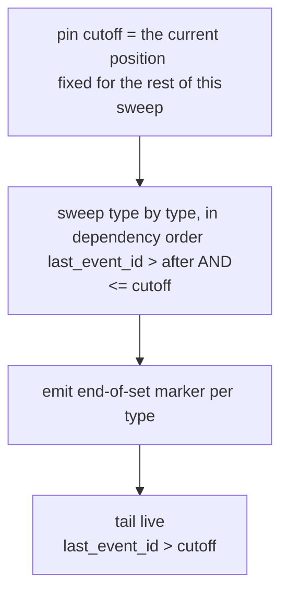

# ADR 07 - Sync streaming

- **Status:** WIP
- **Scope:** Delivery of canonical master data to partner applications - the store
  that backs delivery, the connection unit, catch-up, and resume

## Context

Delivery has to do two things without either being a special case: hand a
returning application everything that changed while it was away, and hand a new
application everything there is. [ADR 06](./06-initial-load.md) describes the
state machine around the second of those. This ADR describes the mechanism under
both.

An earlier version of this ADR did it with a persisted per-endpoint queue: opting
an entity type in wrote the canonical set into that endpoint's queue as ordinary
events, and `Last-Event-ID` was the only position an endpoint ever kept. That
construction has two failures, and both are structural rather than tuning
problems.

**The retention cliff.** A queue accumulates, so it has to be trimmed; trimming
evicts positions, and an application offline long enough has to reload from
scratch. Worse, the reload is itself written into the queue, so a set large enough
to outlive its own retention triggers a reload that materializes the set again -
a loop with no fixed point.

**Write amplification.** A queue holds a copy per recipient. Every change to a
canonical object was written once into each entitled endpoint's queue, and each
tenant's canonical set was copied again whenever one of that tenant's endpoints
was opted into a type. Storage therefore scaled with changes multiplied by
recipients, for data that exists once. A partner application holding 100k endpoints held 100k queues, each with its own retention to
trim and its own position to track.

## Decision

### Delivery reads a compacted index, not a log

agrirouter maintains one record per canonical object, never one per change. Each
carries the object's identity, its entity type, the endpoint whose change produced
the current value, and a globally ordered `last_event_id` that is rewritten every
time the object changes.

No change is ever given a number below one the application has already received,
and the number advances per record, so a cursor may stop anywhere and nothing is
silently skipped.

Because there is one record per object rather than one per change, what agrirouter
holds is proportional to the amount of master data in existence, not to how much
of it has ever been edited, and records are **not evicted**. The system cannot be in a state
which is too far behind to resume: an application away for 5 minutes and one
away for 5 weeks are served the same way, and the second merely gets more
back (assuming more changes happened in the meantime).

This means we do not support intermediate states. An object edited three times while an
application was disconnected is delivered once, carrying its current value; the
application never learns that the two earlier edits happened. That is consistent
with what this protocol
[declares itself not to be](../specification.md#what-this-protocol-is-and-is-not) -
a history store - and it is cheaper than replaying the intermediate
values only to overwrite them.

It also supports deletion at no additional cost. Because agrirouter
[deactivates rather than removes](../specification.md#deactivation), a deleted
object keeps its record, is marked inactive and takes a new `last_event_id`, so
deletions ride the same path as everything else. A design built on hard deletes
would need a second retention clock for tombstones purely so that catch-up could
express what had disappeared. This one does not.

### One stream per app, tenant in the envelope

The connection unit is the **application**, not the endpoint. Tenant identity
travels in the event envelope, so a partner serving 100k farmers holds one
connection and one position rather than 100k of each, and server-side delivery
state is proportional to the number of applications.

Which tenants an application may read is decided by the hub
routes the user created ([ADR 04](./04-routing.md)), and is applied as a predicate on
the query rather than as a property of the connection.

Opt-in per entity type is not a second predicate alongside it. Opt-in is held per
endpoint ([Routing and opt-in](../specification.md#routing-and-opt-in)), and each
of an application's endpoints belongs to a different tenant, so two tenants on the
same stream routinely differ - one exchanging farms and fields, the other only
farms. The filter is therefore per tenant and type, read from each tenant's own
`masterdata-config`. An application MUST NOT assume the types it receives for one
tenant are the types it receives for another.

### Catch-up sweeps by entity type, the live tail follows it

Ordering by `last_event_id` alone is wrong, and not in a rare case. Each record
carries the number of its *most recent* change, so an object whose parent was
edited more recently than itself sorts ahead of that parent:

```
farm  Manor Farm    created at 20, renamed at 60   → reads 60
field Long Meadow   created at 30                  → reads 30
```

Sorted by `last_event_id`, Long Meadow arrives before the farm it references.
Over time this is the normal case rather than the exception, and it would break
the dependency ordering that [ADR 06](./06-initial-load.md) needs in order to
reconcile a field against a farm the application already holds.

Delivery therefore runs in two phases. Each entity type has a **tier** reflecting
the dependency graph - parties before farms, farms before fields, fields before
boundaries. A tier is a property of the *type*, not of an object: it is derived
wherever it is needed and never stored, so the graph can be changed without
touching a row.



The **sweep** takes one entity type at a time, in any order consistent with the
tiers - types sharing a tier have no dependency between them, so their order is
free. Within a type it delivers in ascending `last_event_id`, bounded below by
the sweep's `after`, above by its `cutoff`, and restricted to the tenants it is
entitled to read.

The **tail** then delivers everything above the cutoff in change order, emitting
parents before children within a single change.

The cutoff is not chosen, it is observed: the position at the moment the sweep
begins, then fixed for its duration. It matters as much as the lower bound,
because the two phases divide the data exactly between them - the sweep owns
everything at or below the cutoff, the tail owns everything after, and nothing
belongs to neither. Three things that happen during a sweep long enough to matter:

- **An object already swept is edited.** It moves above the cutoff, so the
  tail delivers it after the sweep ends. It is applied twice and the later value
  wins, which is why apply MUST be idempotent.
- **An object of a type not yet swept is edited.** It moves above the
  cutoff, so the sweep skips it and the tail delivers it. It arrives
  once, current.
- **A new parent and a new child are both created.** Both are above the cutoff, so
  both are skipped by the sweep and delivered by the tail, which orders the parent
  first within that change. The reference resolves.

### The position is composite for as long as a sweep is running

A record's number says when that object last changed, not how far the application has
read. The sweep orders those numbers within one type and then starts the next type
over, so the numbers increase through a type and drop back at every change of type:

```
farms    40, 50, 60
fields   30, 70, 80
         ↑ lower than the farm before it
```

For an application that reconnects it is not sufficient to report `60`: agrirouter
cannot tell whether it finished farms or is part-way through fields, and
"everything after 60" would skip Long Meadow at 30. The position must therefore
carry the entity type and the offset within it. It must also carry the cutoff,
because every type has to be swept against the *same* one - recomputing it on
reconnect would leave changes to an already-swept type below the new cutoff and
above the finished sweep, delivered by neither phase.

Most sweeps are scoped to one tenant, so the entry names it. An application can
have several running at once - one farmer connected last week and is still
loading, another was routed to the hub this morning:

```
{ "position": 90,
  "sweeps": [
    { "tenant": "t-ashcroft",   "type": "fields", "after": 30, "cutoff": 80 },
    { "tenant": "t-brookfield", "type": "farms",  "after": 40, "cutoff": 90 }
  ] }
```

`after` is exclusive and `cutoff` inclusive: they are a sweep's two bounds, both `last_event_id` values, as
is `position`. The whole encoded value is the **cursor**. Each sweep carries its own cutoff, because each was
pinned when that sweep began. Once the list is empty the position is a single
number again, and stays one for the whole of steady state.

This does not disturb SSE: `Last-Event-ID` is opaque to the protocol, so the
encoded value rides in it and reconnects work unchanged. What it does mean is that
two positions can no longer be compared, and that agrirouter MUST be able to tell
a cursor it wrote from one it did not.

The cursor MUST therefore be **versioned** and MUST carry an **integrity check**,
both to detect damage rather than attackers:

- **Versioned**, because positions never expire, so a value we wrote years ago can
  still arrive and parse into a valid but wrong position under a newer reader.
- **Integrity-checked**, because truncation or re-encoding in a client's storage
  fails the same silent way. A keyless checksum serves - detection is the
  requirement, not unforgeability.

A wrong `after` skips records permanently, which is what both rules are for.
Forgery is not: entitlement is a predicate on the query, so a made-up cursor only
moves an application's own place. An implementation MUST NOT derive entitlement
from the cursor.

Given both rules the fallback for an unreadable cursor is a fresh sweep.

### A new tenant or a new entity type is swept, not tailed

Both arrive **behind** the application's position, which is why neither can be a
predicate on the ordinary query.

A farmer who grants access today has data created months ago, so it carries
old numbers. An application sitting at 90 that simply asked for everything above
90 would receive none of it and would show the farmer an empty account. The same
holds when that farmer later opts their endpoint into a further entity type: their
objects of that type are already below the position too.

Each is therefore its own bounded sweep, running alongside the tail with its own
entry in the cursor - the same machinery as initial load, differing only in what
it is scoped to:

| Trigger | Sweep covers |
|---|---|
| First connection | everything granted and opted in |
| A tenant routes one of its endpoints to the hub | that tenant |
| That endpoint is opted into a further entity type | that tenant & entity type |
| A connection carrying no cursor, or one we cannot read | everything granted and opted in |

The middle two are scoped to a single tenant because each is an act by that
tenant's user on their own endpoint: an application cannot opt itself into a type
across its tenants, and agrirouter never sweeps more than one tenant on either.

The others are not triggered by a user, and are therefore not scoped to a tenant.

### A cursor we cannot read is a first connection

An application that presents no `Last-Event-ID`, or one that fails validation,
is swept in full. 

Discarding the cursor is therefore how an application can ask for every entity to
be delivered again.

### The cursor belongs to the application, not to agrirouter

agrirouter stores no position. It encodes the cursor into each frame's `id:`, the
application persists it, and on reconnect hands it back as `Last-Event-ID`.
Delivery is stateless in that respect: nothing on our side records where any
application has got to, which is what keeps a partner with 100k endpoints from
costing us 100k pieces of delivery state.

An application MUST persist a cursor only for objects it has **durably applied**<sup>1</sup>,
never for objects it has merely received, and MUST derive it from its own store
rather than from whatever its stream client last read. Delivery is at-least-once:
everything after the committed position is sent again on reconnect, so a
connection dropping mid-sweep costs a redelivery rather than a gap.

<sup>1</sup> _TBD whether this has consequences for load balancing on client side._

**A new sweep has to reach a cursor that predates it.** A cursor written last week
knows nothing about a tenant routed to the hub this morning, and the cursor is all
the application sends - so agrirouter cannot learn from it that a sweep is owed.
It works that out instead from state it holds anyway: on each connection it
compares the application's hub routes and per-tenant opt-in against what the
cursor has already swept, and adds a sweep entry for anything granted but not yet
delivered.

That comparison needs a stored answer to "has this tenant's farms been handed
over", and [ADR 06](./06-initial-load.md)'s state machine holds it directly:
`LOADING_FROM_AGRIROUTER` means the set is still owed, `RECONCILING` and beyond
mean it has been delivered. agrirouter moves the entity type across that edge when
it emits `CANONICAL_SET_END`, which is precisely the moment the debt is settled.

So the rule is: **add a sweep entry for any (tenant, entity type) that is
`LOADING_FROM_AGRIROUTER` and has no entry in the cursor already.** The second
clause is what stops a reconnect mid-sweep from starting a second one, and the
first is what stops a reconnect during a slow human resolution from starting the
sweep over - the state has moved on even though the endpoint has not confirmed.

Where there is no cursor to compare against, the comparison has no lower bound
and every entitled (tenant, entity type) gets an entry, per
[A cursor we cannot read is a first connection](#a-cursor-we-cannot-read-is-a-first-connection).
That is the only case in which the rule above is not the whole answer, and it is
still derived from routes and opt-in rather than from anything we stored.

### The end of a set is a frame

agrirouter MUST emit an in-band `CANONICAL_SET_END { entityType }` frame when a
type's sweep is exhausted, and an application acts on it as it streams. It names
the type the sweep covered, which is the granularity the question is asked at and
the one [ADR 06](./06-initial-load.md) keys its state by.

An application can also retrieve the information by calling `GET /endpoints/{eid}/masterdata-initial-load`.

The marker is an **upper limit in the delivery, not a claim about either
side**: it says the objects before it are the whole canonical set, not that the
user has worked through the conflicts. The confirmation in
[ADR 06](./06-initial-load.md) is what claims that, and the gap between the two is
human-paced and unbounded. An application MUST NOT stall delivery across that gap.

### Origin suppression moves to read time

With a queue per endpoint, [loop prevention](../specification.md#loop-prevention)
filtered at enqueue. With one shared record per object there is nothing to filter
at write time, so the source endpoint is carried on the record and suppression is
applied as it is read: an object whose most recent change came from the reading
application's own endpoint for that tenant is not delivered back to it.

Compaction makes this coarser and it remains correct, because canonical objects
are whole documents rather than deltas. Whoever produced the current value was
handed that value synchronously - either it wrote the whole document, or
agrirouter [merged](./05-stale-reads.md#a-merged-revision-is-returned-not-streamed)
it and returned the result in the write response - and any earlier change by
somebody else is superseded by it. Suppressing it therefore never withholds
anything the application does not already have.

The premise is that a write response is applied rather than merely acknowledged.
That is what keeps this predicate unconditional: agrirouter needs no notion of a
revision it synthesised, and the delivery record carries no flag exempting one
from suppression.

### Rejected alternative: materializing the canonical set into a queue

Described in [Context](#context). It buys one thing the current design pays for
elsewhere: because agrirouter mints fresh sequential numbers as it writes the
block, those numbers *are* a position, they never descend, and a single integer
resumes correctly from anywhere including mid-load. The composite cursor above is
the price of not writing those copies. It is worth paying, because the copies are
what create both the retention cliff and the per-endpoint amplification, and
neither has a fix that keeps the queue.

## Consequences

- **Initial load, catch-up, resume, re-seed and type backfill are one mechanism.**
  They differ in what they are scoped to and in their starting cursor, not in kind.
  There is no separate delivery mode to build, document, or fall back to.
- **Nothing expires, so nothing has to be recovered.** The `LOADING_FROM_AGRIROUTER`
  reset that an evicted position used to force does not arise, and neither does the
  reload loop that a set larger than its own retention used to create. Rate
  limiting a large sweep is a throughput concern rather than a correctness one.
- **Applications lose intermediate states.** An application MUST NOT infer that it
  observed every change to an object, and MUST NOT derive anything from the number
  of times an object was delivered.
- **Idempotent apply is key in two places**: redelivery on
  reconnect, and the overlap between a long sweep and the tail behind it. Within
  the stream, order is enough to make the later value win; across the stream and
  a write response it is not, so apply is additionally guarded by `revision`
  ([ADR 05](./05-stale-reads.md#consequences)).
- **Dependency-closed opt-in is structural.** An application opted into fields
  but not farms gets no farms sweep at all and then every field with an
  unresolvable reference. [The rule](../specification.md#routing-and-opt-in) is what holds the sweep together.
- **Deactivated objects are retained indefinitely**, which is what makes a
  deletion deliverable at any distance rather than only within a retention
  window. Purging them would reintroduce exactly the horizon this design removes.
- **Delivery state is per application, but initial-load state is not.** The state
  machine in [ADR 06](./06-initial-load.md) is per tenant and entity type while
  the cursor is per application, _so the two are not keyed alike._
- **agrirouter holds no position, and holds no re-delivery requests either.**
  Where an application has got to is entirely in the cursor it sends; whether a
  sweep is owed is ours, derived from routes, opt-in, and the initial-load state
  the endpoint can set. A partner that loses its cursor loses only its place, not
  its entitlement, and recovers by sweeping again.
- **A partner's own data loss is recoverable at two scales.** One entity type of
  one endpoint, by re-entering `LOADING_FROM_AGRIROUTER`
  ([ADR 06](./06-initial-load.md#the-endpoint-can-ask-for-the-set-again)); every
  tenant at once, by discarding the cursor. Neither touches opt-in configuration,
  which is a control over exposure rather than a maintenance lever.
- **This ADR is what forced `RECONCILING` into [ADR 06](./06-initial-load.md).**
  Deciding on reconnect whether a sweep is owed requires distinguishing a set still
  being delivered from one delivered and awaiting a human, which the old
  `LOADING_FROM_AGRIROUTER` conflated. The endpoint gains a state it can read but
  no obligation it would not have without it.
