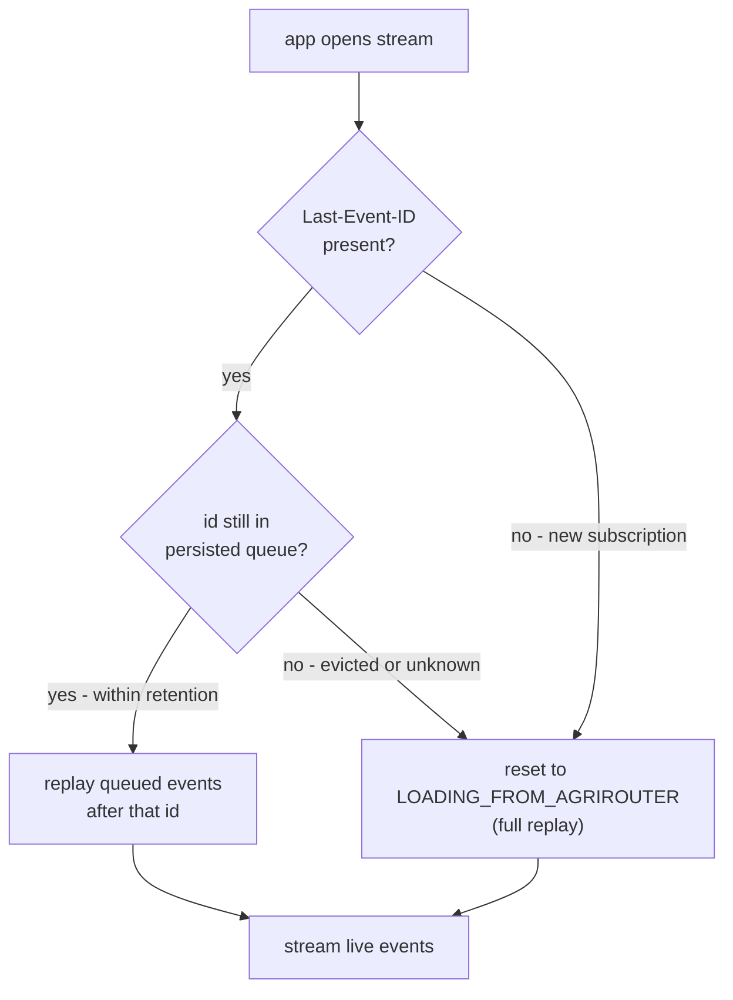
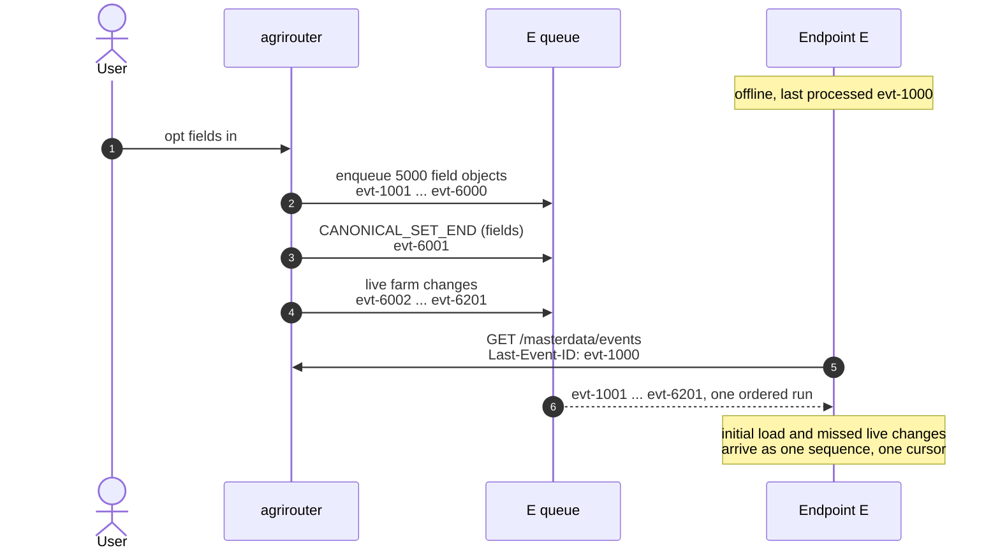

# ADR 06 - Sync streaming

- **Status:** WIP
- **Scope:** Synchronization of master data between agrirouter and partner platforms using streaming approach

## Context

<!-- TODO: explain streaming and resumability -->
https://html.spec.whatwg.org/multipage/server-sent-events.html#the-last-event-id-header

## Decision

### Resuming a stream

Every event carries an `id`. On reconnect the endpoint sends the id of the last
event it processed back in the `Last-Event-ID` header, and agrirouter continues
from the event *after* it. This only works while that id is still in the
persisted queue: the queue has a finite retention, so an endpoint that was down
long enough falls off the tail. In that case agrirouter cannot enumerate what
the endpoint missed, and the only way back to agreement is a full replay -
i.e. re-entering [initial load](./06-initial-load.md).

"Processed" means durably applied, not merely received: an endpoint MUST resume on
the last event it committed to its own store, and it derives that id from that
store rather than from whatever its stream client last read. Delivery is therefore
at-least-once - everything after the committed position is sent again on reconnect,
so a connection dropping mid-batch costs a redelivery rather than a silent gap.
Redelivery arrives in the original order, so an endpoint needs its apply to be
idempotent, but it does not need to reason about ordering.

1. **No `Last-Event-ID`.** The endpoint has no position to resume from, so it is
   treated as a fresh subscription and goes through initial load.
2. **Known id.** The id is still within the retention window: agrirouter sends
   the queued events that follow it, then switches to live delivery. The
   endpoint is caught up without a full replay.
3. **Unknown or evicted id.** The endpoint was offline longer than retention, or
   presents an id agrirouter never issued. agrirouter MUST NOT silently continue
   from the current head - that would leave a gap the endpoint cannot detect.
   Instead it signals the endpoint that the resume point is gone and moves the
   affected entity types back to `LOADING_FROM_AGRIROUTER`, so the canonical set
   is handed over again and reconciled as in [ADR 06](./06-initial-load.md).

### Replay is materialized when the entity type is opted in

Opting an entity type in enqueues its canonical set into the endpoint's persisted
queue immediately, at the tail, with ordinary event ids. Initial load is therefore
not a separate delivery mode - it is a block of events,
sitting in the same queue as everything else, and `Last-Event-ID` remains the only
position an endpoint ever needs to keep.

**Example.** Endpoint E has processed up to `evt-1000` and is offline. The user
opts `fields` in on a tenant holding 5000 of them, and farm changes keep arriving
in the meantime.

The ids are assigned when the toggle happens, not when E shows up, so the canonical
set occupies `evt-1001` to `evt-6000` and everything that happens afterwards sits
behind it. E's stored position is still `evt-1000` and still means what it did
before - it resumes the way it would from any other disconnect. The load and the
changes it missed arrive as one contiguous run, so there is no phase to switch
between and no second request to make. Reading the stream therefore needs no
knowledge that a load began while E was away; what E does learn, in band, is where
the block ends, because that is what licenses the confirmation.

Two properties follow from that. Dependency order is free: opting farms and fields
in together enqueues farms first, so they arrive first, which is what
[ADR 06](./06-initial-load.md) needs in order to reconcile a field against a farm
the endpoint already holds. And a drop mid-load is not a special case - an endpoint
that stops at `evt-4000` reconnects with that id and carries on, using the same
mechanism as a reconnect in steady state.

### The end of a block is marked in band

Materializing the set is what makes the block invisible: `evt-1001 ... evt-6000`
and everything behind it are all `MASTERDATA_CHANGED`, so nothing in the run tells
E it now holds the whole canonical set. agrirouter therefore closes each block with
a `CANONICAL_SET_END { entityType }` event at its tail, enqueued at toggle time
like the objects before it. It is an ordinary event: it carries an id, it is
replayed on resume, and a block per entity type means farms' marker precedes
fields' objects, which is the order [ADR 06](./06-initial-load.md) reconciles in.

The marker is a **boundary in the queue, not a claim about either side**. It says
the objects before it are the whole canonical set, so E that has consumed past it
is reconciling against a complete one. It does not say the user has worked through
the conflicts that reconciling surfaced. The confirmation E sends afterwards,
`PUT .../masterdata-initial-load/{entityType}/status`, is the one that claims that,
and the gap between the two is human-paced and unbounded.

E MUST NOT stall the stream across that gap. Live changes for the type sit behind
the marker on the same cursor, and waiting for a user is exactly what pushes a
position out of retention, so E keeps consuming and reconciles against a canonical
view that is still moving. Redelivery and later changes both land on an idempotent
apply, which is what makes that safe.

Across a restart, "has the set finished arriving" is not a question agrirouter's
state answers - it retunrs `LOADING_FROM_AGRIROUTER` on both sides of the marker.
The marker's id answers it, and agrirouter knows that id because it minted it:
enqueueing the block assigns it, in the same operation that puts the entity type
into `LOADING_FROM_AGRIROUTER`. It is published as `canonicalSetEndEventId` on the
status subresource, populated from that moment - before E has read anything, and
whether or not E is even connected. The field is a position in the queue, not a
statement about E, which is why agrirouter can fill it in without observing E at
all. Opting the type out discards the state and the id with it; opting back in
mints a new block and a new marker.

E derives the rest by comparing that id against its own committed position: at or
past it means the whole set is held. This is the one place in this ADR where an
event id is ordered rather than opaque, and it holds because the delivery sequence
is monotonic per endpoint ([ADR 03](./03-revision-model.md)). An endpoint may
instead record a durable bit when it commits the marker - a local shortcut, not a
second source of truth. Either way E keeps no state machine, only the answer.

## Consequences

- **Enqueueing happens whether or not anyone is listening.** A tenant with 5000
  fields writes 5000 events into every endpoint opted into fields, at the moment of
  the toggle, and an endpoint that never reconnects never reads them. Opting the
  type back out before the first connection leaves them to be suppressed at
  delivery.
- **A large initial load can outlive its own retention.** If materializing pushes
  an offline endpoint past the retention window, its resume point is evicted, which
  triggers a full reload, which materializes the set again - a loop that never
  converges. Initial-load events therefore MUST NOT be evicted before they have
  been delivered once, or materialization MUST be deferred for endpoints with no
  recent live stream.
- **Conflict resolution runs while the stream keeps moving.** `LOADING_FROM_AGRIROUTER`
  and ordinary delivery overlap for as long as the user takes, so an endpoint cannot
  treat initial load as a quiet window in which the canonical set holds still.
- **Losing the position during resolution costs the resolution.** An endpoint evicted
  while a user is halfway through conflicts reloads the set and reconciles again.
  The mappings already committed make most of the second pass a no-op, but the
  unresolved remainder is presented to the user afresh.

