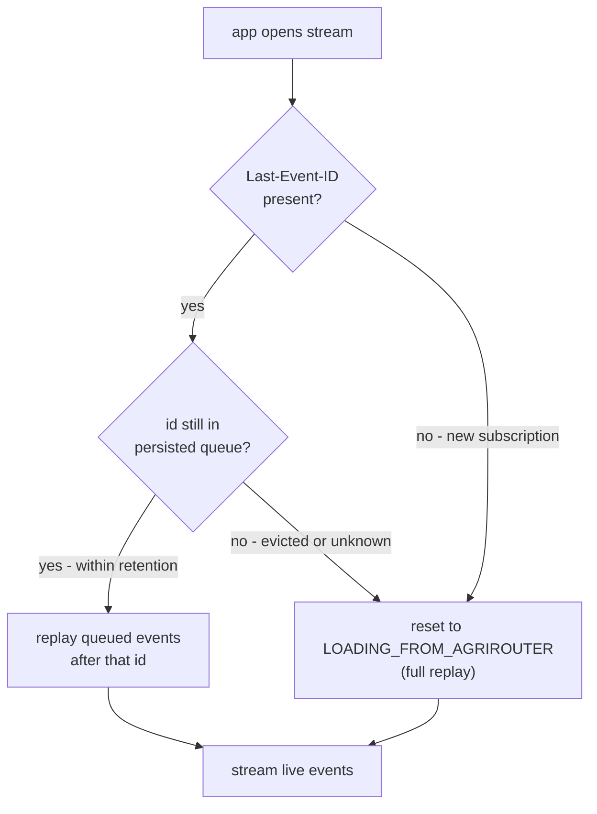

# ADR 06 - Sync streaming

- **Status:** WIP
- **Scope:** Synchronization of master data between agrirouter and partner platforms using streaming approach

## Context

<!-- TODO: explain streaming and resumability -->
https://html.spec.whatwg.org/multipage/server-sent-events.html#the-last-event-id-header

## Decision

### Resuming a stream

Every event carries an `id`. On reconnect the endpoint sends the id of the last
event it processed back in the `Last-Event-ID` header, and agrirouter continues
from the event *after* it. This only works while that id is still in the
persisted queue: the queue has a finite retention, so an endpoint that was down
long enough falls off the tail. In that case agrirouter cannot enumerate what
the endpoint missed, and the only way back to agreement is a full replay -
i.e. re-entering [initial load](./06-initial-load.md).

1. **No `Last-Event-ID`.** The endpoint has no position to resume from, so it is
   treated as a fresh subscription and goes through initial load.
2. **Known id.** The id is still within the retention window: agrirouter sends
   the queued events that follow it, then switches to live delivery. The
   endpoint is caught up without a full replay.
3. **Unknown or evicted id.** The endpoint was offline longer than retention, or
   presents an id agrirouter never issued. agrirouter MUST NOT silently continue
   from the current head - that would leave a gap the endpoint cannot detect.
   Instead it signals the endpoint that the resume point is gone and moves the
   affected entity types back to `LOADING_FROM_AGRIROUTER`, so the canonical set
   is handed over again and reconciled as in [ADR 06](./06-initial-load.md).

## Consequences

