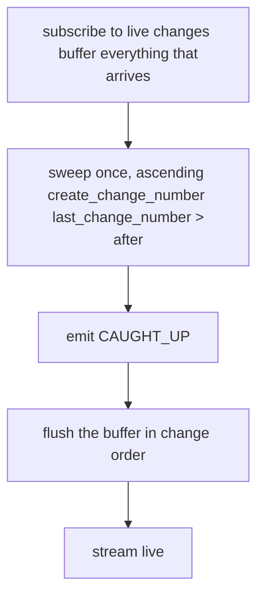

# ADR 07 - Sync streaming

- **Status:** WIP
- **Scope:** Delivery of canonical master data to partner applications - the store
  that backs delivery, the connection unit, catch-up, and resume

## Context

Delivery has to do two things without either being a special case: hand a
returning application everything that changed while it was away, and hand a new
application everything there is. [ADR 06](./06-initial-load.md) describes the
state machine around the second case. This ADR describes the mechanism implementing both.

### Queue based alternative

An alternative version considered is a persisted per-endpoint queue: opting
an entity type in wrote the canonical set into that endpoint's queue as ordinary
events, and `Last-Event-ID` was the only position an endpoint ever kept. That
construction has two failures, and both are structural rather than tuning
problems.

**The retention cliff.** A queue accumulates, so it has to be trimmed; trimming
evicts positions, and an application offline long enough has to reload from
scratch. Worse, the reload is itself written into the queue, so a set large enough
to outlive its own retention triggers a reload that materializes the set again -
a loop with no fixed point.

**Write amplification.** A queue holds a copy per recipient. Every change to a
canonical object was written once into each entitled endpoint's queue, and each
tenant's canonical set was copied again whenever one of that tenant's endpoints
was opted into a type. Storage therefore scaled with changes multiplied by
recipients, for data that exists once. A partner application holding 100k endpoints held 100k queues, each with its own retention to
trim and its own position to track.

## Decision

### Change number

First of all we introduce a concept of change number which is simply monotonically
increasing number that is assigned to every change to canonical masterdata store.
It would have following properties:
- **Uniqueness** - each change number is unique across all changes
- **Monotonicity** - change number given to writes (creates AND updates) created "later" is always greater than change number given to events created "earlier", which creates a total order for all changes and corresponding notion of time
- **Not Generally Linear** - change numbers are allowed to have gaps in the sequence.

An important consequence of this design is that order over change number corresponding
to creation of the object would always correspond with entity dependency graph, in that
if object A (f.e field) depends on the object B (f.e farm), then change number for change
that has created object B would always be less than change number for change that has
created object A, even if there was change to object B after object A was created.

### Delivery reads a compacted index, not a log

agrirouter maintains one record per canonical object, never one per change. Each
carries the object's identity, its entity type, the endpoint whose change produced
the current value, and a globally ordered `last_change_number` that is rewritten every
time the object changes. However `create_change_number` is never rewritten and only assigned
one time when the object is being created for the first time.

No change is ever given a number below one the application has already received,
and the number advances per record, so a cursor may stop anywhere and nothing is
silently skipped.

Because there is one record per object rather than one per change, what agrirouter
holds is proportional to the amount of master data in existence, not to how much
of it has ever been edited, and records are **not evicted**. The system cannot be in a state
which is too far behind to resume: an application away for 5 minutes and one
away for 5 weeks are served the same way, and the second merely gets more
back (assuming more objects changed in the meantime), while if an object has changed
50 times in that period, only the last known state is delivered, which is all the
application needs to know.

This means we do not support intermediate states. An object edited three times while an
application was disconnected is delivered once, carrying its current value; the
application never learns that the two earlier edits happened. That is consistent
with what this protocol
[declares itself not to be](../specification.md#what-this-protocol-is-and-is-not) -
a history store - and it is cheaper than replaying the intermediate
values only to overwrite them.

It also supports deletion at no additional cost. Because agrirouter
[deactivates rather than removes](../specification.md#deactivation), a deleted
object keeps its record, is marked inactive and takes a new `last_change_number`, so
deletions ride the same path as everything else. A design built on hard deletes
would need a second retention clock for tombstones purely so that catch-up could
express what had disappeared.

### One stream per app, tenant in the envelope

The connection unit is the **application**, not the endpoint. Tenant identity
travels in the event envelope, so a partner serving 100k farmers holds one
connection and one position rather than 100k of each, and server-side delivery
state is proportional to the number of applications.

Which tenants an application may read is decided by the hub
routes the user created ([ADR 04](./04-routing.md)), and is applied as a predicate on
the query rather than as a property of the connection.

Opt-in per entity type is not a second predicate alongside it. Opt-in is held per
endpoint ([Routing and opt-in](../specification.md#routing-and-opt-in)), and each
of an application's endpoints belongs to a different tenant, so two tenants on the
same stream routinely differ - one exchanging farms and fields, the other only
farms. The filter is therefore per tenant and type, read from each tenant's own
`masterdata-config`. An application MUST NOT assume the types it receives for one
tenant are the types it receives for another.

### The sweep delivers in creation order

Creation order is dependency order. A field cannot be created before the farm it
references, so the change that created the farm always carries the lower number.
Delivering in ascending `create_change_number` therefore places every parent
before every child, and needs to know nothing about entity types to do it.

A connection runs exactly one sweep. It covers every object the application is
entitled to read whose `last_change_number` is above `after` - the cursor the
application presented, exclusive - delivered in ascending `create_change_number`.
On a first connection `after` is zero and the sweep is the whole entitled set.

The filter and the ordering deliberately read different columns: `last_change_number`
selects what the application is missing, `create_change_number` puts it in an order
the application can apply as it arrives. Each object is delivered at its current
value, because the compacted index holds only that one.

**The scan is stable under concurrent writes**, which is what lets it run without
an upper bound. `create_change_number` is never rewritten, so no row moves under
the scan; `last_change_number` only rises, so a row that satisfies the filter
cannot stop satisfying it; and an object created while the sweep runs takes a
higher creation number, so it lands ahead of the scan rather than behind it.
Nothing is skipped, whatever happens during the pass. Where the sweep *stops* is
set by the buffer, below.

An object unchanged since `after` is outside the filter, so the sweep skips it even
when it delivers that object's children. The reference still resolves: unchanged
since the cursor means it was delivered before the cursor was written.

### Live changes are buffered until the sweep ends

A change landing while the sweep runs cannot go straight out. The sweep is walking
creation order, so it has not yet reached objects sitting further along that order
- and a new child of one of them would arrive before its parent.

agrirouter therefore subscribes to live changes when the connection opens, holds
them in a **buffer** for the duration of the sweep, and flushes them in change
order once the sweep ends. The whole sweep precedes the whole flush, so a parent
delivered by the sweep always precedes a child held in the buffer. After the flush
the connection streams live changes directly.

The buffer also tells the sweep where to stop. Because the subscription opens
first, every object created after it has its creating change in the buffer, so the
first change the buffer receives - the **pin** - is the boundary: creation numbers
below it belong to the sweep, at or above it are buffered already. The pin is
observed rather than chosen, and costs no query of its own.

An idle system produces no pin and needs none: with nothing being written the scan
reaches the end of the index and stops. There is no case in between, because
appending to the index *is* a change - a system busy enough to keep the scan
finding new rows is busy enough to fill the buffer.

The buffer is **compacted like the index it shadows**: it is keyed by object
identity and holds only the latest change per object, so an object edited fifty
times during a sweep costs one entry. Two entries are dropped rather than sent:

- one superseded by a later change to the same object, which the key replaces;
- one for an object the sweep has already emitted at an equal or higher change
  number, which the sweep drops as it goes.

Both are the same rule - only the current value of any object is ever worth
sending - and both are cheap, because the buffer is keyed for exactly this lookup.

**The buffer is an optimization, never a correctness requirement.** Losing it, or
overflowing it, is repaired by a second sweep covering everything changed at or
after the pin: the same query, the same code path, and nothing that was buffered
is unreachable. An implementation MAY therefore bound the buffer and fall back to
a second sweep rather than growing without limit.

### The cursor is a single change number

The cursor is the change number of the last frame the application durably applied.
There is nothing else in it, in any state, and two cursors compare as the integers
they are.

**It does not advance while a sweep runs.** Sweep frames carry the change number
the sweep started from, because objects arrive in creation order and their change
numbers do not ascend with them - committing one would move the cursor by an
arbitrary amount in either direction. It starts advancing when the sweep and its
buffer flush are done, and from then on it tracks change order directly.

An interrupted sweep therefore starts again rather than resuming. It costs
redelivery of what it had already sent, which idempotent apply absorbs, and it
needs no second position to do it: `last_change_number > after` still selects every
object the first attempt delivered. A sweep contributes no position of its own
precisely so that it can be abandoned at any point.

agrirouter MUST put that number in the `id:` of every sweep frame rather than
omitting the field. SSE retains the last id it was given - the buffer is not reset
between events - so an omitted `id:` says the same thing to a client that follows
the spec. Sending it does not rely on that: a client that cleared its stored id
instead would reconnect without `Last-Event-ID` and be served as a first
connection, re-receiving everything it already holds.

The id remains **opaque**, and an application MUST NOT depend on it holding still
across a sweep. Carrying sweep progress in it is what would make an interrupted
sweep resumable, and that option is deliberately left open.

The value rides in `Last-Event-ID`, which SSE treats as opaque. Damage to it is
largely self-limiting - truncating or corrupting a decimal integer overwhelmingly
yields a smaller one, which costs redelivery rather than a gap - so agrirouter need
only reject a value above the current change number, and serve a rejected one as a
first connection.

### A cursor we cannot read is a first connection

An application that presents no `Last-Event-ID`, or one that fails validation, is
swept from zero.

Discarding the cursor is therefore how an application asks for every object it is
entitled to, again.

### A cursor is a position, not a record of entitlement

`after` says where in change order the application stopped. It does not say what
the application was allowed to see when it got there, and nothing else in the
cursor does either.

Data that existed below `after` but was not granted at the time is therefore
indistinguishable from data the application already holds. A tenant that grants
access today has objects created months ago: their change numbers sit below
`after`, so the filter excludes them, and they changed long ago, so the buffer
never sees them. Delivery has no way to tell that they are owed.

Recognising that they are owed, and getting them across, belongs to initial load
([ADR 06](./06-initial-load.md)).

### The cursor belongs to the application, not to agrirouter

agrirouter stores no position. It encodes the cursor into each frame's `id:`, the
application persists it, and on reconnect hands it back as `Last-Event-ID`.
Delivery is stateless in that respect: nothing on our side records where any
application has got to, which is what keeps a partner with 100k endpoints from
costing us 100k pieces of delivery state.

An application MUST persist a cursor only for objects it has **durably applied**,
never for objects it has merely received. Delivery is at-least-once: everything
after the committed position is sent again on reconnect, so a connection dropping
mid-sweep costs a redelivery rather than a gap.

### Parallel apply is fanned out behind the one socket

Entitlement is a predicate on the query rather than a property of the connection,
and the stream carries no scoping parameter, so a second connection would receive
the same frames as the first. An application that needs more throughput than one
consumer gives it therefore fans frames out to its own workers behind the single
socket, and that is the shape we support. Applying in parallel is allowed; letting
the cursor run ahead of the apply is not.

A cursor that moves **backwards** costs a redelivery, which idempotent apply absorbs. A cursor that
moves **forwards** past an object not yet applied is a permanent gap: the object is
below the `after` the next sweep is handed, so it is never sent again, and nothing on
either side detects the omission. Where the two are in tension an application MUST
prefer the older cursor.

### The end of the sweep is a frame

agrirouter MUST emit an in-band `CAUGHT_UP` frame when the sweep is exhausted,
before the buffer is flushed. It says that everything the application was missing
when the sweep began has now been delivered.

The frame is an **upper limit in the delivery, not a claim about the application**:
it says the objects before it are everything owed, not that the application has
worked through them.

The sweep has no per-type boundary. Creation order interleaves entity types by
construction, so no moment exists at which farms are finished and fields have not
started.

### Origin suppression moves to read time

With a queue per endpoint, [loop prevention](../specification.md#loop-prevention)
filtered at enqueue. With one shared record per object there is nothing to filter
at write time, so the source endpoint is carried on the record and suppression is
applied as it is read: an object whose most recent change came from the reading
application's own endpoint for that tenant is not delivered back to it.

Compaction makes this coarser and it remains correct, because canonical objects
are whole documents rather than deltas. Whoever produced the current value was
handed that value synchronously - either it wrote the whole document, or
agrirouter [merged](./05-stale-reads.md#a-merged-revision-is-returned-not-streamed)
it and returned the result in the write response - and any earlier change by
somebody else is superseded by it. Suppressing it therefore never withholds
anything the application does not already have.

The premise is that a write response is applied rather than merely acknowledged.
That is what keeps this predicate unconditional: agrirouter needs no notion of a
revision it synthesised, and the delivery record carries no flag exempting one
from suppression.

### Rejected alternative: materializing the canonical set into a queue

Described in [Context](#context). It buys one thing this design gives up: because
agrirouter mints fresh sequential numbers as it writes the block, delivery order
and position are the same axis, so a position advances during a load and an
interrupted one resumes where it stopped instead of starting again. Restarting an
interrupted sweep is the price of not writing those copies. It is worth paying,
because the copies are what create both the retention cliff and the per-endpoint
amplification, and neither has a fix that keeps the queue.

### Rejected alternative: a live tail concurrent with the sweep

Sending live changes as they arrive, rather than buffering them, removes the
buffer and its bound. It also breaks the ordering the sweep exists to provide: a
child created during the sweep goes out immediately, while its parent waits for
the sweep to reach it in creation order. The reference does not resolve, and the
window is as long as the sweep. Buffering costs memory bounded by the objects
changed during one sweep, and that memory has a fallback; the ordering does not.

## Consequences

- **First connection, catch-up and resume are one mechanism.** They differ in the
  `after` they start from, not in kind. There is no separate delivery mode to
  build, document, or fall back to.
- **Nothing expires, so nothing has to be recovered.** An application away for any
  length of time is a larger sweep rather than a failed one. Rate limiting a large
  sweep is a throughput concern rather than a correctness one.
- **Entity types are interleaved.** Anything keyed per entity type has to derive
  its own completion; the delivery carries one boundary, `CAUGHT_UP`, and it
  covers the sweep as a whole.
- **An interrupted sweep is repeated, not resumed**, and the cost scales with how
  far it got. A large first load over an unreliable connection is the case to
  watch: a sweep that cannot finish between drops does not converge, so
  throughput and connection stability bound how large a set can be delivered.
- **Cursors are comparable integers.** An application applying in parallel commits
  the lowest position it has not yet applied, rather than tracking the order
  frames arrived in.
- **Entitlement gained below the cursor is not reachable from here.** The filter
  excludes it and the buffer never sees it. A cursor records a position, not what
  the application was entitled to on reaching it, so delivery cannot tell data it
  owes from data the application already holds.
- **Applications lose intermediate states.** An application MUST NOT infer that it
  observed every change to an object, and MUST NOT derive anything from the number
  of times an object was delivered.
- **Idempotent apply is key in two places**: redelivery on reconnect, and the
  overlap between the sweep and the buffer behind it. Within the stream, order is
  enough to make the later value win; across the stream and a write response it is
  not, so apply is additionally guarded by `revision`
  ([ADR 05](./05-stale-reads.md#consequences)).
- **Dependency-closed opt-in is structural.** An application opted into fields but
  not farms gets no farms at all and then every field with an unresolvable
  reference. [The rule](../specification.md#routing-and-opt-in) is what holds the
  sweep together.
- **Deactivated objects are retained indefinitely**, which is what makes a
  deletion deliverable at any distance rather than only within a retention
  window. Purging them would reintroduce exactly the horizon this design removes.
- **A sweep delivers them too**, and the absence of that filter is load-bearing.
  A first load is usually taken by a participant that already holds its own data,
  so withholding a deactivated object leads it to send that object back as new -
  duplicating the canonical object and resurrecting what a user archived.
- **The sweep sorts, and the sort is bounded by the delta.** Filtering on
  `last_change_number` while ordering by `create_change_number` cannot be served by
  one index. Only objects created at or below `after` need sorting, though - an
  object created above it has necessarily changed above it too - so the sorted set
  is the catch-up delta rather than the whole result, and everything newer streams
  from an index in creation order.
- **The cursor is the application's coordination point.** Delivery being stateless
  on our side does not remove the state, it relocates it: an application that
  spreads apply across instances shares one cursor between them, and gains an
  ordering obligation it would not have with a position we held. That is the price
  of one connection and one piece of state per application rather than per endpoint.
- **A forward cursor is unrecoverable at the object level.** An application that
  suspects it skipped objects cannot ask for them individually - it discards the
  cursor and sweeps everything again.
- **agrirouter holds no position.** Where an application has got to is entirely in
  the cursor it sends. A partner that loses its cursor loses only its place, not
  its entitlement, and recovers by sweeping again.
