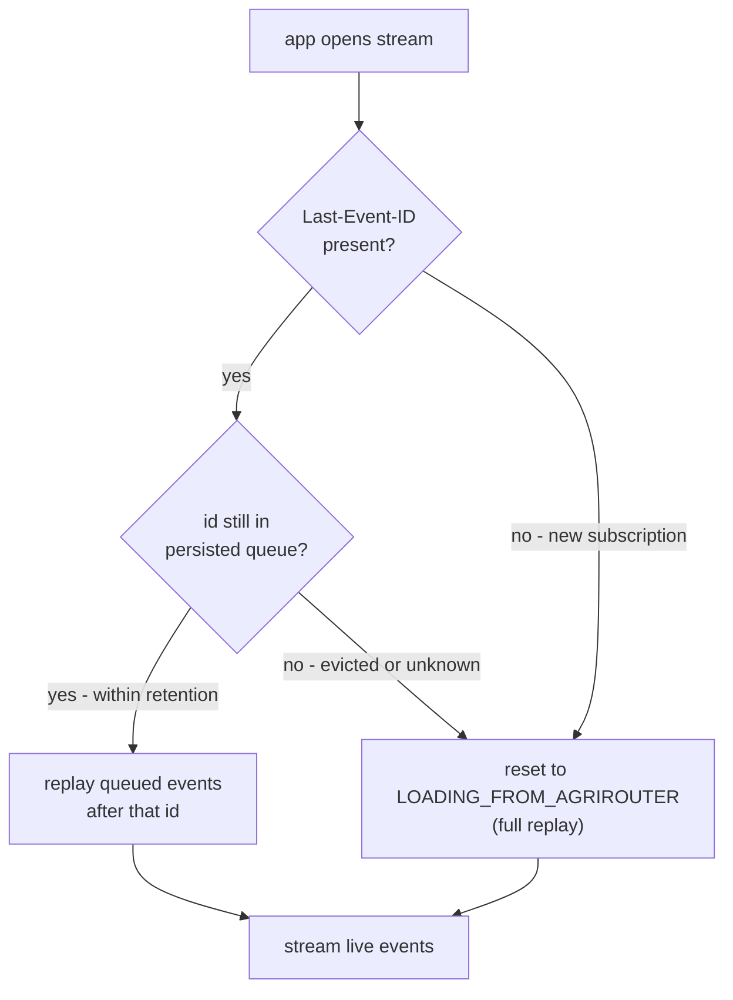
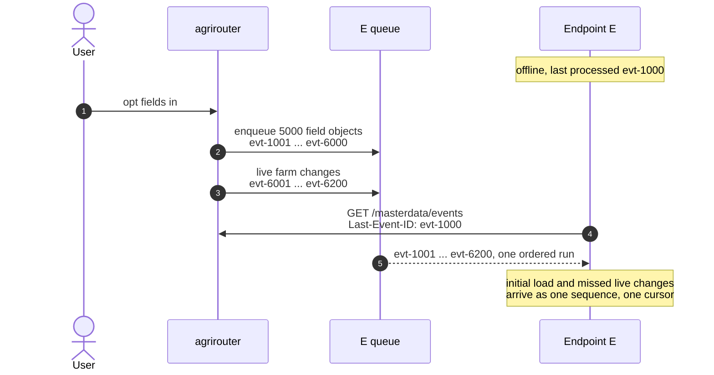
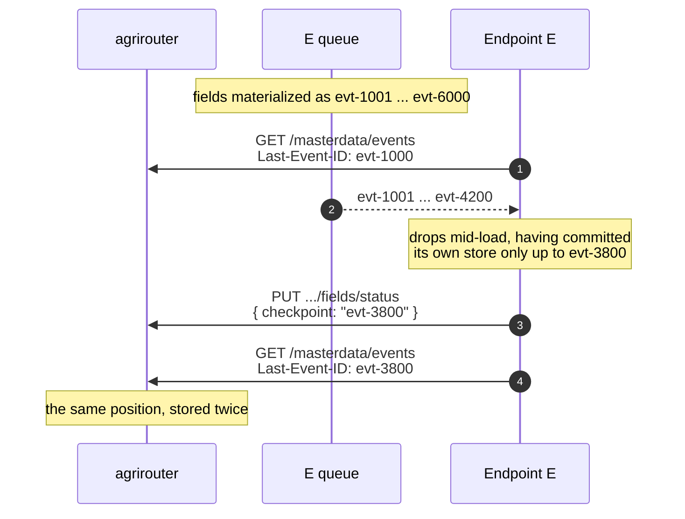

# ADR 06 - Sync streaming

- **Status:** WIP
- **Scope:** Synchronization of master data between agrirouter and partner platforms using streaming approach

## Context

<!-- TODO: explain streaming and resumability -->
https://html.spec.whatwg.org/multipage/server-sent-events.html#the-last-event-id-header

## Decision

### Resuming a stream

Every event carries an `id`. On reconnect the endpoint sends the id of the last
event it processed back in the `Last-Event-ID` header, and agrirouter continues
from the event *after* it. This only works while that id is still in the
persisted queue: the queue has a finite retention, so an endpoint that was down
long enough falls off the tail. In that case agrirouter cannot enumerate what
the endpoint missed, and the only way back to agreement is a full replay -
i.e. re-entering [initial load](./06-initial-load.md).

"Processed" means durably applied, not merely received: an endpoint MUST resume on
the last event it committed to its own store, and it derives that id from that
store rather than from whatever its stream client last read. Delivery is therefore
at-least-once - everything after the committed position is sent again on reconnect,
so a connection dropping mid-batch costs a redelivery rather than a silent gap.
Redelivery arrives in the original order, so an endpoint needs its apply to be
idempotent, but it does not need to reason about ordering.

1. **No `Last-Event-ID`.** The endpoint has no position to resume from, so it is
   treated as a fresh subscription and goes through initial load.
2. **Known id.** The id is still within the retention window: agrirouter sends
   the queued events that follow it, then switches to live delivery. The
   endpoint is caught up without a full replay.
3. **Unknown or evicted id.** The endpoint was offline longer than retention, or
   presents an id agrirouter never issued. agrirouter MUST NOT silently continue
   from the current head - that would leave a gap the endpoint cannot detect.
   Instead it signals the endpoint that the resume point is gone and moves the
   affected entity types back to `LOADING_FROM_AGRIROUTER`, so the canonical set
   is handed over again and reconciled as in [ADR 06](./06-initial-load.md).

### Replay is materialized when the entity type is opted in

Opting an entity type in enqueues its canonical set into the endpoint's persisted
queue immediately, at the tail, with ordinary event ids. Initial load is therefore
not a separate delivery mode - it is a block of events,
sitting in the same queue as everything else, and `Last-Event-ID` remains the only
position an endpoint ever needs to keep.

**Example.** Endpoint E has processed up to `evt-1000` and is offline. The user
opts `fields` in on a tenant holding 5000 of them, and farm changes keep arriving
in the meantime.

The ids are assigned when the toggle happens, not when E shows up, so the canonical
set occupies `evt-1001` to `evt-6000` and everything that happens afterwards sits
behind it. E's stored position is still `evt-1000` and still means what it did
before - it resumes the way it would from any other disconnect, and never has to
know that an initial load began while it was away. The load and the changes it
missed arrive as one contiguous run, so there is no phase to switch between and no
second request to make.

Two properties follow from that. Dependency order is free: opting farms and fields
in together enqueues farms first, so they arrive first, which is what
[ADR 06](./06-initial-load.md) needs in order to reconcile a field against a farm
the endpoint already holds. And a drop mid-load is not a special case - an endpoint
that stops at `evt-4000` reconnects with that id and carries on, using the same
mechanism as a reconnect in steady state.

**Alternative**: tracking initial-load progress outside the stream, as an opaque
`checkpoint` the endpoint reports on its status resource and agrirouter stores and
echoes back. The same scenario, with the endpoint dropping mid-load:

1. **E reconnects** on the position it stored, `evt-1000`, and agrirouter begins
   delivering the materialized set from there.
2. **Delivery reaches `evt-4200` and the connection drops.** E received that far,
   but its own store committed only through `evt-3800` - receiving an event and
   durably applying it are not the same moment.
3. **E reports a checkpoint** of `evt-3800`, the committed position - the same one
   [Resuming a stream](#resuming-a-stream) requires it to resume on.
4. **E reconnects with `Last-Event-ID: evt-3800`** - the same value it just
   reported. The checkpoint told agrirouter nothing the reconnect did not.

For a correctly built endpoint the two positions are therefore always equal, and
the checkpoint is a copy of the stream position kept in a second place. An endpoint
that reports what it *received* instead would put `evt-4200` on the status resource
and still reconnect at `evt-3800`, leaving agrirouter holding two positions 400
events apart for one endpoint and one queue - and because the checkpoint is chosen
by the endpoint and opaque, agrirouter can neither detect the disagreement nor act
on it. So the field is either redundant or unverifiable.

Two further weaknesses. It is written only at the confirmation, at the end of the
from-agrirouter phase, so during the load it is stale by construction. And
surviving eviction, its one apparent advantage over a stream position, is illusory:
knowing where the endpoint got to is worthless once the events after that point are
gone.

A checkpoint carries information `Last-Event-ID` does not only when the canonical
set is delivered outside the queue, for example by scanning the SSOT when the endpoint
connects. That shape needs the second cursor, and it needs every partner to
discard any revision not newer than the one it holds, because a scan running
alongside live delivery can hand over the same object twice in either order.
Materializing at opt-in avoids both by keeping ordering agrirouter's problem
rather than the network's.

## Consequences

- **Enqueueing happens whether or not anyone is listening.** A tenant with 5000
  fields writes 5000 events into every endpoint opted into fields, at the moment of
  the toggle, and an endpoint that never reconnects never reads them. Opting the
  type back out before the first connection leaves them to be suppressed at
  delivery.
- **A large initial load can outlive its own retention.** If materializing pushes
  an offline endpoint past the retention window, its resume point is evicted, which
  triggers a full reload, which materializes the set again - a loop that never
  converges. Initial-load events therefore MUST NOT be evicted before they have
  been delivered once, or materialization MUST be deferred for endpoints with no
  recently live stream.

