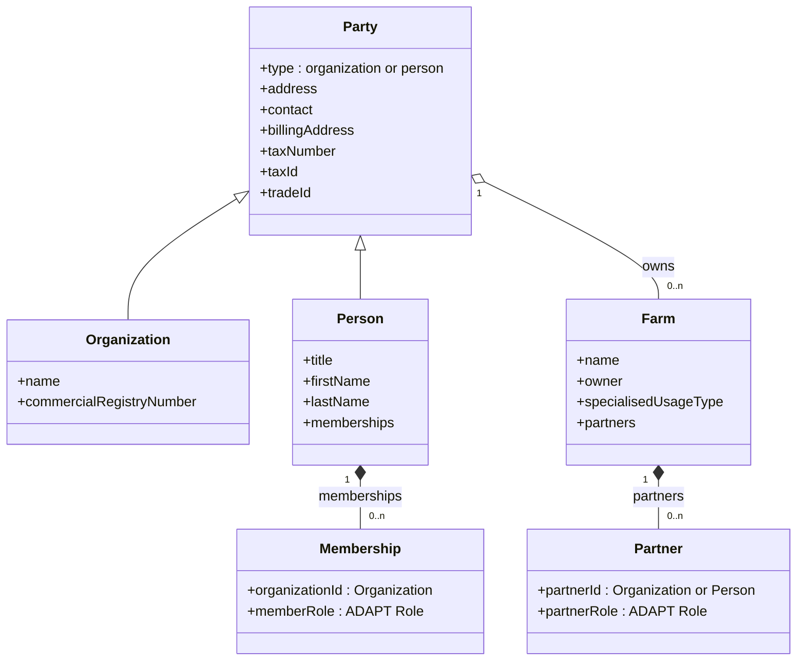
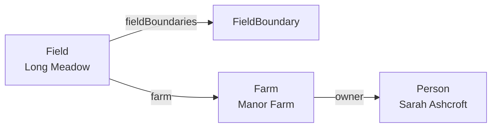
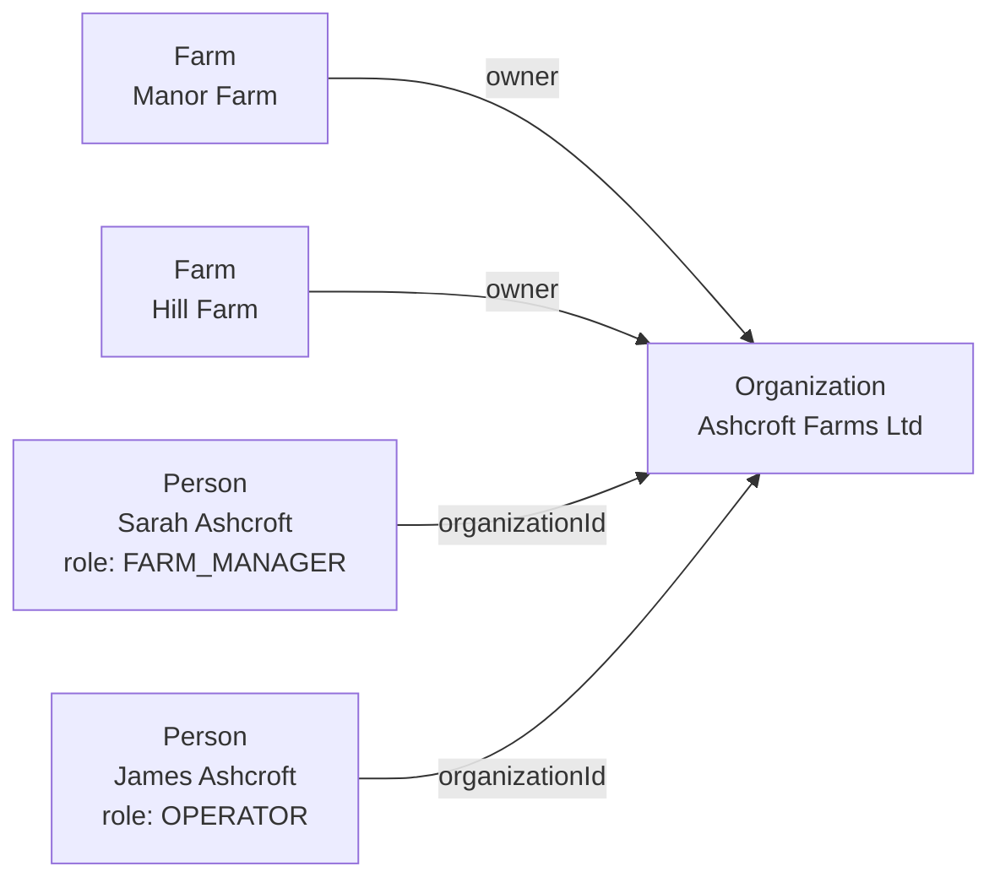
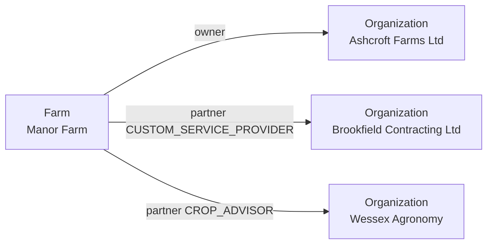
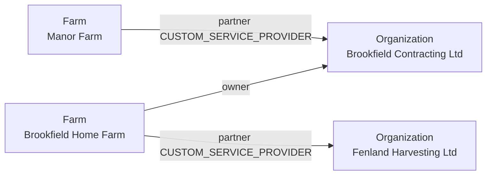

# ADR 08 - Parties, membership, and partners

- **Status:** WIP
- **Scope:** How AMSP models the people and businesses behind farms - who holds
  land, who belongs to an organization, and who works a farm for someone else

## Context

Land is held by businesses and by individuals, and the same actor appears in
several guises: a contractor is a business to its clients and a customer to its
own subcontractors, a farmer is simultaneously a person and a farm business,
and a farm is worked by people who neither own it nor belong to its owner.

A model that names these guises as types forces an actor into one of them.
A model that expresses them as relations does not.

## Decision

**A party is either an organization or a person**, distinguished by the envelope
`type` every entity already carries. Both hold the same contact and fiscal block,
because a farmer has a tax number and a trade id exactly as a company does.
Only the commercial register entry is specific to organizations.

**A member is a person holding a role in an organization.** Membership is state
on the person, expressed as a list, so one agronomist advising three
organizations is one canonical person rather than three copies. There is no
member entity type.

**A partner is a party holding a role on a farm** - the contractor that works it,
the advisor that reads it. Partnership is state on the farm, also a list.

Membership and partnership are the same idea at two attachment points, and both
draw their role from the [ADAPT Role](https://adaptstandard.org/dtd.html) list.

**A farm is owned by a party**, organization or person.

There is no attribute anywhere declaring that a party *is* a contractor or *is* a
customer. Those are relations, read off the graph.

The two reference properties, `organizationId` and `partnerId`, are named inside
the boxes rather than drawn as edges in order not to clutter the diagram.

## Scenarios

Arrows below mean *holds a reference to*.

### Scenario A: a farmer working their own land

No organization, no membership, no partner. The person is the business, and
nothing has to be declared about what kind of party she is.

### Scenario B: a farm business with several farms and staff

Two farms, one owner, two people carrying their roles on themselves.

### Scenario C: a contractor working someone else's land

The contractor is directly reference by farm it works on.

### Scenario D: an actor in several roles at once

Brookfield owns land, works Ashcroft's land, and hires Fenland for its own harvest. All
three hold simultaneously. No single attribute on Brookfield could have carried them.

## Consequences

- Entity types are `organization`, `person`, `farm`, `field`, `fieldBoundary`.
- A person may own a farm, and a member is an ordinary person, so a farm manager
  who also farms privately is expressible.
- A field may name an owner of its own, for systems that attribute fields to a
  party directly rather than only through the farm. It falls back to the farm's
  owner when absent, so the common case stays a single statement of ownership
  while a field held apart from the farm managing it remains expressible.
- Membership and partner entries are embedded and carry no `agrirouterId`. They
  are revised with the object holding them: changing who works for an
  organization revises the person, changing which contractor works a farm revises
  the farm. In both cases the object whose own record changed.
- An organization's roster is therefore not visible from the organization alone -
  it is assembled from the persons pointing at it.
- Receiving a farm discloses its partners, which is information about third
  parties who are not themselves party to that exchange.

## Notes on naming and placement

**`Party` is ADAPT's term.** ADAPT defines a party as a business entity or an
individual, carrying a required party type code that tells the two apart. AMSP
takes both the concept and the name, with two departures: it says **person**
where ADAPT says *individual*, and it draws the distinction from the envelope
`type` rather than a separate code, since every AMSP entity already carries one.
The role vocabulary on memberships and partners is ADAPT's as well.

**`specialisedUsageType` sits on the farm.** FarmSPT places it on Customer/Grower.
A production orientation describes what is grown where, and one party may run an
arable farm and a dairy farm at the same time, so the farm is the narrower and
more accurate holder. This is a deliberate departure from the source document.

## Partners do not grant access

`partners` records a business relationship. It MUST NOT be read as granting
visibility of the farm or of anything below it. Who receives what is decided by endpoint opt-in and routing, before anything is
sent.

A participant receiving a farm MUST NOT translate its `partners` entries into
access grants in its own system without a separate decision by its user.
