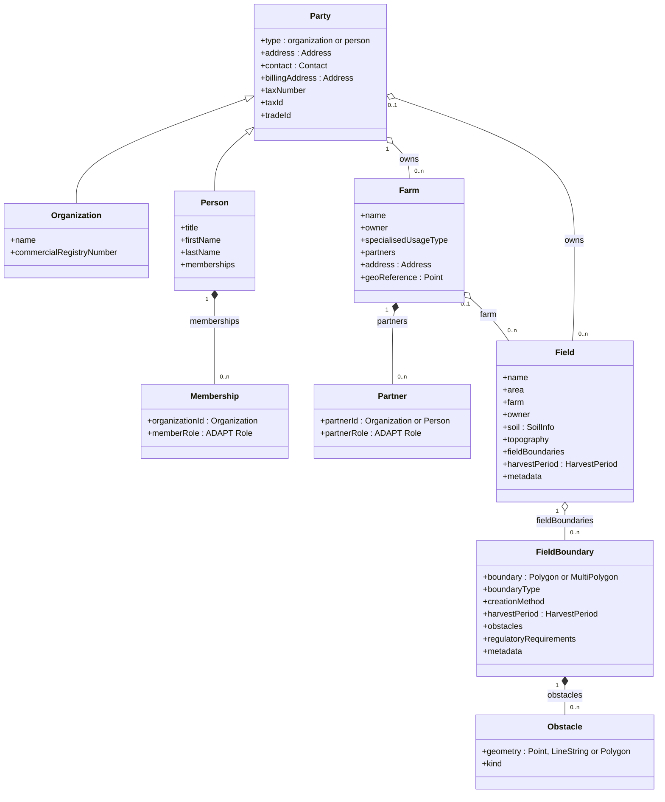
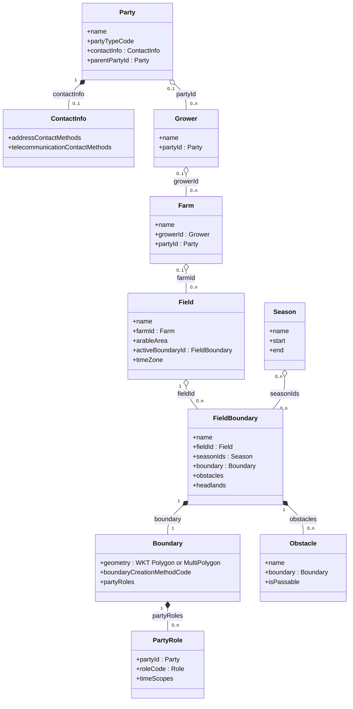

# ADR 11 - Entity model and ADAPT alignment

- **Status:** WIP
- **Scope:** The master-data entities of the specification compared with ADAPT 2,
  whether AgmaSync should adopt the ADAPT data model, and what to take from it
  otherwise

## Context

AgmaSync already borrows from ADAPT: the term *party*
([ADR 08](08-party-model.md)), the Role list, and the BoundaryCreationMethod
codes. The question is whether to go further and use ADAPT's entities as the wire
model, so that systems built on ADAPT can join with less work.

### AgmaSync entities



### The same entities in ADAPT



### Mapping one farm both ways

[examples](../examples/) maps one farm both ways.
Findings from that exercise:

| | |
| --- | --- |
| AgmaSync attributes (envelope plus 6 entity types) | 42 |
| with a native ADAPT counterpart | 17, including owner → Grower (1:1) and harvest period → Season; 2 only after restructuring (boundary list inverted, area in ha) |
| needing a custom context item | 25, which need 45 custom definitions because lists and structured values take several each (e.g. `partners`: list, entry, party id, party type, role). One of them, `AgmaSync-SeasonId`, only links a field to its Season, since an ADAPT Field has no `seasonIds` |
| ADAPT attributes with no AgmaSync source | the boundary `name` ADAPT requires |

Here is an example for the farm's contractor. In AgmaSync:

```json
{
  "type": "farm",
  "name": "Hofgut Sonnenberg",
  …
  "partners": [
    {
      "partner_id": 
        { 
          "type": "organization", 
          "agrirouter_id": "0b6e…4a53" 
        },
      "partner_role": "CUSTOM_SERVICE_PROVIDER"
    }
  ],
  …
}
```

In ADAPT, ADAPT's Farm has no partners, so the same data becomes nested
context items, each one declared in `customDataTypeDefinitions`:

```json
{
  "name": "Hofgut Sonnenberg",
  …
  "contextItems": [
    …
    { "definitionCode": "AgmaSync-Partners", "contextItems": [
      { "definitionCode": "AgmaSync-Partner", "contextItems": [
        { "definitionCode": "AgmaSync-PartnerPartyId", "valueText": "0b6e…4a53" },
        { "definitionCode": "AgmaSync-PartnerPartyType", "valueText": "ORGANIZATION" },
        { "definitionCode": "AgmaSync-PartnerRole", "valueText": "CUSTOM_SERVICE_PROVIDER" }
      ]}
    ]},
    …
  ]
}
```

The gap is mostly in parties and the envelope: fiscal and registry identifiers,
person name parts, memberships, billing address, partners, revision, tenant.

ADAPT 2.0.2 as published is permissive. No object rejects unknown properties.
The rule that a context item carries a value or nested items is not enforced.
A `referenceId` is unique only "within a single data instance", meaning one
file.

## Options

- **A. Keep the AgmaSync model.** Reuse ADAPT code lists where they fit.
- **B. Adopt ADAPT as the wire model.** ADAPT entities, with everything else in
  `AgmaSync-` context items as in the example.
- **C. Keep the AgmaSync model, align selectively, and publish a mapping.** A
  normative two-way mapping plus the `AgmaSync-` custom definitions, so ADAPT
  systems convert at their edge. Adopt ADAPT's structure where it is better for
  sync.
- **D. Accept both on the wire.** agrirouter translates between them.
- **E. Wrap ADAPT in the AgmaSync envelope.** Each object is an AgmaSync
  envelope with typed fields. It carries the unchanged ADAPT component in
  `adapt`, and what ADAPT lacks as typed AgmaSync fields in `extensions`, not
  as context items.

## Criteria

1. **Adoption cost** for each kind of participant.
2. **Contract strength.** Can the published schema reject invalid data?
   ([ADR 02](02-data-model.md) chose strict validation because ISOXML's
   permissiveness made implementations diverge.)
3. **Fit with sync.** Identity, revision, and typed references per object.
4. **Lossless round trip** between participants.
5. **Evolution and governance.** Who controls change, and at what speed.
6. **Tooling.** Generated clients, validators, readability of payloads.
7. **Cost to agrirouter.**

## Analysis

### 1. Adoption cost by participant

Participants fall into three groups. Their share is not known (see Open
questions).

| Participant | A | B | C | E |
| --- | --- | --- | --- | --- |
| Built on ADAPT 2 | map to AgmaSync | lowest: native shape, still must handle `AgmaSync-` items | low: published mapping and definitions | low: `adapt` passes through unchanged, `extensions` are typed |
| Built on ISOXML / EFDI | low: AgmaSync mirrors Customer / Farm / Partfield attributes | high: map to ADAPT, then to context items | low | medium to high: map to ADAPT, no context items |
| Proprietary REST (client / farm / field) | medium | medium to high | medium | medium to high |

B lowers the cost for one group and raises it for the group ADR 02 targets. The
saving for ADAPT systems is also smaller than it looks. 25 of 42 attributes
would still arrive as `AgmaSync-` context items, which they must understand
anyway to read the data. Using ADAPT's shape does not make the content
understood.

### 2. Contract strength

Context items are an entity-attribute-value (EAV) model: a list of
code/value pairs. EAV suits open extension in files. For a validated API
contract it is a known anti-pattern.

- A JSON schema cannot say "when the code is X, the value must be a UUID
  referencing a party". That rule moves out of the schema into prose and into
  code at agrirouter and at every client.
- Everything can still be enforced. agrirouter can reject undeclared codes as a
  `400`, which ADAPT's own rules support. It can also check values against each
  definition's base type, regular expression, range and scopes. That is a second
  validator in addition to JSON schema. It is custom and must be reimplemented by
  every participant that wants to validate before sending.

Example: a participant misspells one name in the partner above.

| | Misspelling | JSON schema says |
| --- | --- | --- |
| AgmaSync | `"partner_rol": "CUSTOM_SERVICE_PROVIDER"` | `400`: `partner_role` is required |
| ADAPT | `"definitionCode": "AgmaSync-PartnerRol"` | valid: any string is a definition code |

Under ADAPT, only the custom validator notices that `AgmaSync-PartnerRol` is not
declared. A participant without it sends the object, and the role is lost.

This recreates the situation ADR 02 set out to avoid: validity defined outside
the schema, so implementations diverge in how strictly they apply it.

### 3. Fit with sync

- **Identity.** ADAPT has no stable identity per object across exchanges. Its
  references are scoped to one file. B keeps AgmaSync's envelope entirely as
  extensions, and must redefine what `farmId`, `growerId` and similar mean on a
  per-object API. In the example, a field's `"farmId": "0b6e…4a54"` only works
  because the sample chose to use the agrirouter id as `referenceId`. ADAPT
  would equally allow `"farmId": "FARM-3001"`, the sending application's own
  local id, which means nothing to other applications:

  ```json
  "farms": [
    {
      "id": {
        "referenceId": "0b6e…4a54",
        "uniqueIds": [
          { "idText": "0b6e…4a54", "idTypeCode": "UUID", "idSource": "https://agrirouter.com" },
          { "idText": "FARM-3001", "idTypeCode": "STRING", "idSource": "urn:example:farm-management-app" }
        ]
      },
      "name": "Hofgut Sonnenberg",
      …
    }
  ],
  "fields": [
    { "name": "Am Mühlenbach", "farmId": "0b6e…4a54", … }
  ]
  ```

  Equally valid ADAPT, where the reference is the sender's local id:

  ```json
  "farms":  [ { "id": { "referenceId": "FARM-3001" }, "name": "Hofgut Sonnenberg", … } ],
  "fields": [ { "name": "Am Mühlenbach", "farmId": "FARM-3001", … } ]
  ```
- **References.** In AgmaSync, every attribute that points at another object has
  the type `EntityReference` or `PartyReference`: `partner_id` above, `owner`,
  `farm`, `organization_id`. agrirouter finds them from the schema and applies
  the same rules to all: resolve a `local_id` on send, fill in `agrirouter_id`
  on delivery, lazy-load by the target's `type`, reject a target not yet sent.
  Under B, both parts can be modelled, but only as AgmaSync conventions:

  - **Reference marker.** The custom definition declares that it holds a
    reference, and to what, in its `keywords` and agrirouter finds references from
    the published definitions.
  - **Target type.** A sibling item carries the party type, so a receiver that
    does not hold the party knows which kind to lazy-load.

  Example: the sender names the contractor by its own local id. In AgmaSync:

  ```json
  "partner_id": { "type": "organization", "local_id": "ORG-1002" }
  ```

  Under B, the partner entry:

  ```json
  { "definitionCode": "AgmaSync-PartnerPartyId", "valueText": "ORG-1002" },
  { "definitionCode": "AgmaSync-PartnerPartyType", "valueText": "ORGANIZATION" }
  ```
  and the definition it relies on:
  ```json
  { "definitionCode": "AgmaSync-PartnerPartyId", "dataDefinitionBaseTypeCode": "TEXT",
    "keywords": "reference:party", … }
  ```

  This works, with the cost described under Contract strength: the JSON schema
  does not enforce either convention, generic ADAPT tools do not understand
  them, and every participant implements them. In AgmaSync they come with the
  schema type.
- **Aggregate boundaries.** ADAPT is better on one point. A boundary references
  its field (`fieldId`), whereas AgmaSync's field lists its boundaries
  (`field_boundaries`). Under AgmaSync's model ([ADR 03](03-revision-model.md)),
  adding a boundary therefore revises the field, which causes needless conflicts
  on the field. The child referencing its parent is the better design for a
  revision-based sync.
- **Grower and Party.** Two objects for one owner means two revisions to keep
  consistent. ADR 08 avoided this split on purpose.
- **Write semantics.** Writes are JSON Merge Patch (RFC 7396): objects merge
  key by key, arrays are replaced whole. Under B, most attributes sit in the
  `contextItems` array, so plain RFC 7396 loses partial updates and turns
  unrelated edits into conflicts. Merging `contextItems` by `definitionCode`, as
  if the array were an object keyed by code, restores both.

  Example: from revision 7, one endpoint corrects the tax number and another
  the trade id. In AgmaSync these are different keys, so agrirouter merges both:

  ```json
  { "tax_number": "24/203/01235" }
  { "trade_id": "276030000012346" }
  ```

  Under B, with the keyed merge, the same two writes also merge:

  ```json
  { "contextItems": [ { "definitionCode": "AgmaSync-TaxNumber", "valueText": "24/203/01235" } ] }
  { "contextItems": [ { "definitionCode": "AgmaSync-TradeId", "valueText": "276030000012346" } ] }
  ```

  With plain RFC 7396, each write would replace the whole array: the first
  would wipe everything but the tax number, and the second would conflict with
  it.

  The keyed merge is a custom rule, not RFC 7396, and it needs more rules to
  be complete:

  - **Removal.** RFC 7396 removes with `null`, but there is no key to set to
    `null`, and ADAPT does not allow `"valueText": null`. A convention is
    needed, e.g. an item with neither `valueText` nor `contextItems`.
  - **Repeated codes.** `AgmaSync-Partner` occurs once per partner and has no
    key, so the partners list is replaced whole, as in AgmaSync. Metadata is
    worse: AgmaSync merges `metadata` per key, while `AgmaSync-Metadata` entries
    are a list, unless the merge also keys them by `AgmaSync-MetadataKey`.
  - **ADAPT's own arrays.** `telecommunicationContactMethods` holds phone,
    mobile and email together, where AgmaSync's `contact` has one key each.
    Merging them per item needs a key per array: `telecommunicationContactTypeCode`,
    `addressContactTypeCode`, `idSource` for `uniqueIds`.

  Every participant implements these rules, since no RFC 7396 library applies
  them.

### 4. Lossless round trip

The example round-trips losslessly only because of the custom definitions.
Where one side has something the other lacks, the loss is structural:

- ADAPT → AgmaSync: a Grower without a Party has no AgmaSync equivalent.
  `{ "id": { "referenceId": "g1" }, "name": "Müller" }` is valid ADAPT, but it
  has no organization-or-person type and no contact data to build a party from.
- AgmaSync → ADAPT: none, provided the receiver knows the `AgmaSync-`
  definitions. An ADAPT tool that does not know them keeps the values but loses
  their meaning.

Under B, a participant that ignores unknown context items, which ADAPT allows,
writes back an object without them. For example, an ADAPT tool renames the farm
and sends it back with only `name` and `growerId`, dropping `AgmaSync-Partners`.
What protects the partners then depends on write semantics, not on the model.
If the tool leaves out `contextItems` entirely, merge patch keeps them. If it
sends `contextItems` with only its own items, plain RFC 7396 replaces the array
and the partners, tax ids and envelope are gone. Only the keyed merge from
Write semantics keeps them.

### 5. Evolution and governance

- Under B, AgmaSync's core shape follows AgGateway's release cycle and
  governance. The attributes that matter most here would live in AgmaSync's own
  definitions anyway, so B couples AgmaSync to ADAPT without handing the content
  over.
- Under A and C, AgmaSync controls its schema and tracks ADAPT through the
  mapping. When ADAPT adds a slot, the mapping moves an attribute out of custom
  items. Neither AgmaSync nor its participants have to change.

### 6. Tooling

- **Generated clients.** Under B, generated code exposes `contextItems` lists,
  not `partners` or `tax_id`. Every participant writes its own lookup and
  conversion code for about 60% of the data. Reading the contractor's role,
  in Go:

  ```go
  // AgmaSync
  role := farm.Partners[0].PartnerRole

  // ADAPT
  var role string
  for _, ci := range farm.ContextItems {
      if ci.DefinitionCode != "AgmaSync-Partners" { continue }
      for _, p := range ci.ContextItems {
          for _, f := range p.ContextItems {
              if f.DefinitionCode == "AgmaSync-PartnerRole" { role = f.ValueText }
          }
      }
  }
  ```
- **Payloads.** The example needs 197 lines as AgmaSync and 1271 as ADAPT,
  including the definitions. On the wire, the definitions would be published
  once, not sent with every object.
- **Readability.** A typed payload documents itself. With context items, a
  reader needs the definitions next to the payload to understand it.

### 7. Cost to agrirouter

| | A | B | C | D | E |
| --- | --- | --- | --- | --- | --- |
| Schema and validation | exists | rewrite, plus a validator driven by the definitions | exists | both | envelope and `extensions` typed; `adapt` by a tightened copy of the ADAPT schema |
| Registry of custom definitions | none | required | publish once | required | none |
| Translation | none | none | none, done at the participant's edge | server-side in both directions | none |
| Conflict and merge semantics | exists | custom merge: keyed by `definitionCode`, plus rules for removal, repeated codes and ADAPT's own arrays | exists | across two representations | RFC 7396; only ADAPT's own arrays are replaced whole |

D is the most expensive. It also makes agrirouter responsible for lossy
translation between participants, so a field lost in translation becomes
agrirouter's fault.

### Option E in detail

The farm from the example under E:

```json
{
  "type": "farm",
  "agrirouter_id": "0b6e…4a54",
  "local_id": "FARM-3001",
  "revision": 12,
  …
  "adapt": {
    "name": "Hofgut Sonnenberg",
    "growerId": "0b6e…4a51",
    …
  },
  "extensions": {
    "specialised_usage_type": "arable farming",
    "partners": [
      {
        "partner_id": { "type": "organization", "agrirouter_id": "0b6e…4a53" },
        "partner_role": "CUSTOM_SERVICE_PROVIDER"
      }
    ],
    …
  }
}
```

E keeps what makes AgmaSync work and removes the EAV problem of B. Assessed on
the [criteria](#criteria) above:

- **Contract strength.** The envelope and `extensions` are typed and validated
  by JSON schema, like today. No context items, no definitions registry, no
  second validator. `adapt` is only as strict as the ADAPT schema, which is
  permissive. AgmaSync would publish a tightened copy that rejects unknown
  properties.
- **Identity and references.** The envelope carries identity, revision and
  tenant, as today. References in `extensions` are `EntityReference` /
  `PartyReference`. References inside `adapt` (`growerId`, `farmId`, `fieldId`,
  `partyId`, `seasonIds`) stay strings. That is a fixed list defined by ADAPT,
  not a growing one, and needs a rule that their value is an `agrirouter_id`
  or the sender's `local_id`.
- **Write semantics.** RFC 7396 works: envelope, `adapt` and `extensions` are
  objects, so a change to `partners` does not touch `name`. Only ADAPT's own
  arrays (`telecommunicationContactMethods`, `addressContactMethods`,
  `uniqueIds`) are replaced whole.
- **Round trip.** An ADAPT tool that edits only `adapt` leaves `extensions`
  untouched, and merge patch keeps them. That is the case B cannot protect
  without a custom merge.
- **Two places for data.** Every attribute lives in `adapt` if ADAPT has a
  slot, otherwise in `extensions`. A reader must know which. When a later ADAPT
  version adds a slot, the attribute moves from `extensions` to `adapt`, which
  is a breaking change. Under C the same event changes only the mapping.
- **Structure inherited from ADAPT.** The body brings Grower and Season as
  objects of their own, and the boundary references its field. The last one is
  wanted. The first two add objects to sync.
- **Versioning.** The envelope must name the ADAPT version of `adapt`, and
  AgmaSync decides when to move to a new one.

E is the strongest option built on ADAPT. Compared with C, it trades a lower
cost for ADAPT participants against a higher one for ISOXML participants, data
split across two vocabularies, and extra objects to sync.

## Recommendation

**Option C.**

1. Keep the AgmaSync model as the contract, under ADR 02.
2. **Reverse the field–boundary reference**, following ADAPT: `fieldBoundary.field`
   replaces `field.field_boundaries`. This needs its own ADR.
3. Keep reusing ADAPT code lists. Wherever AgmaSync has an extensible
   enumeration, draw its values from the ADAPT list if one exists.
4. Publish a normative AgmaSync–ADAPT mapping and the `AgmaSync-` definitions,
   starting from the example. ADAPT-based participants then convert at their
   edge, and there is one conversion instead of one per participant.
5. Keep the Grower concept out of the model. For ADAPT → AgmaSync, the mapping
   states that a Grower becomes its Party, and that a Grower without a Party is
   rejected.

## Open questions

- **Participant mix.** How many prospective participants run on ADAPT 2
  natively, rather than exporting to it? If a clear majority do, the balance in
  criteria 1 and 6 shifts, and E should be reassessed.
- **Harvest period.** Should it become a shared object, like ADAPT's Season? That
  only pays off if participants actually share seasons.
- **Who hosts the mapping.** Should the `AgmaSync-` definitions be proposed to
  AgGateway as standard definitions? That would move them into ADAPT's own list.
