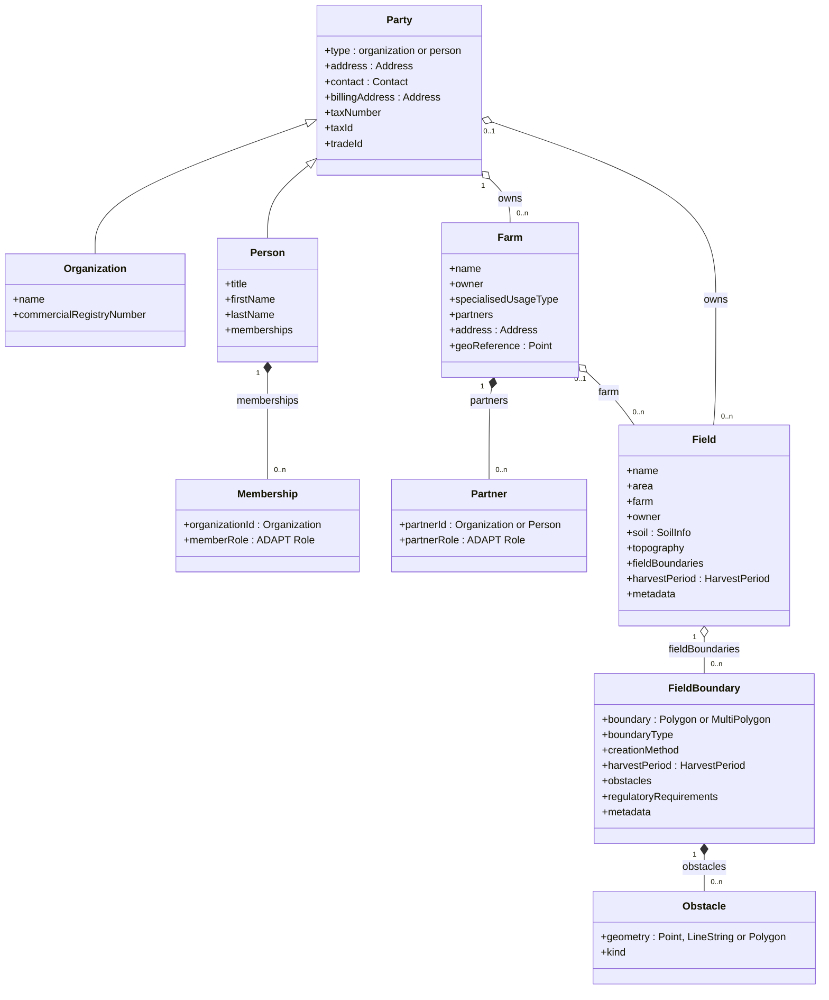
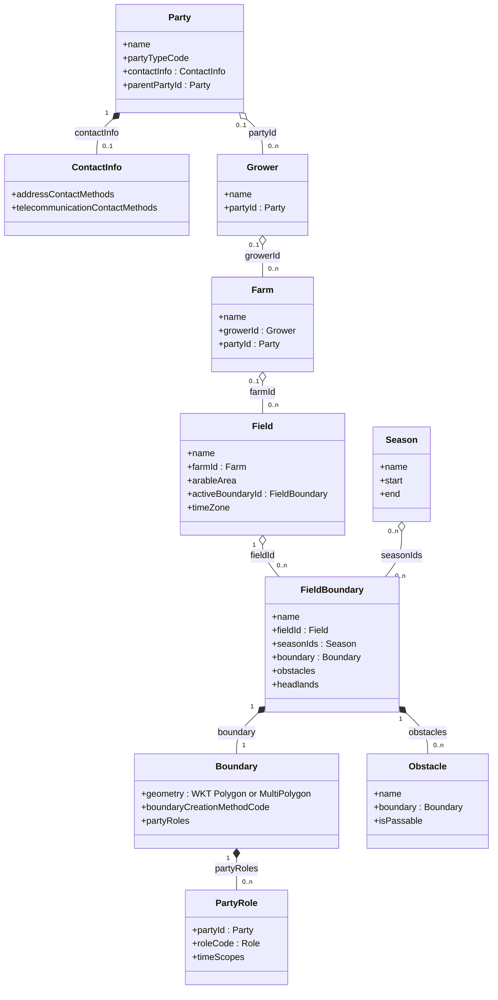

# ADR 11 - Entity model and ADAPT alignment

- **Status:** WIP
- **Scope:** The master-data entities of the specification compared with ADAPT 2,
  whether AgmaSync should adopt the ADAPT data model, and what to take from it
  otherwise

## Context

AgmaSync already borrows from ADAPT: the term *party*
([ADR 08](08-party-model.md)), the Role list, and the BoundaryCreationMethod
codes. The question is whether to go further and use ADAPT's entities as the wire
model, so that systems built on ADAPT can join with less work.

### AgmaSync entities

### The same entities in ADAPT

### Mapping one farm both ways

[examples](../examples/) maps one farm both ways.
Findings from that exercise:

| | |
| --- | --- |
| AgmaSync attributes (envelope plus 6 entity types) | 42 |
| with a native ADAPT counterpart | 17, including owner → Grower (1:1) and harvest period → Season; 2 only after restructuring (boundary list inverted, area in ha) |
| needing a custom context item | 25, which need 42 custom definitions because lists and structured values take several each (e.g. `partners`: list, entry, party id, role). One more, `AgmaSync-SeasonId`, only links a field to its Season, since an ADAPT Field has no `seasonIds` |
| ADAPT attributes with no AgmaSync source | the boundary `name` ADAPT requires |

The gap is mostly in parties and the envelope: fiscal and registry identifiers,
person name parts, memberships, billing address, partners, revision, tenant.

ADAPT 2.0.2 as published is permissive. No object rejects unknown properties.
The rule that a context item carries a value or nested items is not enforced.
A `referenceId` is unique only "within a single data instance", meaning one
file.

## Options

- **A. Keep the AgmaSync model.** Reuse ADAPT code lists where they fit.
- **B. Adopt ADAPT as the wire model.** ADAPT entities, with everything else in
  `AgmaSync-` context items as in the example.
- **C. Keep the AgmaSync model, align selectively, and publish a mapping.** A
  normative two-way mapping plus the `AgmaSync-` custom definitions, so ADAPT
  systems convert at their edge. Adopt ADAPT's structure where it is better for
  sync.
- **D. Accept both on the wire.** agrirouter translates between them.

## Criteria

1. **Adoption cost** for each kind of participant.
2. **Contract strength.** Can the published schema reject invalid data?
   ([ADR 02](02-data-model.md) chose strict validation because ISOXML's
   permissiveness made implementations diverge.)
3. **Fit with sync.** Identity, revision, and typed references per object.
4. **Lossless round trip** between participants.
5. **Evolution and governance.** Who controls change, and at what speed.
6. **Tooling.** Generated clients, validators, readability of payloads.
7. **Cost to agrirouter.**

## Analysis

### 1. Adoption cost by participant

Participants fall into three groups. Their share is not known (see Open
questions).

| Participant | A | B | C |
| --- | --- | --- | --- |
| Built on ADAPT 2 | map to AgmaSync | lowest: native shape, still must handle `AgmaSync-` items | low: published mapping and definitions |
| Built on ISOXML / EFDI | low: AgmaSync mirrors Customer / Farm / Partfield attributes | high: map to ADAPT, then to context items | low |
| Proprietary REST (client / farm / field) | medium | medium to high | medium |

B lowers the cost for one group and raises it for the group ADR 02 targets. The
saving for ADAPT systems is also smaller than it looks. 25 of 42 attributes
would still arrive as `AgmaSync-` context items, which they must understand
anyway to read the data. Using ADAPT's shape does not make the content
understood.

### 2. Contract strength

Context items are an entity-attribute-value (EAV) model: a list of
code/value pairs. EAV suits open extension in files. For a validated API
contract it is a known anti-pattern.

- A JSON schema cannot say "when the code is X, the value must be a UUID
  referencing a party". That rule moves out of the schema into prose and into
  code at agrirouter and at every client.
- Everything can still be enforced. agrirouter can reject undeclared codes as a
  `400`, which ADAPT's own rules support. It can also check values against each
  definition's base type, regular expression, range and scopes. That is a second
  validator in addition to JSON schema. It is custom and must be reimplemented by
  every participant that wants to validate before sending.

This recreates the situation ADR 02 set out to avoid: validity defined outside
the schema, so implementations diverge in how strictly they apply it.

### 3. Fit with sync

- **Identity.** ADAPT has no stable identity per object across exchanges. Its
  references are scoped to one file. B keeps AgmaSync's envelope entirely as
  extensions, and must redefine what `farmId`, `growerId` and similar mean on a
  per-object API.
- **References.** Under B, partners, memberships and field owner become text
  values. Resolving them, lazy-loading, write ordering and routing all remain
  possible, but only as special cases per definition code rather than as a
  generic reference type.
- **Aggregate boundaries.** ADAPT is better on one point. A boundary references
  its field (`fieldId`), whereas AgmaSync's field lists its boundaries
  (`field_boundaries`). Under AgmaSync's model ([ADR 03](03-revision-model.md)),
  adding a boundary therefore revises the field, which causes needless conflicts
  on the field. The child referencing its parent is the better design for a
  revision-based sync.
- **Grower and Party.** Two objects for one owner means two revisions to keep
  consistent. ADR 08 avoided this split on purpose.

### 4. Lossless round trip

The example round-trips losslessly only because of the custom definitions.
Where one side has something the other lacks, the loss is structural:

- ADAPT → AgmaSync: a Grower without a Party has no AgmaSync equivalent.
- AgmaSync → ADAPT: none, provided the receiver knows the `AgmaSync-`
  definitions. An ADAPT tool that does not know them keeps the values but loses
  their meaning.

Under B, a participant that ignores unknown context items, which ADAPT allows,
writes back an object without them. What protects the data then depends on
write semantics (merge patch keeps absent attributes), not on the model.

### 5. Evolution and governance

- Under B, AgmaSync's core shape follows AgGateway's release cycle and
  governance. The attributes that matter most here would live in AgmaSync's own
  definitions anyway, so B couples AgmaSync to ADAPT without handing the content
  over.
- Under A and C, AgmaSync controls its schema and tracks ADAPT through the
  mapping. When ADAPT adds a slot, the mapping moves an attribute out of custom
  items. Neither AgmaSync nor its participants have to change.

### 6. Tooling

- **Generated clients.** Under B, generated code exposes `contextItems` lists,
  not `partners` or `tax_id`. Every participant writes its own lookup and
  conversion code for about 60% of the data.
- **Payloads.** The example needs 197 lines as AgmaSync and 1214 as ADAPT,
  including the definitions. On the wire, the definitions would be published
  once, not sent with every object.
- **Readability.** A typed payload documents itself. With context items, a
  reader needs the definitions next to the payload to understand it.

### 7. Cost to agrirouter

| | A | B | C | D |
| --- | --- | --- | --- | --- |
| Schema and validation | exists | rewrite, plus a validator driven by the definitions | exists | both |
| Registry of custom definitions | none | required | publish once | required |
| Translation | none | none | none, done at the participant's edge | server-side in both directions |
| Conflict and merge semantics | exists | redefine for context items | exists | across two representations |

D is the most expensive. It also makes agrirouter responsible for lossy
translation between participants, so a field lost in translation becomes
agrirouter's fault.

## Recommendation

**Option C.**

1. Keep the AgmaSync model as the contract, under ADR 02.
2. **Reverse the field–boundary reference**, following ADAPT: `fieldBoundary.field`
   replaces `field.field_boundaries`. This needs its own ADR.
3. Keep reusing ADAPT code lists. Wherever AgmaSync has an extensible
   enumeration, draw its values from the ADAPT list if one exists.
4. Publish a normative AgmaSync–ADAPT mapping and the `AgmaSync-` definitions,
   starting from the example. ADAPT-based participants then convert at their
   edge, and there is one conversion instead of one per participant.
5. Keep the Grower concept out of the model. For ADAPT → AgmaSync, the mapping
   states that a Grower becomes its Party, and that a Grower without a Party is
   rejected.

## Open questions

- **Participant mix.** How many prospective participants run on ADAPT 2
  natively, rather than exporting to it? If a clear majority do, the balance in
  criteria 1 and 6 shifts, and B should be reassessed.
- **Harvest period.** Should it become a shared object, like ADAPT's Season? That
  only pays off if participants actually share seasons.
- **Who hosts the mapping.** Should the `AgmaSync-` definitions be proposed to
  AgGateway as standard definitions? That would move them into ADAPT's own list.
