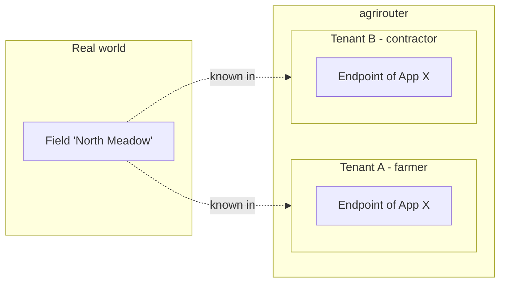
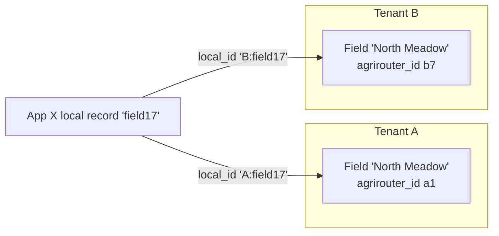
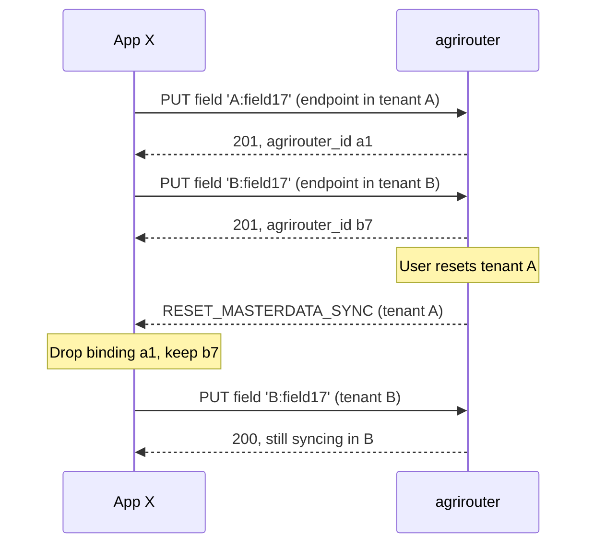
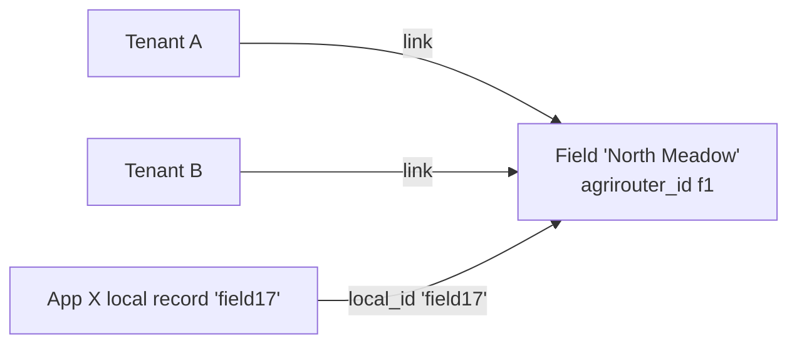
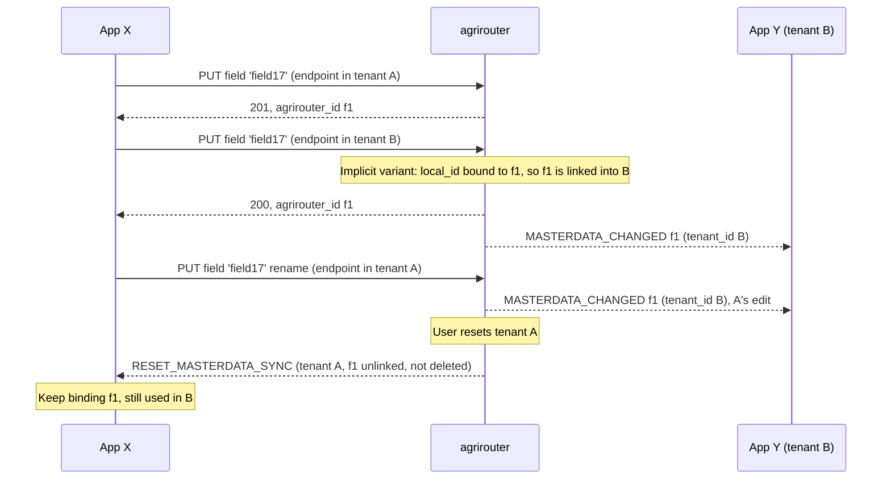
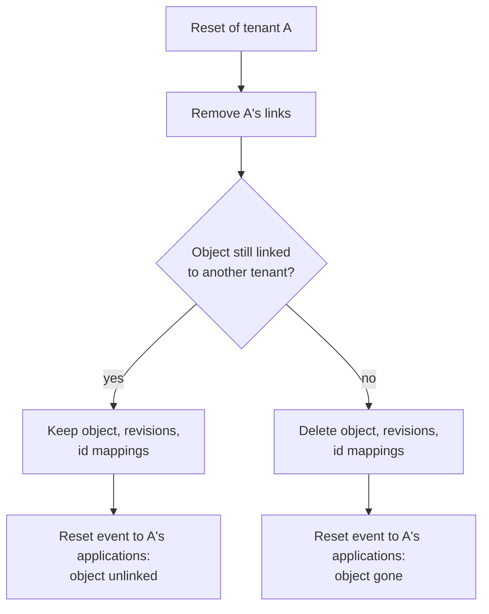
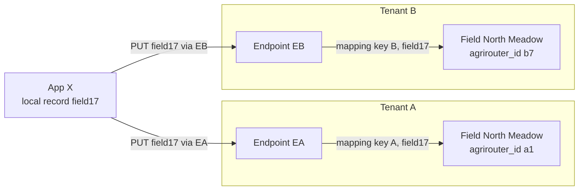
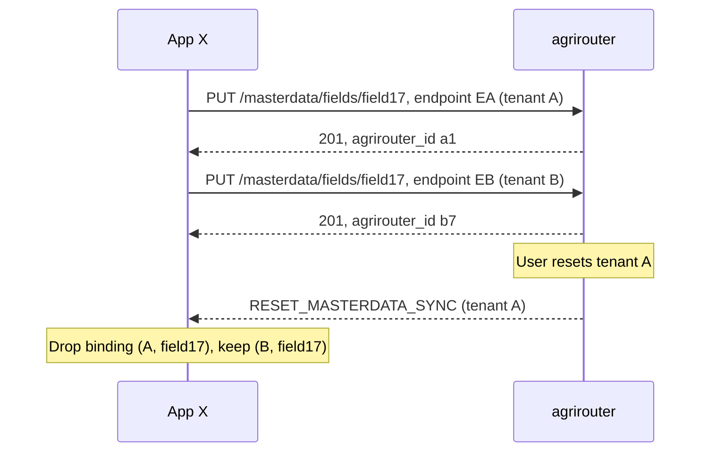

# ADR 14 - Tenant scope of a canonical object

- **Status:** WIP
- **Scope:** Whether a canonical object belongs to exactly one tenant, or can be
  shared by several tenants, and what each answer means for participants and for
  agrirouter

## Context

A tenant is one customer's space in agrirouter: their endpoints, their routes,
their master data. A user resets master data per tenant, and routes are created
per tenant.

agrirouter keeps an identifier mapping per application, from the application's
`local_id` to a canonical object ([ADR 10](./10-identifier-binding.md)). Open
here is its scope: whether a `local_id` names one object across all of the
application's tenants or one object per tenant, and whether one object can be
held by several tenants at all.

Real data does not always respect tenant lines. A contractor works the same
field for a farmer; a farmer runs two agrirouter accounts; one farm management
system serves both. The same field then shows up in two tenants. This ADR decides
whether agrirouter models that as two objects or as one.

Three options:

- **Option 1 - each object belongs to one tenant.** The same field in two
  tenants is two objects.
- **Option 2 - an object can be shared by several tenants.** The field exists
  once and is linked to every tenant that holds it.
- **Option 3 - each object belongs to one tenant, `local_id` scoped per tenant.**
  As option 1, but agrirouter keys the identifier mapping by tenant as well, so
  the application can use the same `local_id` in each tenant.

## Option 1 - each object belongs to one tenant

The field in tenant A and the field in tenant B are two canonical objects, with
two `agrirouter_id`s. They share nothing in agrirouter.

### For a participant

- **One record, two tenants, two local ids.** A `local_id` maps to one canonical
  object, so the application gives the record a different `local_id` per tenant,
  for example a tenant-qualified one. Reusing the same `local_id` in the second
  tenant is rejected with `400`.
- **Edits stay in their tenant.** An edit in tenant A reaches tenant A's other
  participants only. If the application wants both copies to agree, it writes to
  both, itself.
- **Reset is local.** A reset of tenant A discards the application's bindings in
  A. Its bindings in B are untouched, and B keeps syncing.
- **References stay in the tenant.** A field in B can only reference a farm in B.

### For agrirouter

- Every object, revision and delivery row carries one tenant. Isolation follows
  from the key.
- Revisions, conflicts and three-way merges are per tenant. A write in A never
  races a write in B.
- A reset deletes the tenant's objects, its id mappings to them, its routes and
  its initial-load state. Nothing outside the tenant changes.

### Edge cases

| Case | Outcome |
| --- | --- |
| App sends the same `local_id` in tenant B that it already uses in tenant A | `400`: the `local_id` is bound to an object in another tenant |
| Field in B references a farm in A by `agrirouter_id` | `400`: the reference must name an object in the writer's tenant |
| Tenant A is reset while B holds a copy | B's copy is untouched; the two copies were never linked |
| User wants one edit to update both tenants | Not possible in agrirouter; the application writes both copies |
| Another application in B wants to know the copies are the same field | agrirouter cannot tell it; only the writing application knows |

### Cost

The duplicate is visible to whoever looks across tenants, and keeping copies
consistent is the application's job. In exchange, tenants stay isolated: no
write, reset, deactivation or conflict in one tenant affects another.

## Option 2 - an object can be shared by several tenants

The field exists once, as `agrirouter_id` f1. Tenants A and B are both linked to
it. agrirouter deletes the object when its last link goes.

### For a participant

- **One record, one local id.** The application maps its record to f1 once, and
  uses it in both tenants.
- **Writes still go through an endpoint.** Every write names the acting endpoint,
  and the endpoint's tenant is the tenant the write comes through. The object
  must be linked to that tenant.
- **Edits cross tenants.** An edit through tenant A changes the field that
  tenant B's participants receive. B's user did not route anything from A, but
  receives A's change.
- **`tenant_id` names the delivery, not the object.** A receiver still needs a
  `tenant_id` to partition on, so it means "the tenant this delivery is for", and
  the object is delivered once per linked tenant. `source_endpoint_id` can name an
  endpoint in another tenant, which discloses that endpoint to tenant B and
  cannot drive origin suppression per tenant.
- **Reset unlinks.** A reset of tenant A removes A's link to f1. f1 survives in B.
  A reset cannot ask participants to discard every binding in the tenant: the
  application's binding to f1 is one binding, used in both tenants, so it must
  keep it. The reset event has to say which objects are gone and which are only
  unlinked.
- **Linking happens on a write, or on an explicit call.** Two variants:
  - *Implicit:* the application writes through an endpoint in tenant B with a
    `local_id` already bound to f1. agrirouter links f1 into B and applies the
    write. No new operation, but any application in both tenants can carry an
    object from one into the other.
  - *Explicit:* a separate call links f1 into B, and a write through B to an
    unlinked object is refused. Linking becomes a visible step that a consent
    rule can attach to.

### For agrirouter

- The object, its revisions and its identifier mappings carry no tenant. A
  membership relation links objects to tenants.
- Delivery fans out: a change to f1 produces one delivery row per linked tenant,
  each entitled and ordered on its own.
- Revisions and conflicts become global for the object. A write in A can
  conflict with a write in B, and the merge base may come from either tenant.
- Reset removes the tenant's links, then deletes objects with no link left,
  together with their mappings and revisions.

### Questions this option must answer

| Question | Why it matters |
| --- | --- |
| Who may link an object into another tenant, and with whose consent? | Linking moves data into a tenant whose user did not create it. Tenant B's user has to agree, or the link is a data leak. |
| Is deactivation per tenant or global? | Per tenant is the same as unlinking. Global means tenant A can deactivate tenant B's field. |
| Which tenant may a reference point into? | A field in B referencing a farm linked only to A would deliver a dangling reference in B. Links would have to be dependency-closed, like opt-in. |
| What does initial load in B contain? | Objects linked to B, including ones last written through A, with A's `source_endpoint_id`. |
| What does `source_endpoint_id` say on a delivery to B? | Either another tenant's endpoint (disclosure) or a placeholder (origin suppression breaks). |
| How does a participant hold bindings? | Per object, shared across tenants, so it cannot discard "the bindings of a tenant" on reset. The reset event has to distinguish deleted objects from unlinked ones. |
| What happens when B unlinks while A keeps editing? | B stops receiving changes; A carries on. Needs a defined event for "object left this tenant", short of a reset. |

### Edge cases

| Case | Outcome |
| --- | --- |
| App links f1 into tenant B where App Y already has its own copy y5 of the same field | Two objects again, now in one tenant. Merging f1 and y5 needs yet another operation. |
| Concurrent edits to f1 through A and B | One wins, the other merges or conflicts. Each tenant's users see the other tenant's change. |
| Tenant A resets while tenant B is mid initial load of f1 | f1 survives; the load in B is unaffected. A's applications must keep their binding to f1. |
| Last link removed by a reset of B, while A unlinked earlier | f1 is deleted with the reset of B. Applications in A never hear about it, because A's link was gone. |
| Contractor's tenant B is reset | The farmer's fields in A survive, unlinked from B. The contractor's applications keep bindings they can no longer use in B. |

### Cost

One object per real-world thing, and no duplicate copies to keep in step. In
exchange, tenants are not isolated: writes, conflicts and deactivations cross
tenant lines, linking needs a consent model, `tenant_id` and the reset event carry
per-tenant meaning, and every participant's binding store has to cope with
objects that outlive a reset.

## Option 3 - each object belongs to one tenant, `local_id` scoped per tenant

Objects are owned by one tenant, as in option 1. The difference is the
identifier mapping: agrirouter keys it by `(application, tenant, local_id)`.

Every write already carries both parts separately. The acting endpoint, named
in the request, gives the tenant; the path gives the `local_id`. The application
sends `field17` through its endpoint in A and through its endpoint in B, and
agrirouter resolves `(A, field17)` and `(B, field17)` to two different objects.

### For a participant

- **One record, one local id, two bindings.** The application keeps its own id.
  agrirouter returns a different `agrirouter_id` per tenant, so the application
  holds one binding per tenant, keyed `(tenant, local_id)` on its side too.
- **Edits stay in their tenant**, as in option 1. Keeping the copies equal is the
  application's job.
- **Reset is local and clean.** A reset of tenant A discards exactly the
  application's bindings in A; the binding store is already partitioned by
  tenant.
- **A `local_id` reference resolves in the writer's tenant.** A field in B that
  references farm `farm3` resolves `(B, farm3)`.

### For agrirouter

- Objects, revisions and conflicts work exactly as in option 1.
- The identifier mapping gains the tenant in its key. Within one application
  and one tenant, two rules hold: a `local_id` maps to at most one canonical
  object (one `agrirouter_id`), and a canonical object is known under at most one
  of the application's `local_id`s.
- A reset deletes the tenant's mappings by key, without looking up which objects
  they point to.

### Edge cases

| Case | Outcome |
| --- | --- |
| App sends `field17` in tenant B after using it in tenant A | A new object in B, bound to `(B, field17)` |
| App binds `(B, field17)` to an object of tenant A | `404`: the object is not in the acting endpoint's tenant |
| App relies on one `local_id` meaning one object across all its tenants | No longer true; the same `local_id` names one object per tenant |
| Tenant A is reset | Only `(A, …)` bindings go; `(B, field17)` keeps syncing |

### Cost

Applications no longer invent tenant-qualified ids, and a reset maps cleanly
onto their binding store. In exchange, a participant's binding store must be
keyed by tenant as well, and the rule that a `local_id` names one object across
all of an application's endpoints becomes "within one tenant".

## Comparison

| Concern | Option 1 - one owning tenant | Option 2 - shared by several tenants | Option 3 - one owning tenant, `local_id` per tenant |
| --- | --- | --- | --- |
| Same field in two tenants | Two objects; app uses two `local_id`s | One object; one `local_id` | Two objects; app reuses one `local_id` |
| Participant's binding key | `local_id` | `local_id` | `(tenant, local_id)` |
| Keeping copies consistent | Application's job | agrirouter's job | Application's job |
| Edit in A visible in B | No | Yes | No |
| Tenant isolation | Complete | Broken by design; needs consent rules | Complete |
| Reset of A | Deletes A's data; B untouched | Unlinks A; deletes only unlinked objects | Deletes A's data and A's mappings; B untouched |
| Reset event | "Discard bindings in A" | "These objects are gone, these are only unlinked" | "Discard bindings in A" |
| `tenant_id` on an object | The tenant it belongs to | The tenant a delivery is for | The tenant it belongs to |
| `source_endpoint_id` | Always in the object's tenant | Can be another tenant's endpoint | Always in the object's tenant |
| Conflicts | Per tenant | Across tenants | Per tenant |
| New operations | None | Unlink and possibly merge; link and consent if linking is explicit | None |

## Decision

Option 3. Every canonical object belongs to one tenant, and the identifier
mapping is keyed `(application, tenant, local_id)`, with the tenant taken from the
acting endpoint. An application uses its own `local_id` in every tenant it works
in, and holds one binding per tenant on its side.
